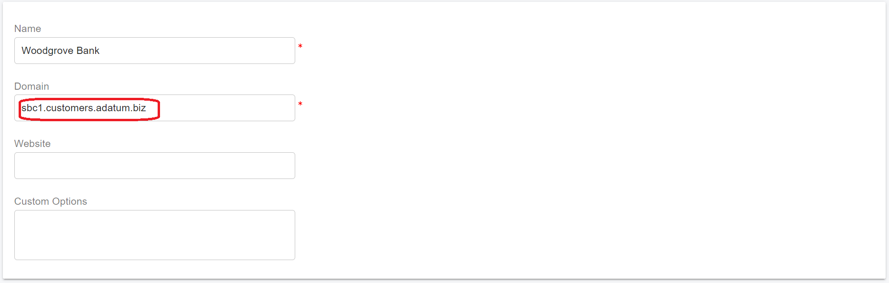
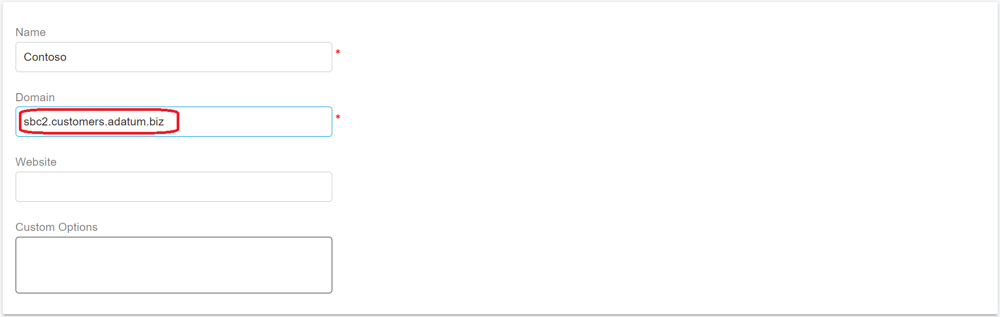
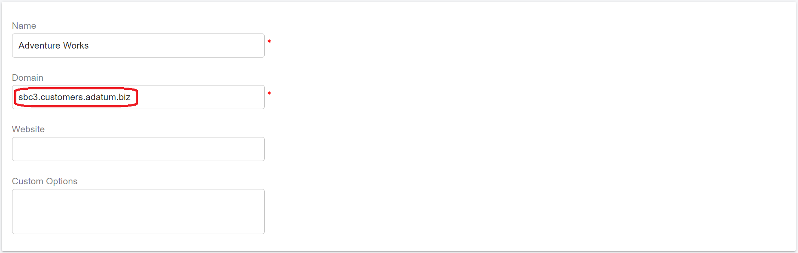

# Configure an SBC for Multiple Tenants

PortSIP SBC supports configuring one Session Border Controller (SBC) to serve multiple tenants for Teams Direct Routing.

## 1. Configuring the Tenant Domains in Microsoft Teams

Microsoft provided a detailed guide for configuring Microsoft Teams Direct Routing for multiple tenants; please follow [Configure a Session Border Controller for multiple tenants](https://learn.microsoft.com/en-us/MicrosoftTeams/direct-routing-sbc-multiple-tenants) to set up the tenant domains in the Microsoft 365 admin center.

According to that guide, the following items summarize the configuration of the base domain and subdomains:

* The Teams Direct Routing Base domain is **customers.adatum.biz**.
* The tenant domains are **sbc1.customers.adatum.biz**, **sbc2.customers.adatum.biz**, and **sbc3.customers.adatum.biz**.
* a wildcard SSL certificate for the domain **\*.customers.adatum.biz.**
* Resolve the domain **customers.adatum.biz** to the SBC IP address.

## **2. Configuring the PortSIP PBX**

Please follow the guides below to install and configure the PortSIP PBX:

* [Installation of the PortSIP PBX](../1-installation-of-the-portsip-pbx/)
* [Configuring the PortSIP PBX](configure-an-sbc-for-multiple-tenants.md#id-2-configuring-the-portsip-pbx)

Now, create three tenants and set their respective SIP domains to **sbc1.customers.adatum.biz**, **sbc2.customers.adatum.biz**, and **sbc3.customers.adatum.biz**.

<figure><figcaption></figcaption></figure>

<figure><figcaption></figcaption></figure>

<figure><figcaption></figcaption></figure>

## 3. Configuring the PortSIP SBC

Please install the PortSIP SBC by following the guide[ Configuring PortSIP SBC](../9-configuring-portsip-sbc/).&#x20;

To configure the PortSIP SBC for multiple tenants, please follow the [guide ](configuring-sbc-and-pbx.md)and pay attention to the following points:

* When adding the TLS certificate in the menu **Settings > TLS Certificates**, enter **customers.adatum.biz** as the TLS domain and select the option **This is an SBC Web Domain Certificate.** Then, copy and paste the wildcard certificate of the domain **\*.customers.adatum.biz** to add the TLS certificate.
* When [adding the Teams Base Domain](configuring-sbc-and-pbx.md#1-add-teams-base-domain), enter **customers.adatum.biz** as the Teams Base Domain.
* From the menu, select **Settings > Network** and enter **customers.adatum.biz** in the **Web Domain** field.

## **4. Configure Call Routing in the PortSIP PBX**

Please follow the guide [Configuring SBC and PBX](configuring-sbc-and-pbx.md#2-add-sbc-as-teams-trunk-in-pbx) to create the Teams trunk and inbound and outbound rules for routing calls. Please skip the section **1 Add Teams Base Domain** since we have already completed that step in the previous steps.

