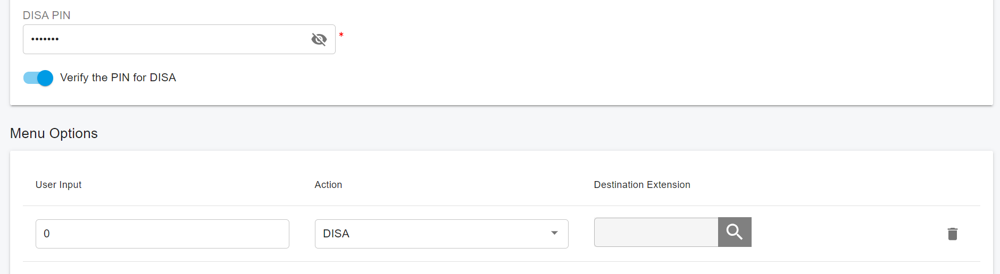
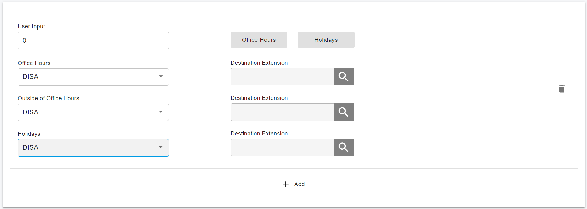

# Direct Inward System Access (DISA)

DISA is commonly known as Direct Inward System Access. It’s a feature offered by the PortSIP PBX that gives the user the ability to call from the outside using his cell phone, or landline… and dial out via the SIP trunk or PSTN trunk connected to the PortSIP PBX as it is an internal extension.&#x20;

In many scenarios where the user needs to access PortSIP PBX resources to perform calls for instance to other extensions or external calls via Trunks but doesn’t have access to his extension. In such cases, if DISA is configured on the PortSIP PBX, the user can call to the PortSIP PBX from any PSTN number, Mobile, or payphone, and act as an internal extension in a secure way using the password.

&#x20;After successful DISA configuration, when users call into PortSIP PBX and reach DISA, they will be required to enter a password.

## Create a New DISA

To configure DISA on the PortSIP PBX, please follow these steps:

1. Sign in to the PBX web portal as the tenant admin.&#x20;
2. Select the menu **Advanced Services > Virtual Receptionist**.&#x20;
3. Create a new Virtual Receptionist or edit an existing Virtual Receptionist.&#x20;
4. In the Virtual Receptionist options, enable the **Verify the PIN for DISA** option and input the PIN (digits only) that the user is required to enter before using DISA to dial out. This option can be disabled if there is no need for authentication.
5. &#x20;In the Menu Options, add a **User Input** for the DTMF tone and select the action as **DISA**.

<figure><figcaption></figcaption></figure>

<figure><figcaption></figcaption></figure>

As shown in the above screenshot, we turned on the DISA pin and set the DTMF tone to **0** for the DISA. When someone calls the virtual receptionist and hears the prompts, they can press **0**. The PBX will then ask for the DISA PIN. If the PIN is correct, the caller can input the destination phone number by pressing DTMF with **#** to end the input. The PBX will make a call to this entered phone number.

If the entered number is an external phone number, an outbound rule must be configured for that phone number to send calls to the SIP trunk.

