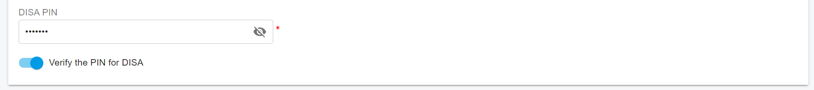

# Direct Inward System Access (DISA)

### Overview

**DISA (Direct Inward System Access)** allows users to access PortSIP PBX resources from an external phone, such as a mobile phone, landline, or even a payphone—and place calls **as if they were an internal extension**.

With DISA, a user can:

* Call into the PortSIP PBX from an external number
* Authenticate using a PIN (optional)
* Make internal calls to extensions
* Make external calls via SIP trunks or PSTN trunks

DISA is especially useful when users need to place business calls but do not have access to their own extension or device.

> **Security Note**\
> DISA should always be protected with a strong PIN and properly restricted outbound rules to prevent unauthorized usage or toll fraud.

***

### How DISA Works

After DISA is configured:

1. A user calls into the PortSIP PBX and reaches a **Virtual Receptionist**.
2. The user presses a configured DTMF key to access DISA.
3. If PIN verification is enabled, the PBX prompts the user to enter the DISA PIN.
4. After successful authentication, the user enters the destination number followed by **#**.
5. The PBX places the call on behalf of the user.

***

### Creating and Configuring DISA

To configure DISA on the PortSIP PBX, follow these steps:

1. Sign in to the **PortSIP PBX Web Portal** as a **Tenant Administrator**.
2. Navigate to **Advanced Services > Virtual Receptionist**.
3. Create a new Virtual Receptionist or edit an existing one.
4. In the Virtual Receptionist settings:
   * Enable **Verify the PIN for DISA**
   * Enter the **DISA PIN** (digits only)\
     This PIN will be required before the caller can dial out.
   * (Optional) Disable this option if authentication is not required (not recommended).
5. In **Menu Options**:
   * Add a **User Input** for the desired DTMF key
   * Set the action to **DISA**
6. Save the configuration.

***

### Example DISA Call Flow

In this example:

* DISA PIN verification is enabled
* DTMF key **0** is assigned to DISA

<figure><figcaption></figcaption></figure>

Call flow:

1. A caller dials the company number.
2. The Virtual Receptionist answers and plays the greeting.
3. The caller presses **0**.
4. The PBX prompts the caller to enter the **DISA PIN**.
5. If the PIN is correct, the caller enters the destination number.
6. The caller presses **#** to indicate the end of number entry.
7. The PBX places the call to the entered destination.

<figure><figcaption></figcaption></figure>

***

### Outbound Call Considerations

* If the entered destination is an **external phone number**, a corresponding **Outbound Rule** must exist.
* The outbound rule must:
  * Match the dialed number
  * Allow the call
  * Route the call to the appropriate SIP trunk or PSTN trunk

Without a valid outbound rule, the external call will not be completed.

***

### Best Practices

* Always enable **DISA PIN authentication**.
* Use a **strong, non-trivial PIN**.
* Restrict outbound rules to limit destinations and reduce fraud risk.
* Monitor call logs and CDRs for unusual activity related to DISA usage.

