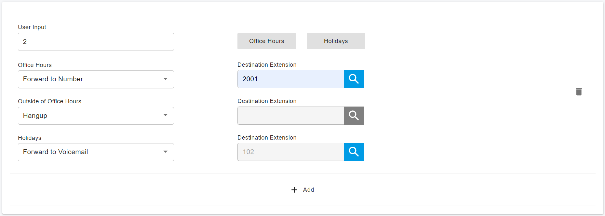
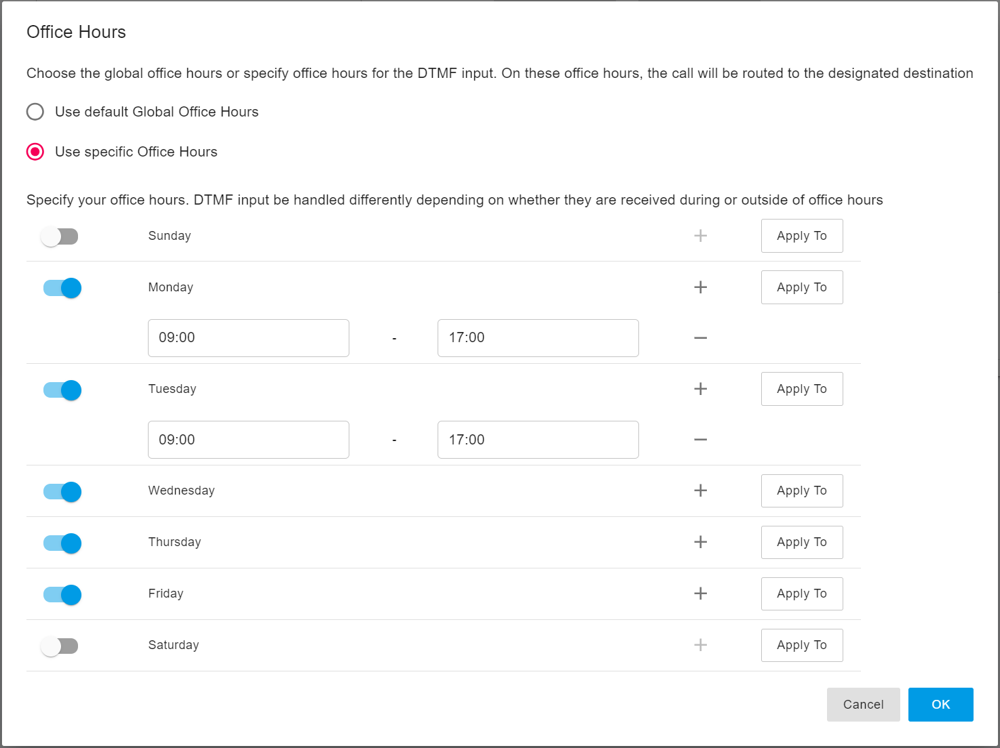
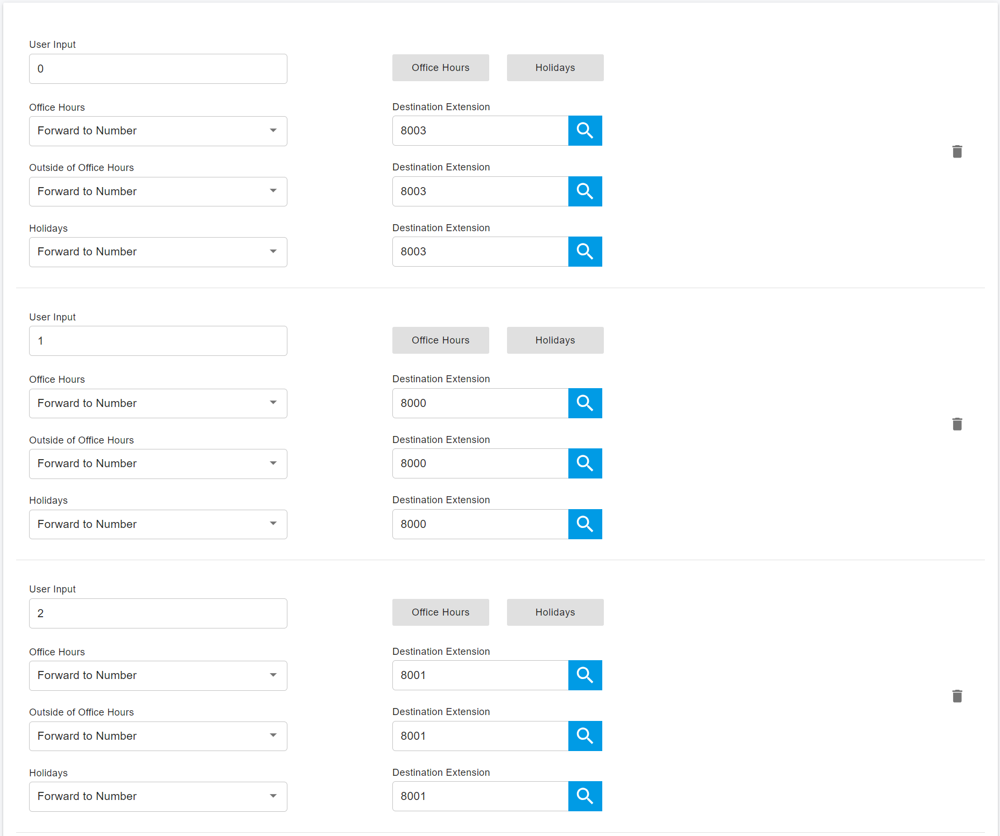

# Managing Virtual Receptionist

### **Recording a Menu Prompt**

Before creating a virtual receptionist, decide which **menu options** you want to offer callers and record the corresponding **announcement prompt**.

**Example prompt:**

> “Welcome to XYZ. For Sales, press 1. For Support, press 2, or stay on the line for an operator.”

#### Best Practice for Prompt Design

It is recommended to state the **menu option first**, followed by the **DTMF digit**, for example:

> “For Sales, press 1”

rather than:

> “Press 1 for Sales”

This approach allows callers to listen for their desired option first and then register the digit to press, resulting in a better caller experience.


For the prompt file format, please refer to [What's the file format required for the PortSIP PBX prompt files?](../../faq/what-file-format-is-required-for-portsip-pbx-prompt.md)


***

### Creating a Virtual Receptionist

You can create multiple virtual receptionists and assign them to specific extensions or inbound numbers.

#### To create a virtual receptionist:

1. Navigate to **Advanced Services > Virtual Receptionist** in the Web Portal.
2. Click **Add**.
3. On the **General** section, enter the **Name** and **Extension Number** for the virtual receptionist.

***

### General Settings

#### Prompt File

By default, the PBX uses a **system-predefined audio prompt**.\
To use a custom prompt, click **Browse** and select a previously recorded audio file.

#### Prompt When Call Is Transferring

The audio file played when a call is being transferred after the caller presses a DTMF key.

#### Virtual Receptionist Language

Specifies the language used for the prompt files.

#### Gap Time Between DTMF Digits (Seconds)

Defines how long the virtual receptionist waits before attempting to match the entered digits to an extension or account.\
If no matching account is found, the system plays an announcement indicating that the extension does not exist.

#### DISA PIN

Configures the [**Direct Inward System Access (DISA)**](direct-inward-system-access-disa.md) PIN if DISA is enabled for this virtual receptionist.\
For more information, refer to **Direct Inward System Access**.

#### Verify PIN for DISA

Specifies whether the virtual receptionist should verify the DISA PIN before allowing access.

***

### Call Handling Options

#### Night Mode

When [**Night Mode** ](../32-night-mode.md)is enabled, all calls reaching this virtual receptionist are handled according to the **Destination for Night Mode** settings. For more details, please refer to [Night Mode](../32-night-mode.md).

#### Block Direct Extension Dialing

Prevents callers from dialing extensions directly.

* You can block individual extensions or define extension ranges.
* Multiple entries must be separated by semicolons.

**Example:** `1001-2001;3000;7000-8000`

#### Destination for Night Mode

Defines how incoming calls are handled when **Night Mode** is active for the tenant.\
For detailed configuration instructions, refer to the **Night Mode** section of this guide.

***

### Timeout and Failure Handling

#### Timeout (Seconds)

Specifies how long the virtual receptionist waits for a **DTMF input** from the caller.\
If no input is received within the specified time, the system automatically performs the **default action**.

This option is intended for callers who do not understand the menu or who are using phones that do not support DTMF input.

#### Call Failure

A **Call Failure** occurs when a caller enters a DTMF digit that triggers a call transfer, but the transfer attempt fails.

In the **Call Failure** section, you can define how the call should be handled in this situation.

***

### Menu Options

In the **Menu Options** tab, you configure the actions associated with each **DTMF digit** entered by the caller.

For each numeric key, you can define an action such as:

* Forwarding the call to an extension
* Ring group
* Call queue
* Another virtual receptionist
* System extension

If the action targets a specific destination, select the desired extension or system extension number.

***

### User Input and Time-Based Routing

The **User Input** option controls when the virtual receptionist starts searching for a destination that matches the caller’s input.

#### Example Behavior (DTMF = 2)

* **During office hours:**\
  The call is forwarded to extension 2001.
* **Outside office hours:**\
  The call is disconnected.
* **During holidays:**\
  The call is forwarded to the voicemail of extension 102.

This allows flexible, time-based call routing using a single virtual receptionist.

> If the caller enters a DTMF digit that does not match any configured DTMF option, the Call Failure rule is not triggered.

<figure><figcaption></figcaption></figure>

***

#### **Office Hours**

You can define the **office hours** for this DTMF input by clicking the **Office Hours** button. Two options are available:

* **Use Global Office Hours**\
  Applies the default office hours defined at the **tenant level**.
* **Use Specific Office Hours**\
  Allows you to define **custom office hours** for this DTMF input.

By default, each DTMF input follows the global office hours configured for the tenant.

<figure><figcaption></figcaption></figure>

#### **Holidays**

Set the holidays for this DTMF input by clicking the **Holidays** button. You can select a holiday list from the tenant scope by clicking the **Select Holidays** button.

### **Direct Destinations**

The Direct Destinations feature is somewhat like a built-in version of the IVR system.

To direct inbound calls to specified extensions, you can use the pre-configured destination fields and link them to pre-recorded announcements and user input options.

Using the sample shown below, the virtual receptionist’s welcome message will be as follows: "**For Sales, press 1. For Support, press 2. For all other inquiries, press 0**." (The user input options are linked to extensions 8003, 8000, and 8001.)

<figure><figcaption></figcaption></figure>

***

#### Direct Destination vs. IVR Node

For simple virtual receptionist configurations, using a direct destination is often the most straightforward and effective option.\
For virtual receptionists that require advanced IVR logic, complex call flows, or integrations, it is recommended to use an IVR node.

***

#### Direct Destination Behavior

Once direct destination mappings are configured, the system automatically dials the associated destination when the caller enters the corresponding DTMF input.

**Example:**\
As shown in the screenshot above, when a caller presses 2, the call is routed to extension 8001.

***

#### Using the Pound Sign (#) Delay

By appending a **pound sign (#)** to a direct destination (for example, `2#`), the system waits **3 seconds** before dialing the destination.

This delay is especially useful when extension numbers consist of **multiple digits**, such as extensions in the **100 range** (101, 102, etc.).\
The 3-second pause ensures the system collects the **entire user input** (for example, `101`) instead of immediately acting on the first digit (`1`).

***

#### User Input Considerations

The User Input value can consist of one or multiple digits. By default, the system dials a direct destination immediately after the caller finishes entering the keypad input.

This behavior can cause conflicts when:

* A direct destination uses a digit that overlaps with the beginning of an extension number
* For example, a direct destination of **1** conflicts with extensions such as **101**, **102**, etc.

In this scenario, the system cannot distinguish whether the caller intends to reach the direct destination or continue dialing an extension.

***

#### Best Practices to Avoid Conflicts

To prevent overlap issues:

* Use extension ranges that **do not conflict** with direct destinations, mailbox prefixes, or outbound dialing prefixes
* Extension ranges such as **4xx to 7xx** are commonly recommended

If changing extension assignments is not practical (for example, extension numbers are already printed on business cards), you can use the **timeout mechanism** instead.

By appending a **pound sign (#)** to the direct destination (for example, `1#`), the system waits **3 seconds** before dialing, allowing callers enough time to complete multi-digit extension input.

***

#### Destination Extension

The **Destination Extension** can be any valid internal destination, including:

* An extension
* A conference room
* Other internal system numbers

***

### Allow Callers to Dial a Known Extension Directly

While the virtual receptionist prompt is playing, callers can enter a known **extension number** to be connected immediately. This allows callers who already know their party’s extension to bypass the receptionist menu and reach the intended extension more quickly.

This option is **enabled by default**. To make effective use of this feature, include clear instructions in the voice prompt.

**Example prompt:**

> “Welcome to Company XYZ. If you know your party’s extension number, please enter it now. For Sales, press 1. For Support, press 2.”

from platforms like Cisco, Avaya, and RingCentral.

***

### Sending HTTP Requests to a WebHook

When creating a Virtual Receptionist, the configuration interface includes three tabs:

* **Virtual Receptionist**
* **Action URL**
* **Outbound Caller ID**

In the Virtual Receptionist tab, you configure the basic IVR behavior.\
In the Action URL tab, you define WebHook-based actions and how calls are handled when specific conditions are met.

***

#### Action URL Overview

An Action URL allows the Virtual Receptionist to send an HTTP request to a third-party server and route the call dynamically based on the response.

**Typical Scenario**

When a caller enters a preconfigured **DTMF input** (or when the caller number matches a defined rule), the Virtual Receptionist:

1. Sends an HTTP request to the specified WebHook URL
2. Receives a response from the third-party server
3. Parses the response
4. Routes the call to the destination defined in the response

This mechanism enables **advanced IVR logic**, such as database lookups, external validation, or dynamic call routing.

***

#### Action URL Configuration

**Name**

Enter a **user-friendly name** for the Action URL.\
This field is **mandatory** and is used to identify the action.

***

**Type**

Specifies how the Action URL is triggered. PortSIP PBX supports the following trigger types:

* **DTMF** – Triggered by user-entered DTMF digits
* **Caller Number** – Triggered by matching the caller’s number

> When **DTMF** is selected and the entered DTMF matches a rule defined in the **Action URL**, the PBX **overrides** the DTMF handling configured in the Virtual Receptionist tab and processes the call according to the Action URL settings.

***

#### DTMF Match List / Caller Number Match List

Depending on the selected **Type**, configure one of the following:

* **DTMF Match List**
* **Caller Number Match List**

You can specify:

* A **semicolon-separated list** of values\
  Example: `101;102;103`
* A **number range**\
  Example: `860000–880000`
* A **wildcard pattern** using asterisks (`*`)\
  Example: `*****` (matches any 5-digit DTMF input)

Each entry must be **unique** and must not be duplicated.

**Common Use Cases**

* Matching bank card numbers or account IDs entered by callers
* Triggering external validation or lookup services
* Handling variable-length DTMF input dynamically

***

#### HTTP Request Behavior

Once an Action URL rule is triggered, the Virtual Receptionist sends an HTTP request to the configured WebHook server.

**Authentication**

You may optionally configure:

* **Username**
* **Password**

These credentials are used for **HTTP Basic Authentication**.

***

#### HTTP Method

Choose how the request is sent:

* **GET**
* **POST**

***

#### Timeout Settings

* **Connection Timeout**\
  Defines how long the system waits to establish a connection with the WebHook server.
* **Response Timeout**\
  Defines how long the system waits for a response after sending the request.

These settings control communication reliability between the Virtual Receptionist and the WebHook server.

***

#### Request URL

Specifies the **WebHook endpoint URL**.

When the action is triggered, the Virtual Receptionist sends an HTTP request to this URL and processes the call based on the **HTTP response message** returned by the server.

***

#### Additional Headers

Allows you to include **custom HTTP headers** in the request.

To add multiple headers, use the following format:

```
key1:value1&key2:value2
```

**Example:**

```http
Authorization:Bearer token123&X-App-ID:portsip
```

***

### Summary

The Action URL feature enables the Virtual Receptionist to integrate with **external systems** and perform **dynamic, logic-driven call routing**, making it ideal for:

* CRM and database integrations
* Banking or account verification
* Advanced IVR workflows
* Custom business logic

***

### HTTP Request Message

PortSIP defines the following parameters for constructing the **HTTP request message** sent to a WebHook.\
The request payload is formatted in **JSON** (for POST requests) or as URL query parameters (for GET requests).

#### Parameters

* **from:** The caller’s number (the extension or number calling the Virtual Receptionist).
* **to:** The callee’s number (the extension number assigned to the Virtual Receptionist).
* **input:** The DTMF digits entered by the caller.
* **from\_name:** The display name of the caller. This field is empty if no display name is available.
* **account\_name:** The name of the Virtual Receptionist.
* **session\_id**: The unique ID of that call.

***

#### Example Scenario

Assume a Virtual Receptionist is configured with the following settings:

* **Number:** 888
* **Name:** Sales
* **Action Name:** Action1
* **Action Type:** DTMF
* **DTMF Match List:** `22;33`
* **HTTP Method:** GET
* **Request URL:**\
  `http://www.appserver.com/dest.php`

***

#### GET Request Example

When **extension 101** (display name **Jason**) calls **888**, the Virtual Receptionist automatically answers the call and plays the configured prompt.

If the caller enters **DTMF 22**, the Virtual Receptionist sends the following **HTTP GET request** to the WebHook endpoint:

```
http://www.appserver.com/dest.php?session_id=12345678&from=101&to=888&input=22&from_name=Jason&account_name=Sales
```

***

#### POST Request Example

If **POST** is selected as the HTTP method, the Virtual Receptionist sends the request in **JSON format** in the HTTP request body:

```json
{
  "from": "101",
  "to": "888",
  "input": "22",
  "from_name": "Jason",
  "account_name": "Sales",
  "session_id": "12345678"
}
```

### HTTP Response Message

PortSIP PBX defines the following **HTTP response format** for WebHook requests sent by the **Virtual Receptionist**.\
The response is expected in **JSON format** and determines how the Virtual Receptionist should handle the call.

#### Response Parameters

* **status\_code**\
  The HTTP status code returned by the WebHook endpoint.\
  A value of **200** indicates that the request was processed successfully. Any other value is treated as a failure.
* **action**\
  Specifies the action the Virtual Receptionist should take. Supported values are:
  * **call** – Forward the call to the number specified in `destination`
  * **hangup** – Immediately terminate the call
  * **repeat** – Replay the prompt message
* **destination**\
  The target callee number. This parameter is **only valid when `action` is set to `call`**.\
  It is ignored for all other actions.

***

#### Example Response

```json
{
  "status_code": 200,
  "action": "call",
  "destination": "222"
}
```

***

#### Call Handling Behavior

When the Virtual Receptionist receives the response above, it forwards the call to **extension 222**, as specified in the `destination` field of the JSON response.

