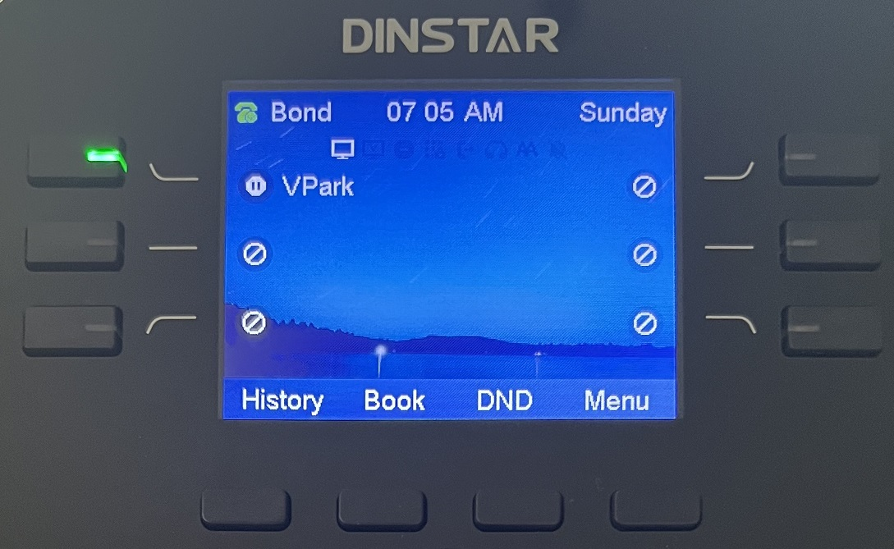
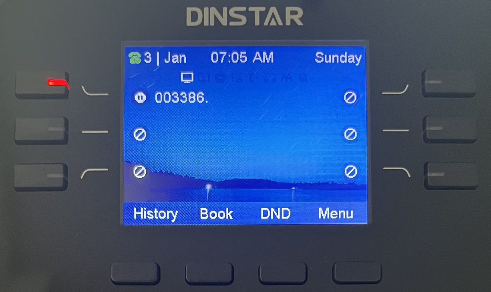

# Using Enhanced Call Park on Dinstar IP Phones

This article explains how to use **PortSIP PBX’s enhanced call park feature** with **Dinstar IP phones**, providing a simplified call parking experience with visual notifications and one-touch operations.

***

### Supported Dinstar IP Phone Models

* **Models:** C60, C61, C62, C63, C64, C66
* **Minimum firmware versions:**
  * `2.x.6.9.7`, or
  * `2.x.11.9.7`

***

### Application Scenarios

#### Enhanced Call Park

**Enhanced Call Park** improves the traditional call park experience by replacing manual Feature Access Code (FAC) dialing with **dedicated Park and Retrieve soft keys** on Dinstar IP phones.

When integrated with PortSIP PBX, Enhanced Call Park provides:

* One-touch call parking and retrieval
* Visual notifications for parked calls
* Access to additional enhanced call park features supported by PortSIP PBX

***

#### Call Park

The **Call Park** service allows users to temporarily suspend an active call and retrieve it later from the same extension or from another extension.

**Typical use case:**\
You are on an active call and need to move to a different location. You park the call and retrieve it once you reach your destination.

***

#### Group Call Park

**Group Call Park** introduces a hunting mechanism that parks a call against an **available member of a configured Call Park group**, rather than only the user who initiated the park.

**Typical use case:**\
If you and your colleagues belong to the same Call Park group, a parked call may be placed on a colleague’s line. That colleague can retrieve the call, continue the conversation, or transfer it back to you.

***

#### Call Park Notification

**Call Park Notification** provides a **visual alert** on the Dinstar IP phone when a call is parked for a user.

* The phone displays an on-screen notification
* Keys or indicators light up
* The user retrieves the call by pressing the corresponding button

This eliminates the need to manually dial retrieval codes.

***

#### Retrieve Park

A parked call can be retrieved by dialing the **Call Park Retrieve Feature Access Code**, followed by the extension number where the call is parked.

**Typical use cases:**

* Retrieve a call parked on your own extension
* Retrieve a call parked on a colleague’s extension, then transfer the call or notify them

> **Note:** When Enhanced Call Park is enabled, retrieval is typically performed using a **dedicated soft key** instead of dialing a FAC.

***

#### Recall

The **Recall** feature ensures that parked calls are not left unanswered indefinitely.

* You can configure:
  * The **recall destination** (the parking user or a specified number)
  * The **recall timer**
* If a parked call is not retrieved within the configured time, the PBX automatically recalls the call to the defined destination.

**Example:**\
If the recall timer is set to **30 seconds**, and no one retrieves the call within that time, the PBX recalls the call to the original parking user (or the configured recall destination).

***

### Configuring a Soft Key for Visual Park

When provisioning an IP phone, you can assign a **soft key** to **Visual Call Park** to enable one-touch call parking and retrieval.

<figure><figcaption></figcaption></figure>

#### How it works

* During the IP phone provisioning process, configure a soft key with the **Visual Park** function.
* After the phone is successfully provisioned:
  * The soft key displays the label **“Visual Park”**
  * The user can park and retrieve calls without dialing any Feature Access Codes (FACs)

#### Example

In the example shown:

* User **James** has extension **103**
* A soft key is configured with the **Visual Park** function
* The IP phone displays the **Visual Park** label, allowing James to manage parked calls directly from the phone interface

<figure><figcaption></figcaption></figure>

***

### Parking a Call

If **James** wants to park a call for his colleague whose extension number is **105**, he can do so using the **Visual Park** key—without dialing any Feature Access Codes (FACs).

#### Park a call to a specific extension

1. While on an active call, James presses the configured **Visual Park** key.
2. When prompted, he enters the destination extension number (`105`).
3. James presses the **Visual Park** soft key again to confirm.

The IP phone parks the call on **extension 105**.

> **Result:**\
> James does not need to remember or dial the call park FAC. The entire operation is completed using the Visual Park key.

***

### Group Call Park

Group Call Park allows a user to park a call to a **Call Park group**, making the call available for retrieval by any member of the group.

#### Prerequisites: Configure a Call Park Group

1. Sign in to the PortSIP PBX Web Portal as the **Tenant Admin**.
2. Navigate to **Advanced Services > Call Park**.
3. Follow the [configuration guide](./) to create a Call Park group.

**Example configuration:**\
Extensions **101**, **102**, **103**, **104**, and **105** are members of the same Call Park group.

***

#### Park a call to the Call Park group

If **James** (extension **103**) wants to park a call to the Call Park group:

1. While on an active call, James presses the configured **Visual Park** key **twice**.
2. The IP phone automatically parks the call to the Call Park group.

#### Call behavior

* The call is parked using the group hunting logic.
* **All members of the Call Park group** receive a parked-call alert notification.
* Any group member can retrieve the call using their device’s parked-call button or retrieval method.

> **Result:**\
> James does not need to remember or dial the FAC for Group Call Park. The Visual Park key provides a simple, one-touch experience.

***

### Retrieve a Parked Call

In this example, **Alice** is on a call with **Bob**. Bob parks the call on **James’s extension (103)** using the **Visual Park** key.

#### Visual notification

* On James’s IP phone, the **Visual Park** soft key **flashes red**, indicating that a call has been parked on his extension.

#### Retrieve the call

1. James presses the **flashing Visual Park** soft key.
2. The call is immediately connected to James.

> **Result:**\
> James retrieves the parked call with a single key press and does **not** need to remember or dial any Feature Access Codes (FACs).

<figure><figcaption></figcaption></figure>

