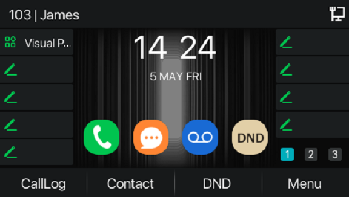

# Using Enhanced Call Park on Fanvil IP Phones

This article explains how to use PortSIP PBX’s enhanced call park feature with Fanvil IP phones, providing a more intuitive and efficient call parking experience.

***

### Supported Fanvil IP Phone Models

#### V1 Series

* **Models:** X4U, X5U, X6U, X7, X7C, X210, X210i
* **Minimum ROM version:** 2.4.13

#### V2 Series

* **Models:** X4U-V2, X5U-V2, X6U-V2, X7-V2, X7C-V2, X210-V2, V62, V64, V65
* **Minimum ROM version:** 2.12.16.17

***

### Application Scenarios

#### Enhanced Call Park

**Enhanced Call Park** improves the traditional call park experience on Fanvil IP phones by replacing manual Feature Access Code (FAC) dialing with **dedicated park and retrieve keys**.

When used with PortSIP PBX, Enhanced Call Park provides:

* One-touch call parking and retrieval
* Visual call park notifications
* Seamless integration with PortSIP’s advanced call park features

***

#### Call Park

The **Call Park** service allows a user to temporarily place a call on hold and retrieve it later from the same extension or another extension.

**Typical use case:**\
You are on an active call and need to move to a different location. You park the call on your extension and retrieve it once you reach the desired location.

***

#### Group Call Park

**Group Call Park** introduces a hunting mechanism for parked calls. When a call is parked, the system searches for an **available user within a configured Call Park group** instead of parking the call only on the original user’s extension.

**Typical use case:**\
If you and your colleagues belong to the same Call Park group, a parked call can be placed on a colleague’s line. That colleague can retrieve the call and either continue the conversation or notify and transfer the call to you.

***

#### Call Park Notification

**Call Park Notification** provides a **visual alert** on Fanvil IP phones when a call is parked for a user.

* The phone displays an on-screen notification
* Line keys or indicators light up
* The user can retrieve the parked call by pressing the corresponding key

This eliminates the need to manually dial retrieval codes.

***

#### Retrieve Park

A parked call can be retrieved by dialing the **Call Park Retrieve Feature Access Code**, along with the extension number where the call is parked.

**Typical use cases:**

* Retrieve a call you parked on your own extension
* Retrieve a call parked on a colleague’s extension, then transfer it or notify verify the caller

_(With Enhanced Call Park enabled, retrieval is typically done using a dedicated key instead of dialing.)_

***

#### Recall

The **Recall** feature ensures parked calls are not left unanswered indefinitely.

* You can configure:
  * **Recall destination** (parking user or a specified number)
  * **Recall timer**
* If a parked call is not retrieved within the configured time, the PBX automatically recalls the call to the defined destination.

**Example:**\
If the recall timer is set to **30 seconds**, and no one retrieves the parked call within that time, the PBX recalls the call to the original parking user (or the configured recall number).

***

### Configuring a Key for Visual Park

When provisioning an IP phone, you can configure a **soft key** for **Visual Call Park** to enable one-touch call parking and retrieval.

<figure><figcaption></figcaption></figure>

#### How it works

* During the IP phone provisioning process, assign a soft key to the **Visual Park** function.
* After the phone is successfully provisioned, the soft key displays the label **“Visual Park”** on the device.
* The user can then use this key to park and retrieve calls visually, without dialing Feature Access Codes.

#### Example

In the example shown:

* User **James** has extension **103**
* A soft key has been configured with the **Visual Park** function
* The IP phone displays the **Visual Park** label, allowing James to manage parked calls directly from the phone interface

<figure><figcaption></figcaption></figure>

***

### Parking a Call

If **James** wants to park a call for his colleague whose extension number is **105**, he can do so using the **Visual Park** key without dialing any Feature Access Codes (FACs).

#### Park a call to a specific extension

1. While on an active call, James presses the configured **Visual Park** soft key.
2. When prompted, he enters the destination extension number (for example, `105`).
3. James presses the **Visual Park** soft key again.

The IP phone parks the call on **extension 105**.

> ❗**Result:**\
> James does not need to remember or dial the call park FAC. The entire operation is completed using the Visual Park key.

***

### Group Call Park

Group Call Park allows a user to park a call to a **Call Park group**, making the call available to any member of that group.

#### Configure a Call Park group

1. Sign in to the PortSIP PBX Web Portal as the **Tenant Admin**.
2. Go to **Advanced Services > Call Park**.
3. Follow the configuration guide to [configure a park group](./#adding-and-deleting-a-call-park-group).

**Example configuration:**\
Extensions **101**, **102**, **103**, **104**, and **105** are members of the same Call Park group.

***

#### Park a call to a Call Park group

If **James** (extension **103**) wants to park a call to the Call Park group:

1. While on an active call, James presses the **Visual Park** soft key **twice**.
2. The IP phone automatically parks the call to the Call Park group.

#### Call behavior

* The call is parked against the group using the group hunting logic.
* **All members of the Call Park group** receive a parked-call alert notification.
* Any group member can retrieve the call using their device’s parked-call button or retrieval method.

> ❗**Result:**\
> James does not need to remember or dial the FAC for Group Call Park. The Visual Park key provides a simple, one-touch experience.

***

### Retrieve a Parked Call

In this example, **Alice** is on a call with **Bob**. Bob parks the call to **James’s extension (103)** using **Visual Park**.

#### Call flow

1. Bob presses the **Visual Park** key.
2. Bob enters **103** and presses the **Visual Park** key again.
3. The call is parked on **James’s extension (103)**.

<figure><figcaption></figcaption></figure>

#### Visual notification on James’s phone

* On James’s IP phone, the **Visual Park** key flashes **red**, indicating that a call is parked on his extension.
* James presses the flashing **Visual Park** key to view the parked call details.

#### On-screen information

* The phone displays the parked call information.
* The caller name is shown as **“Parked”** (in this case, **Alice**).

#### Retrieve the call

* James presses the **Retrieve** button (located at the bottom-left of the screen).
* The call is immediately connected to James.

> ❗**Result:**\
> James retrieves the parked call with a single key press and does **not** need to remember or dial any Feature Access Codes (FACs).

<figure><figcaption></figcaption></figure>

