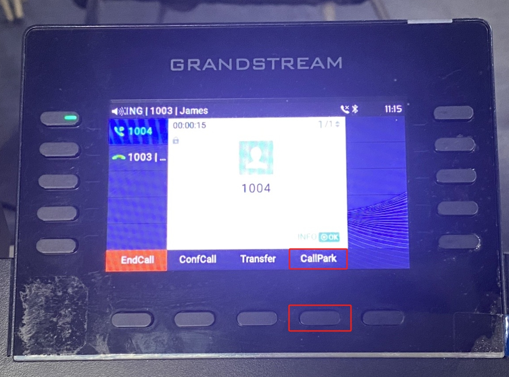
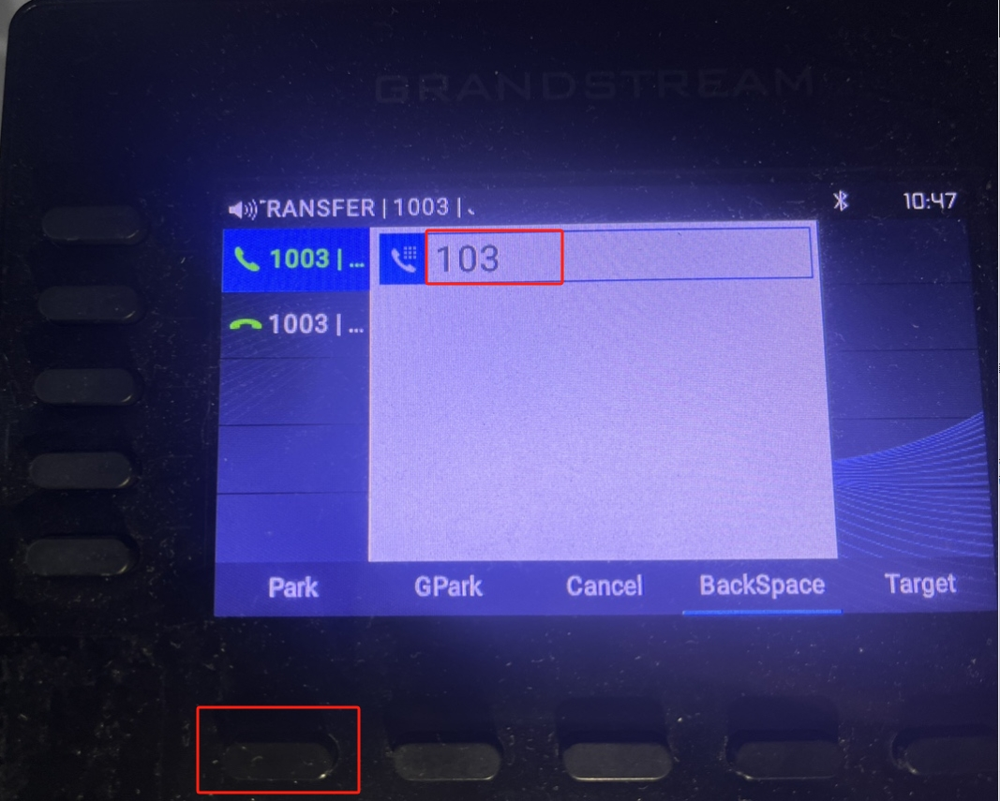
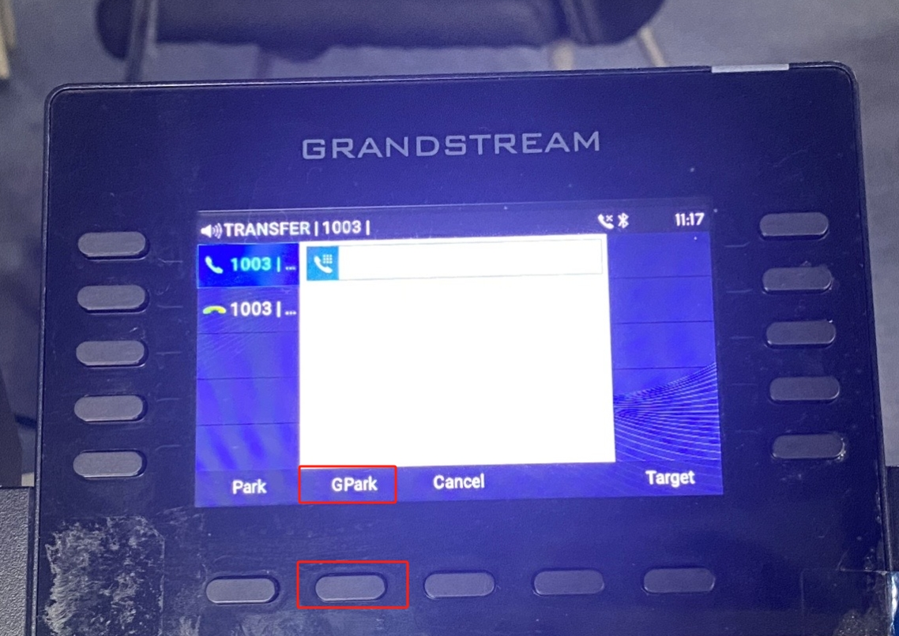
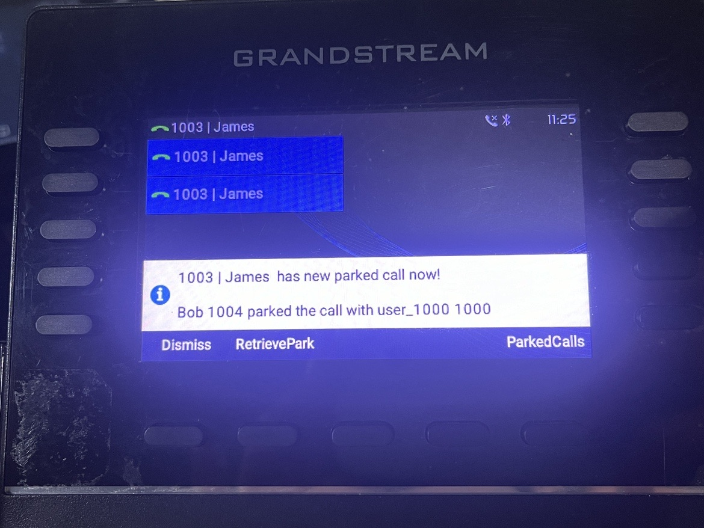

# Using Enhanced Call Park on Grandstream IP Phones

This article explains how to use **PortSIP PBX’s enhanced call park feature** with **Grandstream IP phones**, providing a streamlined call parking experience with visual notifications and one-touch actions.

***

### Supported Grandstream IP Phone Models

#### GRP 260x Series

* **Models:** 2601, 2602, 2603, 2604
* **Minimum firmware version:** 1.0.5.68

#### GRP 26xx Series

* **Models:** 2610, 2611, 2612, 2613, 2614, 2615, 2616, 2624, 2634, 2636, 2650, 2670
* **Minimum firmware version:** 1.0.13.13

***

### Supported PortSIP PBX Version

* **PortSIP PBX v22.0 or later**

***

### Application Scenarios

#### Enhanced Call Park

**Enhanced Call Park** improves the traditional call park experience by replacing manual Feature Access Code (FAC) dialing with **dedicated Park and Retrieve soft keys** on Grandstream IP phones.

When integrated with PortSIP PBX, Enhanced Call Park provides:

* One-touch call parking and retrieval
* Visual notifications for parked calls
* Seamless interaction with PortSIP’s advanced call park features

***

#### Call Park

The **Call Park** service allows users to temporarily place a call on hold and retrieve it later from the same extension or a different extension.

**Typical use case:**\
You are on an active call and need to move to another location. You park the call and retrieve it once you reach your destination.

***

#### Group Call Park

**Group Call Park** introduces a hunting mechanism that parks a call against an **available member of a configured Call Park group**, rather than only the user who initiated the park.

**Typical use case:**\
If you and your colleagues belong to the same Call Park group, a parked call may be placed on a colleague’s line. That colleague can retrieve the call, handle it directly, or transfer it back to you.

***

#### Call Park Notification

**Call Park Notification** provides a **visual alert** on the IP phone when a call is parked for a user.

* The phone displays an on-screen notification
* Indicators or keys light up
* The user can retrieve the call by pressing the corresponding button

This eliminates the need to manually dial retrieval codes.

***

#### Retrieve Park

A parked call can be retrieved by dialing the **Call Park Retrieve Feature Access Code**, followed by the extension number where the call is parked.

**Typical use cases:**

* Retrieve a call parked on your own extension
* Retrieve a call parked on a colleague’s extension, then transfer the call or notify them

> **Note:** When Enhanced Call Park is enabled, retrieval is typically performed using a **dedicated soft key** rather than dialing a FAC.

***

#### Recall

The **Recall** feature ensures that parked calls are not left unanswered indefinitely.

* You can configure:
  * The **recall destination** (the parking user or a specified number)
  * The **recall timer**
* If a parked call is not retrieved within the configured time, the PBX automatically recalls the call to the defined destination.

**Example:**\
If the recall timer is set to **30 seconds** and no one retrieves the parked call within that time, the PBX recalls the call to the original parking user (or the configured recall destination).

***

### Parking a Call

If **James** wants to park a call for his colleague whose extension number is **103**, he can do so using the **Call Park** key—without dialing any Feature Access Codes (FACs).

<figure><figcaption></figcaption></figure>

#### Steps

1. While on an active call, James presses the **Call Park** key.
2. When prompted, he enters the destination extension number (`103`).
3. James presses the **Park** key to confirm.

The IP phone parks the call on **extension 103**.

<figure><figcaption></figcaption></figure>

***

### Group Call Park

Group Call Park allows a user to park a call to a **Call Park group**, making the call available for retrieval by any member of that group.

#### Prerequisites: Configure a Call Park Group

1. Sign in to the PortSIP PBX Web Portal as the **Tenant Admin**.
2. Navigate to **Advanced Services > Call Park**.
3. Follow the [configuration guide](./) to create a Call Park group.

**Example configuration:**\
Extensions **1001**, **1002**, **1003**, **1004**, and **1005** are members of the same Call Park group.

***

#### Park a Call to the Group

In this example:

* **James** has extension **1003**
* James is on an active call with **extension 1004**

To park the call to the Call Park group:

1. While on the active call, James presses the **Call Park** key on his IP phone.
2. As shown on the IP phone screen in the screenshot below, James then presses the **GPark** key.
3. The IP phone parks the call to the Call Park group automatically.

<figure><figcaption></figcaption></figure>

#### Call behavior

* The call is parked using the group hunting logic.
* **All members of the Call Park group** receive a parked-call alert notification.
* Any group member can retrieve the parked call using their device’s parked-call button or retrieval method.

> **Result:**\
> James does not need to remember or dial any Feature Access Codes (FACs). Group call parking is completed using on-screen keys, providing a faster and more user-friendly experience.

<figure><figcaption></figcaption></figure>

***

### Retrieve a Parked Call

In this example, **Alice** is on a call with **Bob**. Bob parks the call on **James’s extension (1003)**.

#### Visual notification

* On James’s IP phone, a **Retrieve** label is displayed on the screen (as shown in the screenshot below), indicating that a call has been parked on his extension.

#### Retrieve the call

1. James presses the **RetrievePark** soft key on his IP phone.
2. The call is immediately connected to James.

> **Result:**\
> James retrieves the parked call with a single key press and does **not** need to remember or dial any Feature Access Codes (FACs).

<figure><figcaption></figcaption></figure>

