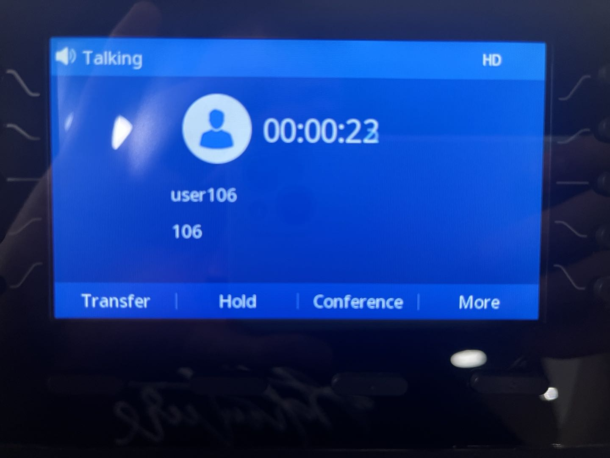
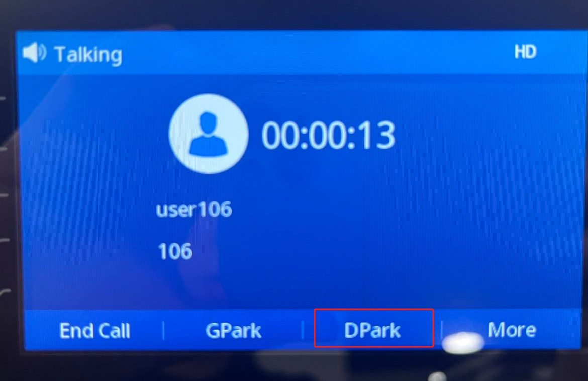
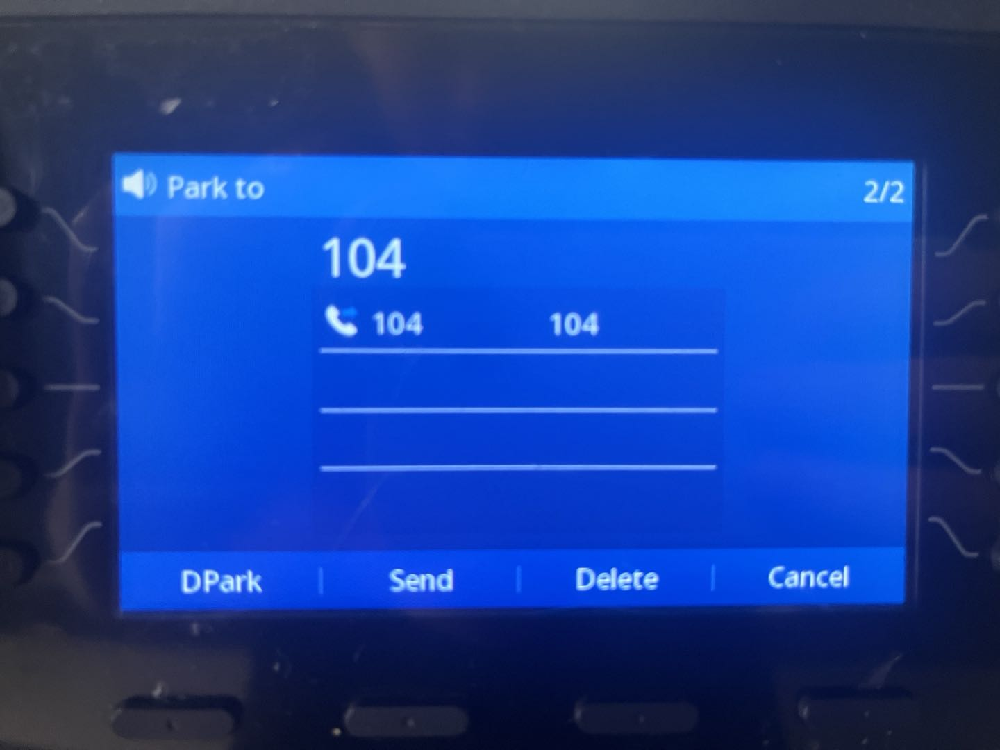
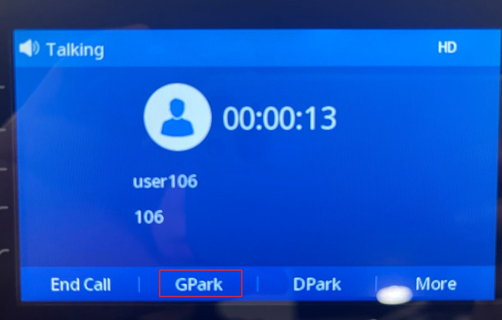
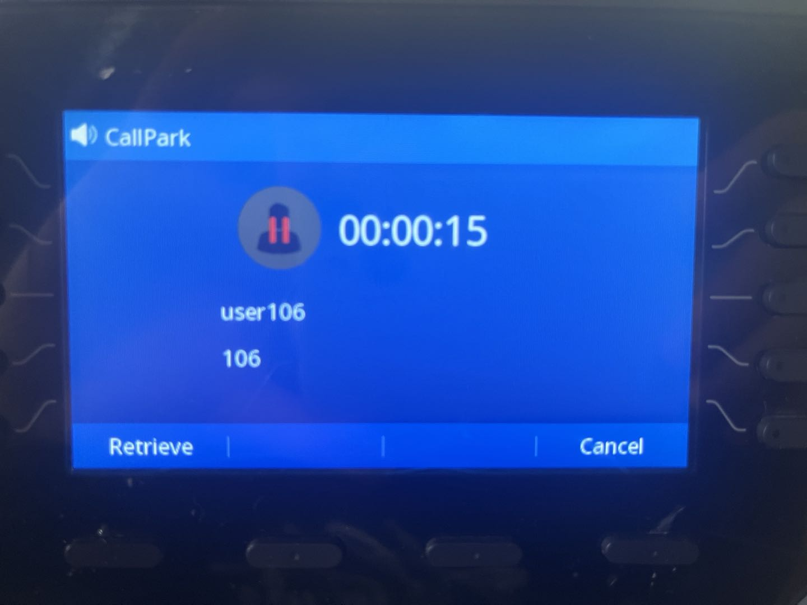

# Using Enhanced Call Park on Htek IP Phones

This article explains how to use **PortSIP PBX’s enhanced call park feature** with **Htek IP phones**, providing a simplified and efficient call parking experience with visual notifications and one-touch operations.

***

### Supported Htek IP Phone Models

#### Models

* UCxxx series

#### Firmware Requirements

* Firmware version V2.42.6.6.1R22 or later

***

### Application Scenarios

#### Enhanced Call Park

**Enhanced Call Park** improves the traditional call park experience by replacing manual Feature Access Code (FAC) dialing with a **dedicated Park and Retrieve key** on Htek IP phones.

When integrated with PortSIP PBX, Enhanced Call Park provides:

* One-touch call parking and retrieval
* Visual notifications for parked calls
* Access to additional enhanced call park capabilities provided by PortSIP PBX

***

#### Call Park

The **Call Park** service allows users to temporarily suspend an active call and retrieve it later from the same extension or from another extension.

**Typical use case:**\
You are on an active call and need to move to another location. You park the call and retrieve it once you reach your destination.

***

#### Group Call Park

**Group Call Park** uses a hunting mechanism to park a call against an **available member of a configured Call Park group**, rather than only the user who initiated the park.

**Typical use case:**\
If you and your colleagues are members of the same Call Park group, a parked call may be placed on a colleague’s line. That colleague can retrieve the call, handle it directly, transfer it back to you, or notify you after retrieval.

***

#### Call Park Notification

**Call Park Notification** provides a **visual alert** on the Htek IP phone when a call is parked for a user.

* The phone displays an on-screen notification
* Indicators or keys highlight the parked call
* The user retrieves the call by pressing the corresponding button

This eliminates the need to manually dial retrieval codes.

***

#### Retrieve Park

A parked call can be retrieved by dialing the **Call Park Retrieve Feature Access Code**, followed by the extension number where the call is parked.

**Typical use cases:**

* Retrieve a call parked on your own extension
* Retrieve a call parked on a colleague’s extension, then transfer the call or notify them

> **Note:** When Enhanced Call Park is enabled, retrieval is typically performed using a **dedicated key** rather than dialing a FAC.

***

#### Recall

The **Recall** feature ensures that parked calls are not left unanswered.

* You can configure:
  * The **recall destination** (the parking user or a specified number)
  * The **recall timer**
* If a parked call is not retrieved within the configured time, the PBX automatically recalls the call to the defined destination.

**Example:**\
If the recall timer is set to **30 seconds** and no one retrieves the call within that time, the PBX recalls the call to the original parking user (or the configured recall destination).

***

### Provisioning IP Phones

Once an IP phone is successfully provisioned, the **PortSIP PBX Enhanced Call Park** feature is automatically activated on the device.

> **Note:**\
> Ensure the IP phone model and firmware version meet the supported requirements for Enhanced Call Park to function correctly.

***

### Parking a Call

If **James** wants to park a call for his colleague whose extension number is **104**, he can do so using the on-screen keys—without dialing any Feature Access Codes (FACs).

<figure><figcaption></figcaption></figure>

#### Steps

1. While on an active call, James presses the **More** button on the IP phone (as shown in the screenshot below).
2. On the next screen, James presses the **DPark** button.

<figure><figcaption></figcaption></figure>

3. When prompted, James enters the destination extension number (`104`).
4. James presses the **DPark** button again to confirm.

The IP phone parks the call on **extension 104**

<figure><figcaption></figcaption></figure>

***

### Group Call Park

Group Call Park allows a user to park a call to a **Call Park group**, making the call available for retrieval by any member of that group.

#### Prerequisites: Configure a Call Park Group

1. Sign in to the PortSIP PBX Web Portal as the **Tenant Admin**.
2. Navigate to **Advanced Services > Call Park**.
3. Follow the [configuration guide](./) to create a Call Park group.

**Example configuration:**\
Extensions **101**, **102**, **103**, **104**, and **105** are members of the same Call Park group.

***

#### Park a Call to the Group

In this example, **James** (extension **103**) wants to park an active call to the Call Park group.

1. While on the active call, James presses the **More** button on his IP phone.
2. James then presses the **GPark** button.
3. The IP phone parks the call to the Call Park group automatically.

#### Call behavior

* The call is parked using the group hunting mechanism.
* **All members of the Call Park group** receive a parked-call alert notification.
* Any group member can retrieve the parked call using their device’s parked-call button or retrieval method.

> **Result:**\
> James does not need to remember or dial any Feature Access Codes (FACs). Group call parking is completed using on-screen keys, providing a faster and more user-friendly experience.

<figure><figcaption></figcaption></figure>

***

### Retrieve Call

Once an IP Phone receives a park call/group park call notification, it will display the information like the screenshot below, simply by pressing the Retrieve button to retrieRetrieve a Parked Call

When an IP phone receives a **Call Park** or **Group Call Park** notification, it displays the parked call information on the screen (as shown in the screenshot below).

To retrieve the call, simply press the **Retrieve** button.

<figure><figcaption></figcaption></figure>

