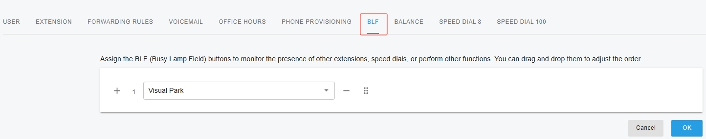
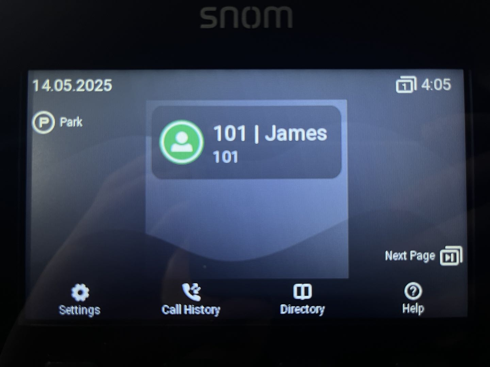
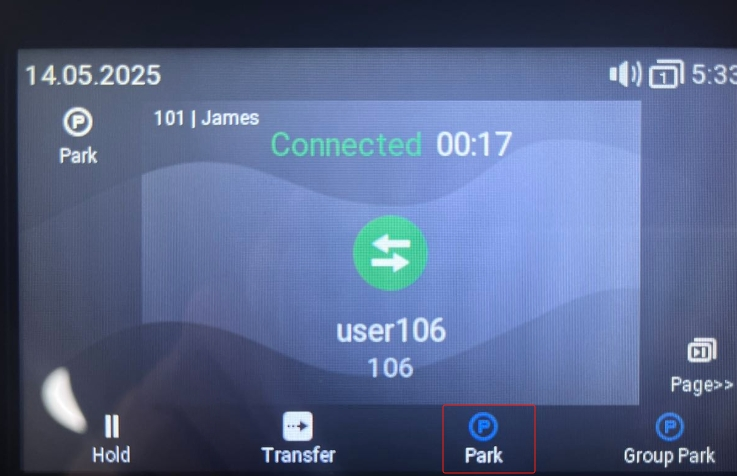
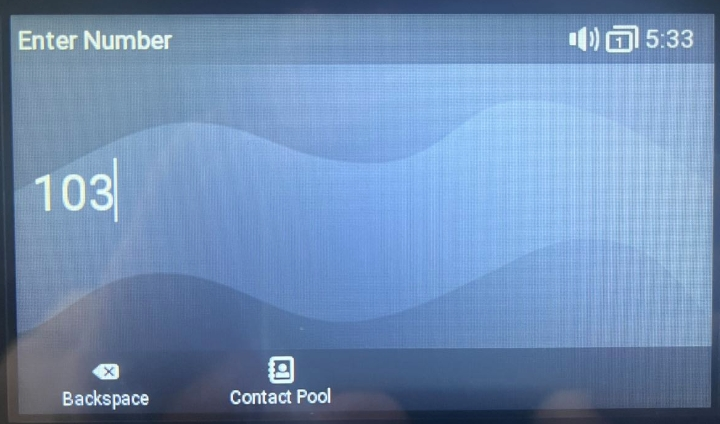
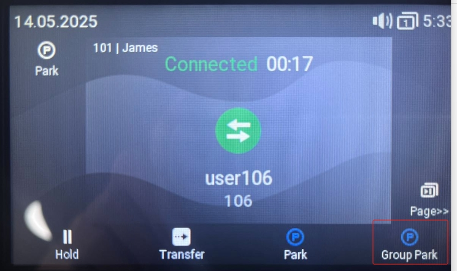
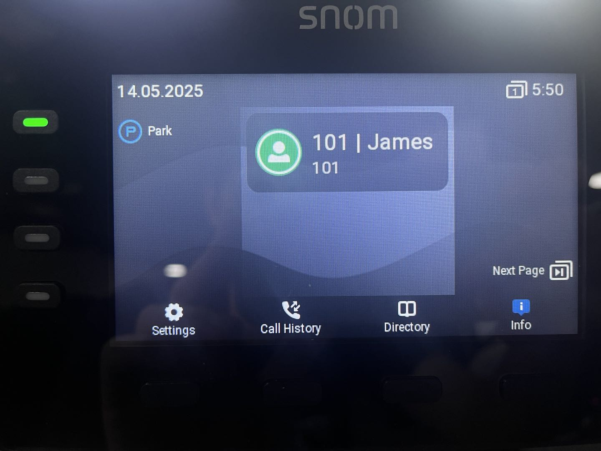
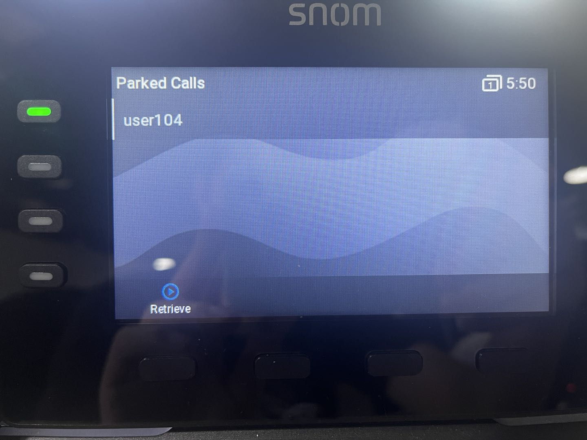

# Using Enhanced Call Park on Snom IP Phones

This article explains how to use **PortSIP PBX’s enhanced call park feature** with **SNOM IP phones**, delivering a modern call parking experience with visual notifications and simplified call handling.

***

### Supported SNOM IP Phone Models

#### Models

* **D1xx series**
* **D7xx series**
* **D8xx series**

#### Firmware Requirements

* **Firmware version 10.1.204.0 or later**

***

### Supported PortSIP PBX Version

* **PortSIP PBX v22.2 or later**

***

### Application Scenarios

#### Enhanced Call Park

**Enhanced Call Park** improves the traditional call park experience by replacing manual Feature Access Code (FAC) dialing with **dedicated Park and Retrieve soft keys** on SNOM IP phones.

When used with PortSIP PBX, Enhanced Call Park provides:

* One-touch call parking and retrieval
* Visual notifications for parked calls
* Integration with PortSIP’s advanced call park capabilities

***

#### Call Park

The **Call Park** service allows users to temporarily suspend an active call and retrieve it later from the same extension or a different extension.

**Typical use case:**\
You are on a call and need to move to another location. You park the call and retrieve it once you reach your destination.

***

#### Group Call Park

**Group Call Park** introduces a hunting mechanism that parks calls against an **available member of a configured Call Park group**, rather than only the user who initiated the park.

**Typical use case:**\
If you and your colleagues belong to the same Call Park group, a parked call may be placed on a colleague’s extension. That colleague can retrieve the call, continue the conversation, or transfer it back to you.

***

#### Call Park Notification

**Call Park Notification** provides a **visual alert** on the SNOM IP phone when a call is parked for a user.

* The phone displays an on-screen notification
* Keys or indicators highlight the parked call
* The user can retrieve the call by pressing the corresponding button

This eliminates the need to manually dial retrieval codes.

***

#### Retrieve Park

A parked call can be retrieved by dialing the **Call Park Retrieve Feature Access Code**, followed by the extension number where the call is parked.

**Typical use cases:**

* Retrieve a call parked on your own extension
* Retrieve a call parked on a colleague’s extension, then transfer the call or notify them

> **Note:** When Enhanced Call Park is enabled, retrieval is typically performed using a **dedicated soft key** rather than dialing a FAC.

***

#### Recall

The **Recall** feature ensures that parked calls are not left unanswered.

* You can configure:
  * The **recall destination** (the parking user or a specified number)
  * The **recall timer**
* If a parked call is not retrieved within the configured time, the PBX automatically recalls the call to the defined destination.

**Example:**\
If the recall timer is set to **30 seconds**, and no one retrieves the call within that time, the PBX recalls the call to the original parking user (or the configured recall destination).

***

### Configure Visual Park Using BLF

To enable **Visual Call Park** on a SNOM IP phone, you must configure a **BLF key** during phone provisioning.

#### Configure the BLF key

1. During the SNOM phone provisioning process, open the **BLF** tab.
2. From the BLF function list, select **Visual Park**, as shown in the screenshot below.
3. Save the configuration and provision (or reprovision) the phone.

<figure><figcaption></figcaption></figure>

#### Result after provisioning

* Once the phone is successfully provisioned:
  * The BLF key is displayed on the phone with the **Visual Park** label.
  * The user can park and retrieve calls using this key without dialing Feature Access Codes (FACs).

> **Note:**\
> BLF configuration changes take effect only after the phone is provisioned or reprovisioned.

<figure><figcaption></figcaption></figure>

***

### Parking a Call

If **James** wants to park a call for his colleague whose extension number is **103**, he can do so using the **Park** key, without dialing any Feature Access Codes (FACs).

<figure><figcaption></figcaption></figure>

#### Steps

1. While on an active call, James presses the **Park** key.
2. When prompted, he enters the destination extension number (`103`).
3. James presses **OK** to confirm.

The IP phone parks the call on **extension 103**.

<figure><figcaption></figcaption></figure>

***

### Group Call Park

Group Call Park allows a user to park a call to a **Call Park group**, making the call available for retrieval by any member of that group.

#### Configure a Call Park Group

1. Sign in to the PortSIP PBX Web Portal as the **Tenant Admin**.
2. Navigate to **Advanced Services > Call Park**.
3. Follow the [configuration guide](./) to create a Call Park group.

**Example configuration:**\
Extensions **101**, **102**, **103**, **104**, and **105** are members of the same Call Park group.

***

#### Park a Call to the Group

In this example:

* **James** has extension **101**
* James is on an active call with **extension 106**

To park the call to the Call Park group:

1. While on the active call, James presses the **Call Park** key on his IP phone (as shown in the screenshot below).
2. The IP phone parks the call to the Call Park group automatically.

#### Call behavior

* The call is parked using the group hunting logic.
* **All members of the Call Park group** receive a parked-call alert notification.
* Any group member can retrieve the parked call using their device’s parked-call button or retrieval method.

> **Result:**\
> James does not need to remember or dial any Feature Access Codes (FACs). Group call parking is completed with a single key press.

<figure><figcaption></figcaption></figure>

***

### Retrieve a Parked Call

When an extension receives a notification indicating that a call has been parked for that user, the **BLF key lights up in green**, signaling that a parked call is available.

<figure><figcaption></figcaption></figure>

#### Retrieve the call

1. The user presses the **green-lit BLF key** on the IP phone (as shown in the screenshot below).
2. The phone displays a list of **parked calls** on the screen.
3. The user selects the desired parked call and presses the **Retrieve** button.

The call is immediately connected to the user.

<figure><figcaption></figcaption></figure>

