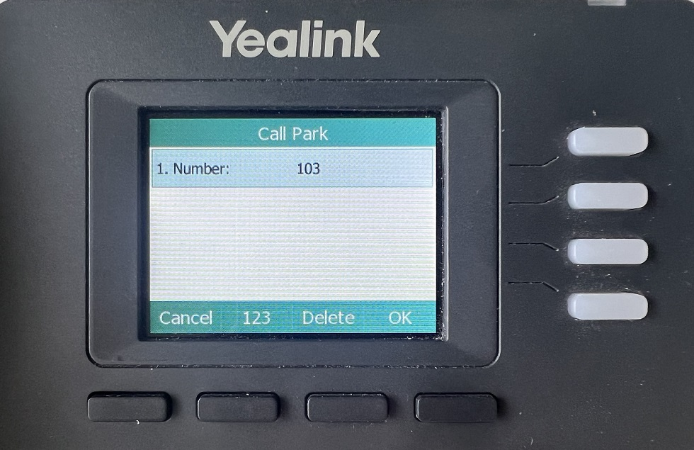

# Using Enhanced Call Park on Yealink IP Phones

This article explains how to use PortSIP PBX’s enhanced call park feature with Yealink IP phones, providing a streamlined call parking experience with visual notifications and one-touch actions.

***

### Supported Yealink IP Phone Models

* T3x series, download the firmware:
  * [T31(T30,T30P,T31G,T31P,T33P,T33G)-124.86.0.163-muti.rom](https://yealink7-my.sharepoint.com/:u:/g/personal/jim_jia_yealink7_onmicrosoft_com/EW8MO9Pup05Mu3Fd8CIqpVUBKFAQ_15J0_EC-epILVQQlA?e=evSJJt)
  * [T31(T30,T30P,T31G,T31P,T33P,T33G)-124.86.0.118-muti.rom](https://dmfile.yealinkops.com/firmware/b842ee3ae2e94aa2b8450314b6867aba/1670571390494/T31\(T30,T30P,T31G,T31P,T33P,T33G\)-124.86.0.118.rom)&#x20;
* T4x series, download the firmware:&#x20;
  * [T46U(T43U,T46U,T41U,T48U,T42U,T44U,T44W)-108.86.0.164.rom](https://yealink7-my.sharepoint.com/:u:/g/personal/jim_jia_yealink7_onmicrosoft_com/EeK1bPv1h2VDnwzjGYwXY9cBD6g5sv8BUHRQg-9LWQppKQ?e=vkbFqs)
  * [T46U(T43U,T46U,T41U,T48U,T42U,T44U,T44W)-108.86.0.118.rom](https://dmfile.yealinkops.com/firmware/18facaab3c9c479e86e1707970ebe6fb/1670571333242/T46U\(T43U,T46U,T41U,T48U,T42U\)-108.86.0.118.rom)
* T5x series, download the firmware:&#x20;
  * [T54W(T57W,T53W,T53,T53C,T54,T57)-96.86.0.163.rom](https://yealink7-my.sharepoint.com/:u:/g/personal/jim_jia_yealink7_onmicrosoft_com/EevWwF0-xKNKgnwOB17mctUBLNnWQpQzuPfKehj8r0e4BQ?e=vj12dh)
  * [T54W(T57W,T53W,T53,T53C,T54,T57)-96.86.0.118.rom](https://dmfile.yealinkops.com/firmware/821074fc924f43a8ad2fe494a0a5cae9/1670571488097/T54W\(T57W,T53W,T53,T53C,T54,T57\)-96.86.0.118.rom)
* T7x, T8x serries, download the firmware from Yealink website.

***

### Application Scenarios

#### Enhanced Call Park

**Enhanced Call Park** improves the traditional call park experience by replacing manual Feature Access Code (FAC) dialing with **dedicated Park and Retrieve soft keys** on Yealink IP phones.

When integrated with PortSIP PBX, Enhanced Call Park provides:

* One-touch call parking and retrieval
* Visual call park notifications
* Seamless interaction with PortSIP’s advanced call park features

***

#### Call Park

The **Call Park** service allows users to temporarily place a call on hold and retrieve it later from the same or another extension.

**Typical use case:**\
You are on an active call and need to move to another location. You park the call and retrieve it once you reach your destination.

***

#### Group Call Park

**Group Call Park** uses a hunting mechanism to park calls against an **available member of a configured Call Park group**, rather than only the original parking user.

**Typical use case:**\
If you and your colleagues are in the same Call Park group, a parked call may be placed on a colleague’s line. That colleague can retrieve the call and either handle it directly or transfer it back to you.

***

#### Call Park Notification

**Call Park Notification** provides a **visual alert** on Yealink IP phones when a call is parked for a user.

* The phone displays an on-screen notification
* Line keys or indicators light up
* The user can retrieve the call by pressing the corresponding soft key

This removes the need to dial retrieval codes.

***

#### Retrieve Park

A parked call can be retrieved by dialing the **Call Park Retrieve Feature Access Code**, followed by the extension number where the call is parked.

**Typical use cases:**

* Retrieve a call parked on your own extension
* Retrieve a call parked on a colleague’s extension, then transfer the call or notify them

> **Note:** When Enhanced Call Park is enabled, retrieval is typically performed using a **dedicated soft key** instead of dialing a FAC.

***

#### Recall

The **Recall** feature ensures parked calls are not left unanswered.

* You can configure:
  * The **recall destination** (parking user or a specified number)
  * The **recall timer**
* If the parked call is not retrieved within the configured time, the PBX automatically recalls the call to the defined destination.

**Example:**\
If the recall timer is set to **30 seconds**, and no one retrieves the call within that time, the PBX recalls the call to the original parking user (or the configured recall destination).

***

### Configuring Soft Keys for Visual Park

When provisioning an IP phone, configure **BLF keys** for **Visual Call Park** and **Visual Group Park** to enable one-touch call parking and retrieval.

<figure><figcaption></figcaption></figure>

#### How it works

* During the IP phone provisioning process, assign BLF keys to:
  * **Visual Park**
  * **Visual Group Park**
* After the phone is successfully provisioned:
  * The BLF keys display the labels **“Visual Park”** and **“Visual Group Park”**
  * These keys allow users to park and retrieve calls visually, without dialing Feature Access Codes (FACs)

#### Example

In the example shown:

* User **James** has extension **101**
* BLF keys have been configured for **Visual Park** and **Visual Group Park**
* The phone displays the corresponding labels, allowing James to manage parked calls directly from the phone interface

<figure><figcaption></figcaption></figure>

***

### Parking a Call

If **James** wants to park a call for his colleague whose extension number is **103**, he can do so using the **Visual Park** key—without dialing any Feature Access Codes (FACs).

#### Steps

1. While on an active call, James presses the configured **Visual Park** key.
2. When prompted, he enters the destination extension number (`103`).
3. James presses **OK**.

The IP phone parks the call on **extension 103**.

***

#### Result

* The call is successfully parked on extension **103**.
* James does **not** need to remember or dial the call park FAC.
* The operation is completed quickly using on-screen prompts.

<figure><figcaption></figcaption></figure>

***

### Group Call Park

Group Call Park allows a user to park a call to a **Call Park group**, making the call available for retrieval by any member of that group.

#### Prerequisites: Configure a Call Park Group

1. Sign in to the PortSIP PBX Web Portal as the **Tenant Admin**.
2. Navigate to **Advanced Services > Call Park**.
3. Follow the [configuration guide](./) to create a Call Park group.

**Example configuration:**\
Extensions **101**, **102**, **103**, **104**, and **105** are members of the same Call Park group.

***

#### Park a Call to the Group

In this example:

* **James** has extension **101**
* James is on an active call with **extension 102**

To park the call to the Call Park group:

1. While on the active call, James presses the **Group Park** key on his IP phone.
2. The IP phone parks the call to the Call Park group automatically.

#### Call behavior

* As shown on the IP phone screen in the screenshot above, pressing the **Group Park** key parks the call to the group.
* **All members of the Call Park group** receive a parked-call alert notification.
* Any group member can retrieve the parked call using their device’s parked-call button or retrieval method.

> **Result:**\
> James does not need to remember or dial any Feature Access Codes (FACs). Group call parking is completed with a single key press, providing a faster and more user-friendly experience.

<figure><figcaption></figcaption></figure>

***

### Retrieve a Parked Call

In this example, **Alice** is on a call with **Bob**. Bob parks the call on **James’s extension (101)**.

#### Visual notification

* On James’s IP phone, a **Retrieve** label is displayed on the screen (as shown in the screenshot below), indicating that a call has been parked on his extension.

#### Retrieve the call

1. James presses the **Retrieve** soft key on his IP phone.
2. The call is immediately connected to James.

> **Result:**\
> James retrieves the parked call with a single key press and does **not** need to remember or dial any Feature Access Codes (FACs).

<figure><figcaption></figcaption></figure>

