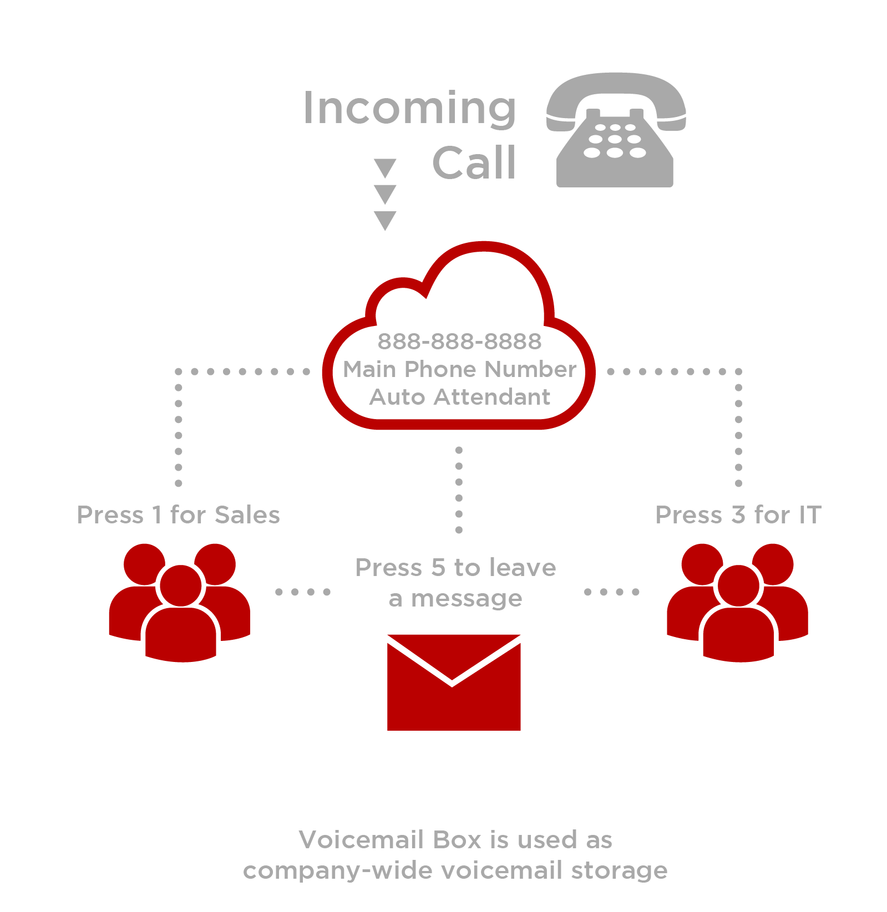
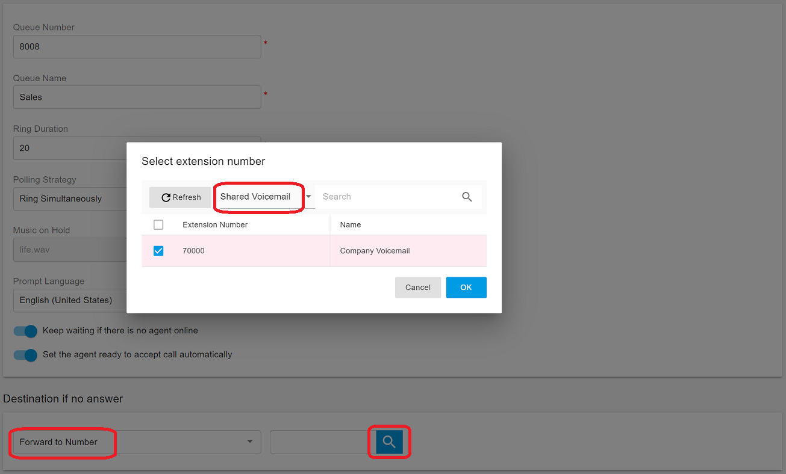
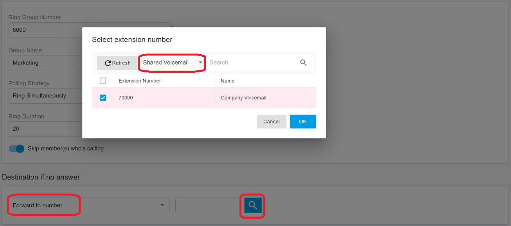
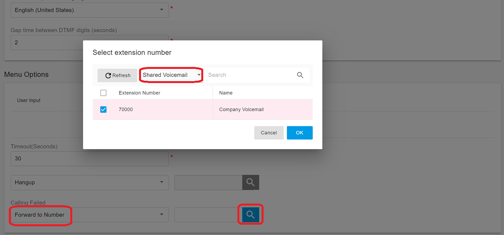
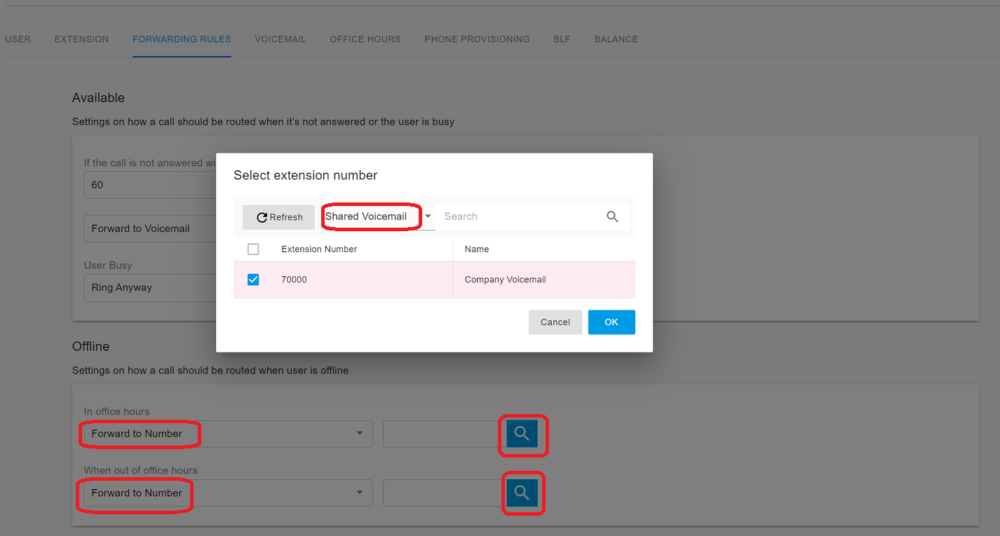
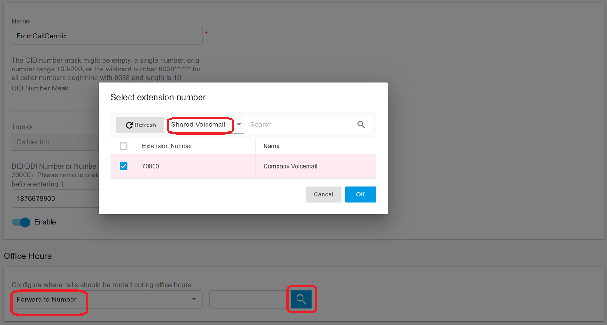
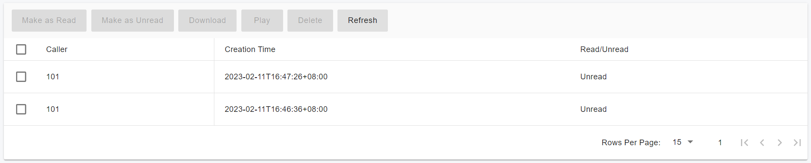

# 15 Shared Voicemail

How to access call group voicemail in some instances, extensions or groups within your company may share a voicemail box. An example would be a voicemail assigned to the main company telephone number, the Virtual Receptionist, the Ring Group, or the Call Queue. There are various ways a shared voicemail box can be used. Here are some examples:

Example A: In this example, there is one companywide voicemail box accessed when a caller calls the main number, reaches the Virtual Receptionist/Auto Attendant, and Presses 5 to leave a message OR if either group (Sales or IT) does not answer.

<figure><figcaption></figcaption></figure>

## **Creating a Shared Voicemail**

* In the PortSIP PBX Web Portal, select **Call Manager** > **Advanced Services** > **Shared Voicemail** and click the **Add** button
* Now enter the below fields:
  * **Extension Number** – This number identifies the shared voicemail from other extensions, also known as the **Shared Voicemail Number**. Specify a new one as needed. Do not specify an existing extension number
  * **Display Name** – Enter a friendly name for the shared voicemail
  * **Prompt Language** – Select the prompt language
  * **Pin Number** – Set a voicemail box password
  * **Email** – Set an email used to receive the notifications
  * **Voicemail PIN Authentication** - If this option is turned on, the PBX will verify the voicemail box PIN when the user accesses this shared voicemail box
  * **Send email when receiving a voicemail**  - Set email notifications to send or not when having a new voice message

## **Redirect Call to Shared Voicemail**

For the below scenarios, we can redirect the call to a shared voicemail.

### Call Queue

Redirect the unanswered queue call to a shared voicemail:

1. Click the **Destination if no answer** combo box and select **Forward to Number**.
2. In the popup window, click the combo box and select **Shared Voicemail**. A list of currently shared voicemails will appear.
3. Choose the shared voicemail you want the call to be redirected to.
4. Click **OK**.

<figure><figcaption></figcaption></figure>

### Ring Group

Redirect the unanswered ring group call to a shared voicemail.

1. Click the **Destination if no answer** combo box and select **Forward to Number**.
2. In the popup window, click the combo box and select **Shared Voicemail**. A list of currently shared voicemails will appear.
3. Choose the shared voicemail you want the call to be redirected to.
4. Click **OK**.

<figure><figcaption></figcaption></figure>

### Virtual Receptionist

Redirect the unanswered virtual receptionist call to a shared voicemail.

1. Click the **Call Failed** combo box and select **Forward to Number**.
2. In the popup window, click the combo box and select **Shared Voicemail**. A list of currently shared voicemails will appear.
3. Choose the shared voicemail you want the call to be redirected to.
4. Click **OK**.

<figure><figcaption></figcaption></figure>

### Extension

Redirect the call to a shared voicemail.

1. Click the call forward destination combo box and select **Forward to Number**.
2. In the popup window, click the combo box and select **Shared Voicemail**. A list of currently shared voicemails will appear.
3. Choose the shared voicemail you want the call to be redirected to.
4. Click **OK**.

<figure><figcaption></figcaption></figure>

### Inbound Rule

Redirect the inbound call to a shared voicemail.

1. Click the call forward destination combo box and select **Forward to Number**.
2. In the popup window, click the combo box and select **Shared Voicemail**. A list of currently shared voicemails will appear.
3. Choose the shared voicemail you want the call to be redirected to.
4. Click **OK**.

<figure><figcaption></figcaption></figure>

## How to Access Shared Voicemail

### To access shared voicemail from an IP phone, app:&#x20;

From any IP phone or client APP, dial `*56` followed by the **shared voicemail number**_. At the greeting, press the_ key to enter the voicemail PIN.&#x20;

### To access shared voicemail from the PBX Web Portal:

In the PortSIP PBX Web Portal, select **Call Manager** > **Advanced Services** > **Shared Voicemail**, double click a shared voicemail, select a shared voicemail then click the **Edit** button, and click the **Voicemail** page.

In the voicemails list, you can download, play, or delete the voicemails.

<figure><figcaption></figcaption></figure>

