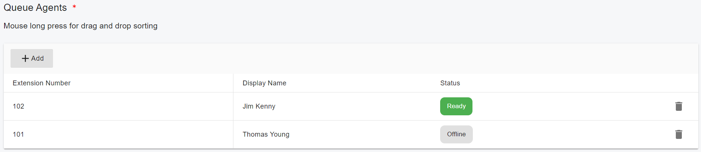
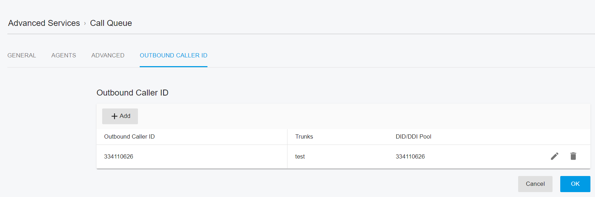

# Configuring Call Queue

### Creating a Call Queue

From the Web Portal, navigate to **Advanced Services > Call Queues** and click **Add**.\
Configure the following settings:

***

### Basic Settings

**Queue Number**\
Specifies the queue number. This number must **not conflict with an existing extension**.

**Queue Name**\
Enter a **descriptive name** for the queue.

**Ring Duration**\
Defines the **ring timeout (in seconds)** for each agent before the call is considered unanswered and routed according to the selected strategy.

**Music on Hold**\
Select the **music file** played to callers while they are waiting in the queue.

**Play Periodic Announcement**\
When this option is enabled, you can upload an announcement audio file and configure a Periodic Announcement Interval (in seconds).\
The queue will play the announcement periodically to callers while they are waiting, for example, to deliver informational messages or advertisements.

**Night Mode**\
Set the queue with Night Mode activated or deactivated.

***

### Call Distribution Strategy (Polling Strategy)

**Polling Strategy**\
Determines how calls are distributed to available agents:

* **Ring Simultaneous** – All queue members ring at the same time.
* **Prioritized Hunt** – Agents ring sequentially in the configured order.
* **Cyclic Hunt** – Agents ring in a round-robin order; the agent who rang least recently is prioritized.
* **Least Worked Hunt** – Calls are routed to the agent who has answered the fewest calls from this queue.
* **Skill-Based Routing – Prioritized Hunt** – Rings available agents serially, starting with the highest skill group.
* **Skill-Based Routing – Cyclic Hunt** – Rings the agent who has not been rung for the longest time, starting with the highest skill group.
* **Skill-Based Routing – Least Worked Hunt** – Rings the agent who has answered the fewest calls, starting with the highest skill group.

***

### Agent State Management

**Keep Waiting If There Are No Members Online**\
If enabled, callers remain in the queue even when no agents are online, until the maximum wait time is reached.

**Set Agent to Ready Automatically**\
When enabled, agents are automatically set to **Ready** upon registration and after completing or missing a call.\
When disabled, agents must manually sign in and change their status to **Ready** using a FAC or the REST API.

**Set Agent Status to Wrap-Up After Non-ACD Calls**\
If enabled, agents are automatically placed into **Wrap-Up** after completing a non-ACD call.\
This option is ignored if **Set Agent to Ready Automatically** is enabled.

**Last Called Agent Routing**\
Enables routing repeat callers to the agent who last handled their call.\
For more details, see **Skill-Based Routing**.

**Wrap-Up Time (Seconds)**\
When this option is enabled, you can configure a **wrap-up duration** for agents.\
Once the specified time expires, the agent automatically transitions from **Wrap-Up** to **Ready**.

***

### Destination If No Answer

**Destination If No Answer**\
Defines the **maximum queue waiting time** and the action to take if the call remains unanswered.\
If no agents are logged in and **Keep Waiting If There Are No Members Online** is disabled, this destination is triggered immediately.

***

### Destination for Night Mode

**Destination for Night Mode**\
Defines how incoming calls are handled when **Night Mode** is active.\
For details, refer to the **Night Mode** section of this guide.

***

### Queue Options

**Announce Queue Position**\
Controls how the caller’s position in the queue is announced:

* Don’t announce the position
* Periodically announce position
* Announce once when connected, then periodically

**Play Intro Prompt Before Calling Agents**\
Allows you to configure a custom introduction prompt and music-on-hold file, and control whether the full prompt plays before agents are rung.

**Maximum Queue Wait Time**\
Defines the maximum time a caller can remain in the queue.\
Once exceeded, the call is treated as **Abandoned** and follows the **Destination If No Answer** settings.

**SLA Time (Seconds)**\
Defines the **Service Level Agreement (SLA)** threshold.\
Calls waiting longer than this value are marked as **SLA breached** in reports and trigger notifications.

**Example:**\
If calls must be answered within **3 minutes**, set the SLA time to **180 seconds**.

***

### Configuring Queue Agents

In the **Agents** tab, you can select the agents assigned to the call queue.\
To change the order of the agents, simply **drag and drop** them into the desired sequence.

<figure><figcaption></figcaption></figure>

***

### Notifications

You can configure the system to send **email notifications** when:

* A call **exceeds the SLA time**, or
* A call is **lost or abandoned**

To enable email notifications:

* The **email server** must be properly configured
* The **notification option** must be enabled

For detailed instructions, refer to [**Configuring Email Notifications**](../configuring-email-notifications.md).

***

### Outbound Caller ID

When an **external (PSTN) number** is configured as the **Destination if No Answer**, the call is forwarded to a SIP trunk based on the **matched outbound rule**.

In this scenario, you can specify the **Outbound Caller ID** to be used for the forwarded call.\
The outbound caller ID may **replace certain SIP headers or fields**, depending on the trunk configuration.

For more details, refer to:

* [**Outbound Parameters**](../7-trunk-management/)
* [**Handle Outbound Calls Through SIP Trunk**](../7-trunk-management/handle-outbound-calls-through-sip-trunk.md)

<figure><figcaption></figcaption></figure>

