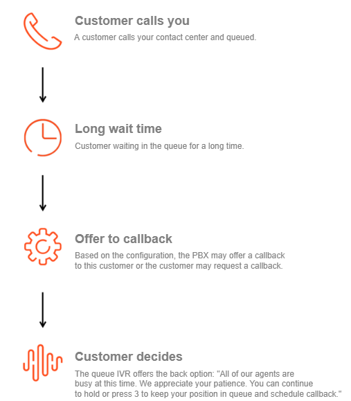
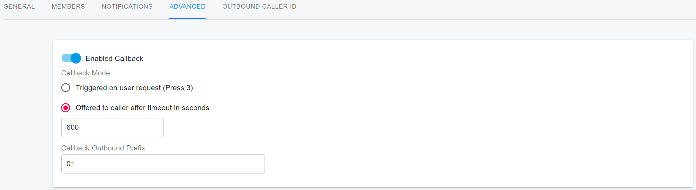

# Configuring Queue Callback and Queue Exit

### Queue Callback

A **callback** allows callers to request a return call instead of waiting on hold when agents are unavailable. In contact center environments, callbacks help reduce queue congestion, improve agent efficiency, and enhance customer experience by eliminating long hold times and potential long-distance charges.

By offering callbacks, customers can **retain their position in the queue** and receive a call back automatically when an agent becomes available.

<figure><figcaption></figcaption></figure>

***

#### Callback Configuration Overview

**Tenant Administrators** can configure and manage callback rules for call queues.\
When enabled, the queue can automatically offer callers the option to schedule a callback while preserving their queue position.

***

#### Callback Outbound Prefix

You can configure a **Callback Outbound Prefix** to ensure that callback calls match an appropriate **outbound rule** when dialing the caller.

**Callback Outbound Prefix Example:**

Assume a caller with the number **12345** requests a callback:

* **Without an outbound prefix**\
  The PBX dials the number exactly as received:\
  `12345`
* **With an outbound prefix configured**\
  The PBX prepends the configured prefix before dialing.\
  For example, if the prefix is set to **003**, the PBX dials:\
  `00312345`

This is commonly used for PSTN access codes, country codes, or carrier routing rules.

<figure><figcaption></figcaption></figure>

***

#### Callback Trigger Modes

You can configure how callbacks are offered to callers using one of the following modes.

**Callback Requested by the Caller**

In this mode, the caller can manually request a callback by pressing a predefined DTMF key (for example, **3**) while waiting in the queue.

When the caller presses **3**, the following prompt is played:

> “Please confirm your phone number in full, followed by the pound key (#), so that we may call you back.\
> Alternatively, if you would like us to contact you on the current number, just press #.\
> To continue holding, please press \* and we will be with you as soon as possible.”

**Callback Offered After Queue Timeout**

In this mode, the callback option is **automatically offered** after the caller has waited longer than the configured **Offered to the Caller After Timeout** (in seconds).

When the timeout is reached, the queue plays the following prompt:

> “All of our agents are busy at this time. We appreciate your patience.\
> You can continue to hold, or press 3 to keep your position in the queue and schedule a callback.”

If the caller presses **3**, the following prompt is played:

> “Please confirm your phone number in full, followed by the pound key (#), so that we may call you back.\
> Alternatively, if you would like us to contact you on the current number, just press #.\
> To continue holding, please press \* and we will be with you as soon as possible.”

***

#### Callback Completion Flow

Once the caller confirms their phone number:

1. The original call **ends automatically**
2. The caller’s **queue position is preserved**
3. When the caller reaches the front of the queue:
   * The PBX calls an **available agent**
   * Once the agent answers, the PBX places the **callback call to the caller**
4. The callback is considered **complete** when the caller answers the callback call

***

### Queue Exit Options

**Queue Exit Options** allow callers who are waiting in a call queue to **proactively leave the queue** and choose an alternative action, instead of simply hanging up and abandoning the call.\
This is typically implemented through an **IVR option**, where the caller presses a designated key on their phone keypad (for example, **press 8**).

The primary purpose of Queue Exit Options is to **improve the caller experience**, reduce frustration during long wait times, and **lower call abandonment rates** by giving callers more control over how their call is handled.

***

#### Common Queue Exit Destinations

When a caller exits the queue, the call can be routed to one of the following **configured destinations**:

* **Voicemail**
* **Shared Voicemail**
* **IVR**
* **Another Queue**
* **Ring Group**
* **Extension**
* **External Number**

