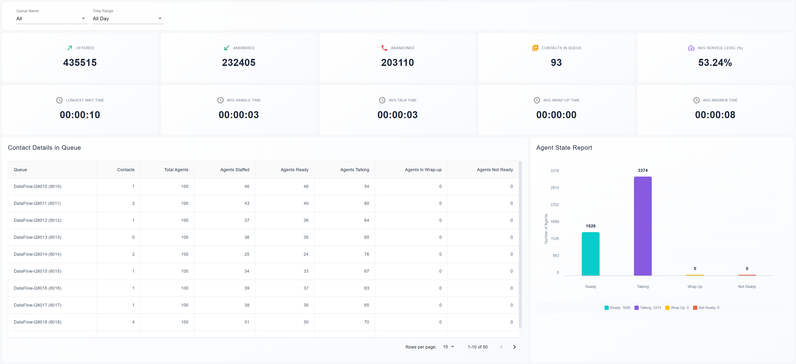
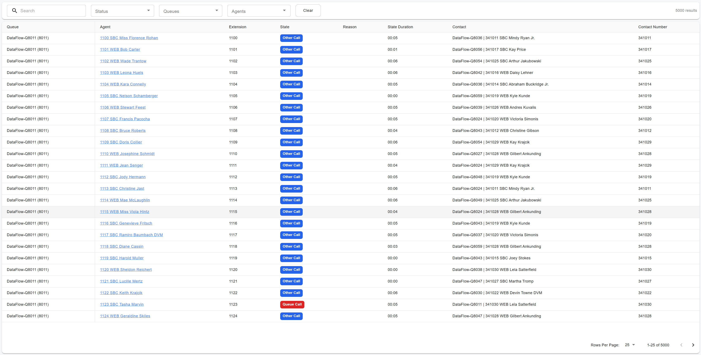

# Live Wallboards

### Live Wallboards Overview

PortSIP Contact Center Live Wallboards provide real-time visibility into contact center performance through dynamic, widget-based dashboards. These wallboards allow supervisors and operations teams to monitor key metrics at a glance and tailor the display to their specific operational needs.

Live wallboards can also be displayed on **large screens** in shared environments, making them ideal for team rooms, operations centers, and supervisor dashboards—ensuring everyone stays aligned on current queue and agent performance.

***

### Permissions

Access to Live Wallboards is controlled by user roles and permissions:

* Users assigned the **Tenant Administrator** or **Queue Manager** role can access Live Wallboards by default.
* If you create a **custom role**, you must explicitly grant the **Data Analytics** permission.
  * Any user assigned to this custom role will then be able to access Live Wallboards.

This role-based access control ensures secure and appropriate visibility across your contact center operations.

***

### Accessing Live Wallboards

<figure><figcaption></figcaption></figure>

Follow the steps below to access Live Wallboards in the PortSIP PBX web portal:

1. Sign in to the PortSIP PBX web portal using one of the following methods:
   * Sign in as a **System Administrator**, then switch to the desired tenant.
   * Sign in directly as a **Tenant Administrator** or **Queue Manager**.
2. Navigate to the Wallboards:
   * Go to **Contact Center > Wallboard** to view live wallboards for call queues.
   * Go to **Contact Center > Agent Activity** to view real-time agent activity boards.
3. View detailed information:
   * Click on a **queue** to view detailed statistics for that queue.
   * Click on an **agent** to view detailed real-time information for the selected agent.

***

### Queue Details

Click a **queue name** to view detailed information about the selected queue, including the callers currently waiting in the queue.

<figure><figcaption></figcaption></figure>

***

### Agent Activity

Navigate to **Contact Center > Agent Activity** to view the real-time status of all agents, as shown in the screenshot below.

<figure><figcaption></figcaption></figure>

***

### Agent Details

Click an **agent** to display real-time information for that agent, including current status and activity details.

<figure><figcaption></figcaption></figure>

