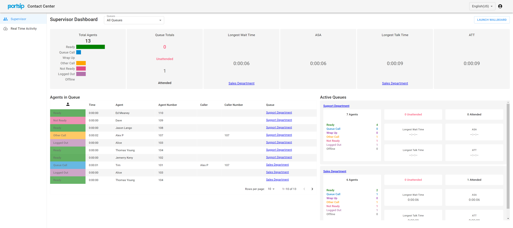
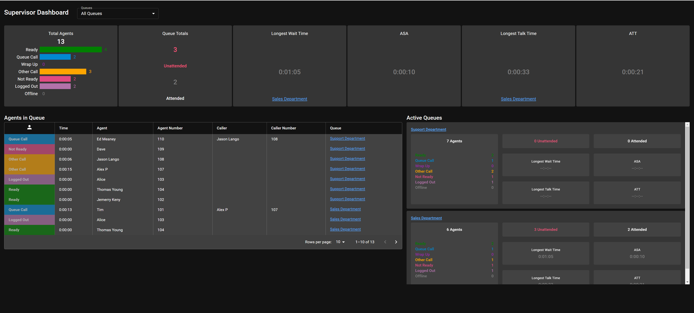

# Wallboards

Use PortSIP Contact Center wallboards to display real-time reports within widgets, so that you can monitor your contact center to suit your needs.

Wallboards can broadcast information on a large screen for a team of people.

## Permissions

Only users who are either **Tenant Administrators** or **Queue Managers** have permission to sign in to the Wallboards.

## Access Wallboard

Please follow the below steps to access the Wallboard:

* Sign in as a Tenant Administrator or Queue Manager to the PortSIP PBX web portal
* Navigate to the **Contact Center** menu, then click on **Wallboards.** A new login page will then appear.&#x20;
* Just enter the user name (not extension number), user password (not extension password), and tenant SIP domain to sign in.

## Supervisor Dashboard

<figure><figcaption></figcaption></figure>

## Real-Time Activity

<figure><figcaption></figcaption></figure>

## Queue Details

You can click on a queue name to view the details, such as the waiting callers in the queue.

<figure><figcaption></figcaption></figure>

## Wallboard

Display the wallboard by clicking the **Launch Wallboard** button.

<figure><figcaption></figcaption></figure>

