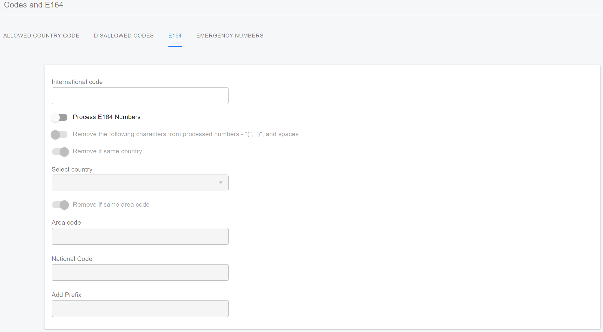
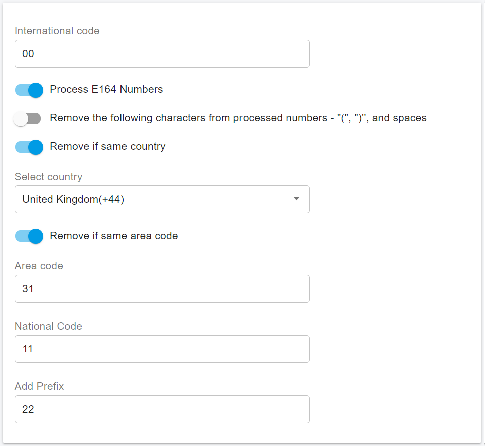
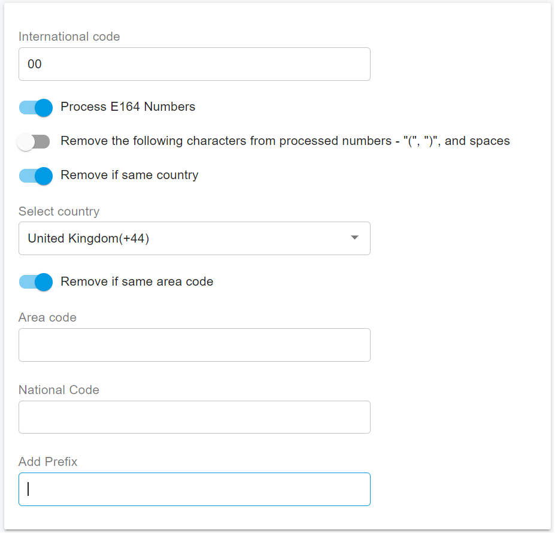

# 18 E164 Number Processing

E.164 is an [international standard](https://en.wikipedia.org/wiki/International_standard) ([ITU-T](https://en.wikipedia.org/wiki/ITU-T) Recommendation), titled _The international public telecommunication numbering plan_, that defines a [numbering plan](https://en.wikipedia.org/wiki/Telephone_numbering_plan) for the worldwide [public switched telephone network](https://en.wikipedia.org/wiki/Public_switched_telephone_network) (PSTN) and some other data [networks](https://en.wikipedia.org/wiki/Telecommunications_network).

E.164 defines a general format for international [telephone numbers](https://en.wikipedia.org/wiki/Telephone_number). Plan-conforming telephone numbers are limited to only digits and to a maximum of fifteen digits.[\[1\]](https://en.wikipedia.org/wiki/E.164#cite_note-:0-1) The specification divides the digit string into a country code of one to three digits, and the subscriber telephone number of a maximum of twelve digits.

In PortSIP PBX, E164 processing converts user-dialed numbers (including those with a leading +) into a standardized format that can be interpreted by your outbound rules and provider.

Using E164 processing is optional, but it can help solve the issue of handling numbers dialed with a leading +. It converts these numbers into a format that can be interpreted by the rules based on the call type (local, national, or international).

## E164 Settings

After signing in as an admin user of a tenant, navigate to the **Blacklist and Codes > Codes and E164 > E164** menu. The settings will appear as shown in the screenshot below.

<figure><figcaption></figcaption></figure>

**International Code:** If you call a different country with "**Select country**" using the E164 format then the number will be converted and the international code will be added. If you are in the US for example this will be 011. This will enable you to make international calls without the "+" Example: The number dialed as +44123456789 will be converted to 01144123456789.

**Process E164 Numbers:** if this option is disabled, the PBX will don't convert the dialed number even if it is with a leading +.

**Remove the following characters from processed numbers - "(", ")", and spaces**: removed the special characters in the dialed number if this option is enabled.

**Remove if same country:** When this option is selected and you try calling the same country using the E164 format the country code will be removed from the called number. Example: The number dialed as +12345678910 will be converted to 2345678910.

**Select Country**: Choose the country you are currently located in so that the PBX can determine your country code. For our examples, let’s use the United States (US) as our country.

**Area Code and Remove if same Area Code:** Enter your area code here. If you’re making calls within your area and the area code isn’t required, you can choose to remove it by selecting the ‘**Remove if same Area Code**’ option. For example, if our area code is set to 813 and we dial +181345678910, it will be converted to 45678910.

**National Code:** If you need to add a national code when making calls, you can enter it here and it will be automatically added to the beginning of the number during processing. For example, if the national code is set to 8 and we dial +12345678910, it will be converted to 82345678910.

**Add Prefix:** You can add a prefix here if it’s required or if you want to use it to select an outbound rule. E164 rules are processed before outbound rules. For example, if the prefix is set to 2 and we dial +12345678910, it will be converted to 22345678910. 

## Non E164 Call

If the dialed number without the leading + and begins with the "**International Code**", then the call will be recognized as an international call. The PBX will check this call against the Blacklist and "**Codes > Codes and E164 > Allowed Country Code**".&#x20;

For example, if the International Code is set to "**00**" and we dial 004412345678, the PBX will check if 44 is an allowed country code. If it's not allowed, the call will fail. In this example, the PBX will also check the caller role and permissions. If they don't have permission to make international calls, then the call will fail.

If the call is not an international call, the PBX will check the caller role and permissions. If they don't have permission to make domestic calls, then the call will fail.

## E164 Call

If the dialed number begins with + then this call will be recognize as International call in E164 format.

### **Process E164 Numbers is disabled**

if the "**Process E164 Numbers**" is disabled, the PBX will check this call against the Blacklist and "**Codes > Codes and E164 > Allowed Country Code**". For example, if we dial +4412345678, the PBX will check if 44 is an allowed country code. If it's not allowed, the call will fail. In this example, the PBX will also check the caller role and permissions. If they don't have permission to make international calls, then the call will fail.

### Process E164 numbers is enabled

if the "**Process E164 Numbers**" is enabled, the leading "+" will be removed anyway. After that, the called number will be processed as the below flows.

#### 1. Dialed number starts with the "Select country" code

* This call will be recognized as a national call, the country code will be removed or not is depends on the option "**Remove if same country**".
* Convert the dialed number as the rule "**Prefix + National Code + Dialed number**" then get an new dialed number.
* Check the caller role and permissions. If they don't have permission to make domestic calls, then the call will fail.

<figure><figcaption></figcaption></figure>

Example: If "**Process E164 Numbers**" is enabled and the "**Select Country**" code is set to 44 with an Area Code of 31, and both "**Remove if same country**" and "**Remove Area Code**" are enabled with a "**National Code"** of 11 and an **"Add Prefix"** of 22, then when a user dials +4431867762, the PBX will remove the "+" and country code 44, then remove the area code 31. It will then prepend the National Code 11 and Prefix 22. Finally, the dialed number will be converted to 2211867762.

#### 2. Dialed number does not start with the "Select Country" code

* If an E164 number doesn’t begin with the **Country Code**, the PBX will convert the dialed number according to the rule "**Prefix + International Code + Dialed number**" to generate a new dialed number.&#x20;
* If "**Add Prefix**" is empty, then this call will be recognized as an international call; otherwise, it will be considered a national call.&#x20;
* If it’s an international call, the PBX will check this call against the Blacklist and "**Codes > Codes and E164 > Allowed Country Code**".

<figure><figcaption></figcaption></figure>

For instance, as shown in the above screenshot, if we dial **+3312345678**, the call is recognized as an international call. The PBX converts the dialed number to **003312345678** and checks if **33** is an allowed country code. If it’s not allowed, the call will fail. Additionally, the PBX checks the caller’s role and permissions. If they don’t have permission to make international calls, then the call will also fail.

