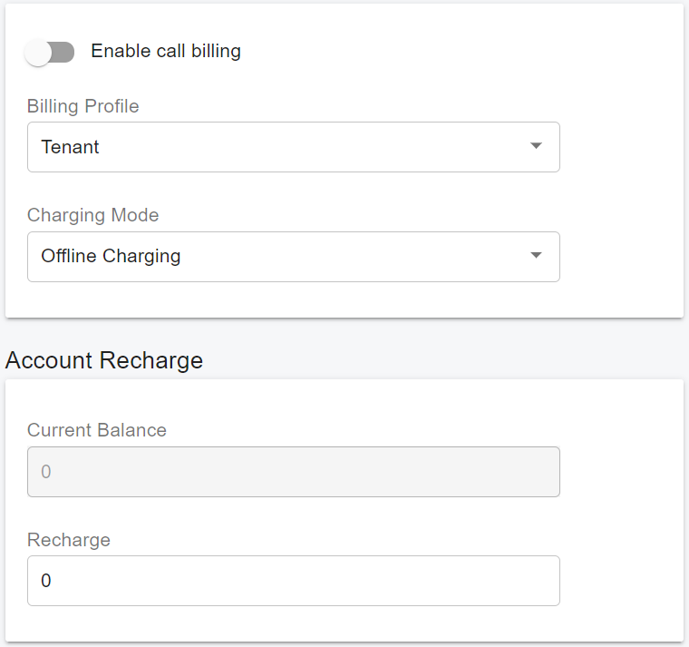
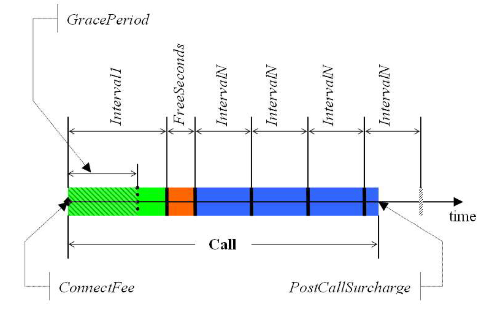
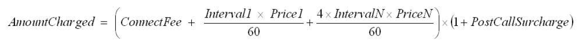

# 19 Billing

PortSIP PBX integrates a complete Call Accounting System through which you can generate a wide variety of reports manually and automatically.

After signing in as a tenant administrator, select **Billing > Settings** from the menu. From there, you can enable or disable the billing feature.

## Billing Settings

<figure><figcaption></figcaption></figure>

**Enable Call Billing:** Turn it on to enable the billing feature.

**Billing Profile:** This feature allows you to set billing to be either from the tenant or from a user.

**Charge Mode:** This feature allows you to choose between **Online** and **Offline** charging.

* **Online Charging:** The PBX will check the balance for each call that matches the billing rule. It verifies if the balance is sufficient, deducts the appropriate amount, and records the cost in the **CDR** field once the call is completed. If the billing profile is set to the **tenant**, it will check the tenant’s balance; if it is set to the **extension**, it will check the extension’s balance.
* **Offline Charging:** The PBX does not check the balance but will calculate the call cost and record it in the **CDR** field.

## Account Recharge

**Current Balance:** This displays the current balance of the tenant. It is read-only and cannot be modified.

&#x20;**Recharge:** This allows you to recharge the tenant’s balance.

## Recharge for the User

From the menu, select **Call Manager > Users**. Edit a user and click on the “**Balance**” tab. On that page, the tenant administrator can recharge a user’s balance.

## Managing Billing Rules

Select **Billing > Billing Rules** from the menu. From there, you can create, modify, delete, import, or export billing rules.

PortSIP PBX uses the called number to match the billing rule prefix; that call will be billed if the prefix is matched. For billing rules, the prefix cannot be duplicated.

### Parameters of billing rules

There are a few parameters that need to be entered when creating the billing rule:

* FreeSeconds - in seconds
* ConnectFee - in monetary units
* PostCallSurcharge - in percent (0.01 means 1%)
* GracePeriod - in seconds
* Price' - in monetary units per minute
* PriceN - in monetary units per minute
* Interval' - in seconds
* IntervalN - in seconds

The simplest parameters are _ConnectFee_, which is a fixed amount of money charged for each successful call regardless of its duration; and _PostCallSurcharge_ which is additional charge applied. It is calculated on the percentage of the amount charged, that is if the call costs 1 dollar and the _PostCallSurcharge_ is 0.01, the actual amount charged will be 1.01 dollar.

The following picture illustrates how the calls are charged. The process starts with comparing value of the _GracePeriod_ parameter with the duration of the call. The _GracePeriod_ parameter determines the minimum duration of the call that will be subject of charge. Calls with durations of less than this value are not charged at all. _GracePeriod_ value of 0 second and 1 second provide almost the same behavior except that when the _GracePeriod_ is 1 second, connected calls with zero duration won't be charged with connection fee.

A _ConnectFee_ is charged immediately upon connection, and all calls shorter than Interval’ will be rounded to _Interval1_ seconds. _FreeSeconds_ are granted after the _Interval1_, so this part of the call is not charged, and calls shorter than (_Interval1_ + _FreeSeconds_) will be rounded to _Interval1_ seconds. If call is longer than (_Interval1_ + _FreeSeconds_) remaining portion will be rounded up to multiple _IntervalIN_ seconds. After that, the _PostCallSurcharge_ is applied to the total amount charged.

<figure><figcaption></figcaption></figure>

The call illustrated in the figure will be charged using the following formula:

<figure><figcaption></figcaption></figure>

* Connect fee - monetary units
* Price 1 - monetary units
* Price N - monetary units
* Interval 1 - seconds
* Interval N - seconds
* Post call surcharge - fractional based on the setting in the Tariff/Destination Set (E.g. for 10% fractional = 0.1)
