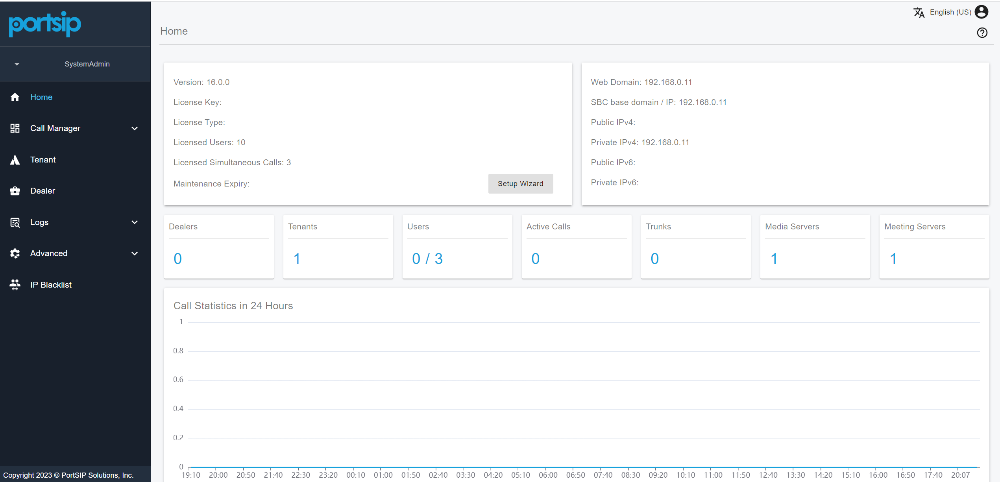
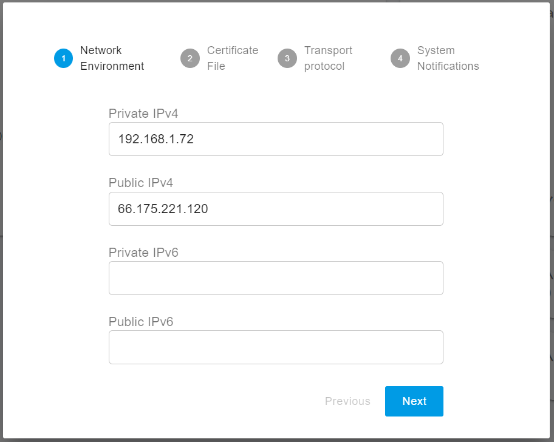
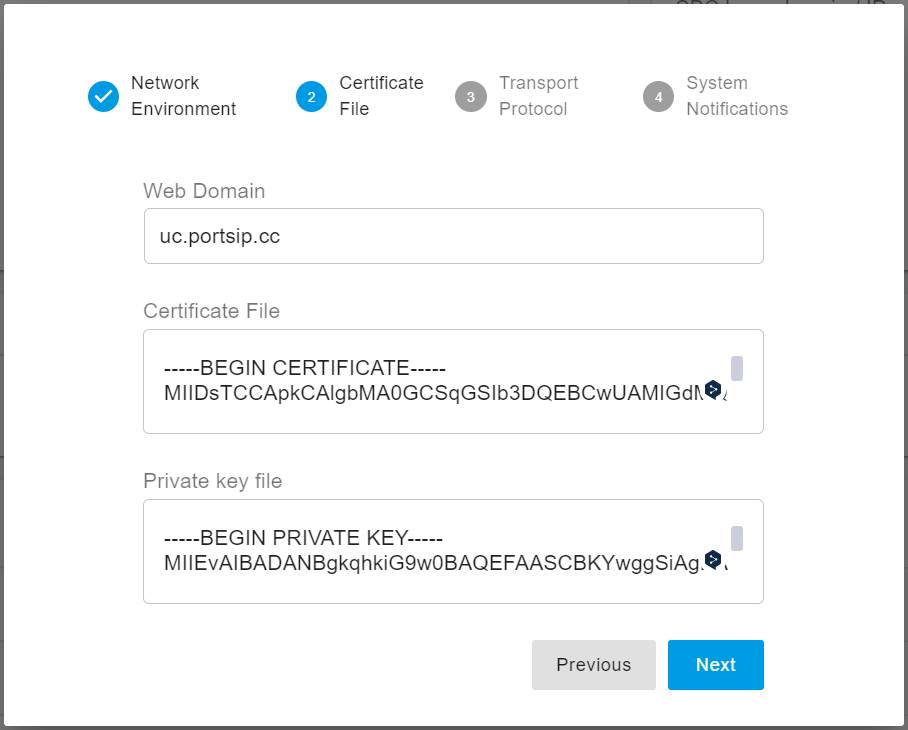
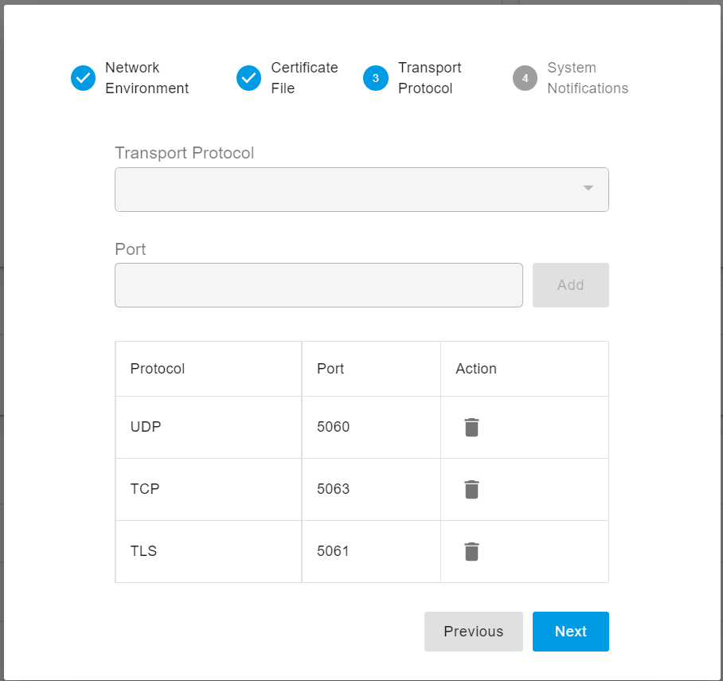

# 2 Configuring the PortSIP PBX

If you have already completed the configurations in the [**Installation of the PortSIP PBX**](1-installation-of-the-portsip-pbx-1/) step, please skip this article.

Once the PortSIP PBX is successfully installed, you can access the web portal by opening your browser and navigating to [**https://66.175.221.120:8887**](https://66.175.221.120:8887). If your browser displays an SSL certificate warning, you may safely ignore it and proceed. You will then be directed to the login page, as shown in the screenshot below.

<figure><figcaption></figcaption></figure>

Click on **"Sign in as the administrator or dealer"** to navigate to the administrator login page, as shown in the screenshot below. Enter **admin** as both the username and password to log in to the web portal.

<figure><figcaption></figcaption></figure>


Please change the default password of the admin after you log in.


After successfully logging in to the PBX Web Portal, the dashboard will appear as shown in the screenshot below.

<figure><figcaption></figcaption></figure>

## Setup Wizard

If the setup wizard has not been completed, it will launch automatically upon logging into the web portal. Some settings are required to get the PBX operational.

### **Step 1: Network Environment**

* If the PBX server has a static public IP address, enter it in the **Public IPv4** field. If the server does not have a static public IP, leave the **Public IPv4** field blank.
* You must enter the private IPv4 address. If the server does not have a private IP, use the public IP address instead.
* The IP addresses must be accessible by your SIP client, as the IP address entered here will serve as the SIP server IP for the PBX. This address is essential when a SIP client or IP phone registers to PortSIP PBX and should be configured as the **Outbound Proxy Server**.
* If the PBX is deployed in the cloud, both **Private IPv4** and **Public IPv4** must be entered. If the PBX is on a LAN, only the **Private IPv4** should be entered.


The loopback interface (127.0.0.1) is unacceptable for the private IP. Only the static IP for the LAN where the PBX is located is allowed (do not use DHCP dynamic IP).&#x20;


<figure><figcaption></figcaption></figure>

### Step 2: SSL Certificate

To enable TLS transport for SIP and secure HTTPS access to the Web Portal and REST API, a trusted SSL certificate must be uploaded to the PBX during this step.

* You'll need to have a web domain. For example, you can purchase a domain from a provider like GoDaddy and point it to your PBX IP address.
* Additionally, you must purchase a trusted SSL certificate for this domain to avoid browser warnings. Recommended certificate providers include Digicert, GeoTrust, GoDaddy, or others.
* If you do not have a domain or SSL certificate, you can simply use the PBX IP address as the **Web Domain** and proceed with the default certificate. However, note that PortSIP PBX uses a self-signed certificate by default, which will cause most browsers to block the connection and display a security warning.

Please follow up on this guide for purchasing the SSL certificate: [Preparing TLS Certificates for TLS/HTTPS/WebRTC](certificates-for-tls-https-webrtc/).

You have two certificate files.

* portsip.key
* portsip.pem

To configure the certificates:

1. In the **Web Domain** field, enter **uc.portsip.cc**.
2. Open the **portsip.pem** file in a text editor like Windows Notepad, and copy its entire contents into the **Certificate File** field.
3. Similarly, open the **portsip.key** file, and copy its entire contents into the **Private Key File** field.

<figure><figcaption></figcaption></figure>

### Step 3: Transport Protocol

You can configure the transport layer protocol for SIP signaling by clicking the **Add** button. The default transport ports are:

* **UDP:** 5060
* **TCP:** 5063
* **TLS:** 5061

You are free to change these default ports to any preferred port, but ensure that the new port is not already in use by other applications.


After adding a new transport protocol, be sure to update your firewall rules to allow traffic on the newly assigned transport port. The IP Phone client app will use this transport and port to connect to the PBX.


<figure><figcaption></figcaption></figure>

### Step 4: System Notifications

To enable email notifications in PortSIP PBX for system alerts, you must configure the SMTP settings.

**Google**

If you’re using Google’s SMTP server, ensure that **less secure apps** is enabled for your Gmail account. For more details, refer to Google's documentation:

[Less secure apps & your Google Account ](https://support.google.com/accounts/answer/6010255?hl=en)

Additionally, you’ll need to select either SSL or TLS as the security protocol for the Google SMTP server. Use the following settings:

* SMTP Server: smtp.gmail.com
* Port: 587
* Username: The username of the SMTP server
* Password: Your password
* Sender Email: The sender's email address
* Use TLS: ON

**Microsoft 365**

If you’re using the Microsoft 365 SMTP server, SSL or TLS must also be selected as the security protocol. Use the following settings:

* SMTP Server: smtp.office365.com
* Port: 587
* Username: The username of the SMTP server
* Password: Your password
* Sender Email: The sender's email address
* Use TLS: ON

Once a critical event occurs in the PBX, alert emails will be sent to the specified **Recipients**.

## **Reboot to Apply the Certificate**

If you uploaded a trusted certificate in  [Step 2: Certificate File](2-configuring-the-portsip-pbx.md#step-2-certificate-file) (instead of the default self-signed certificate), you need to restart the PBX to apply the certificate. Use the following commands to reboot the PBX:

```
cd /opt/portsip
/bin/sh pbx_ctl.sh restart
```

For Windows, just simply restart the server.

