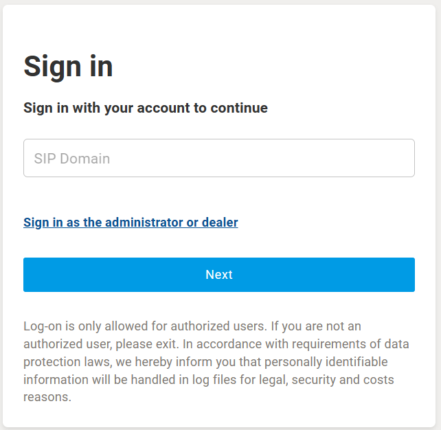
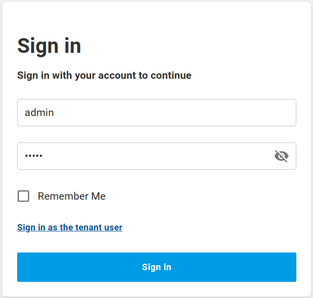
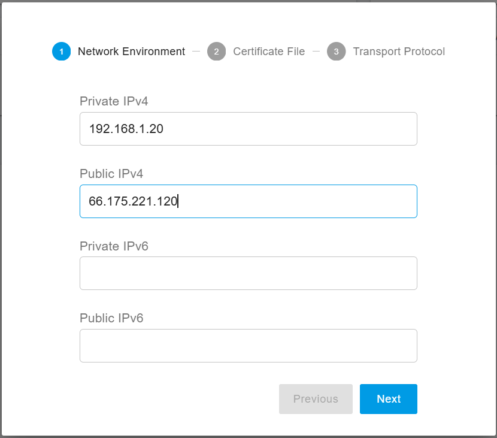
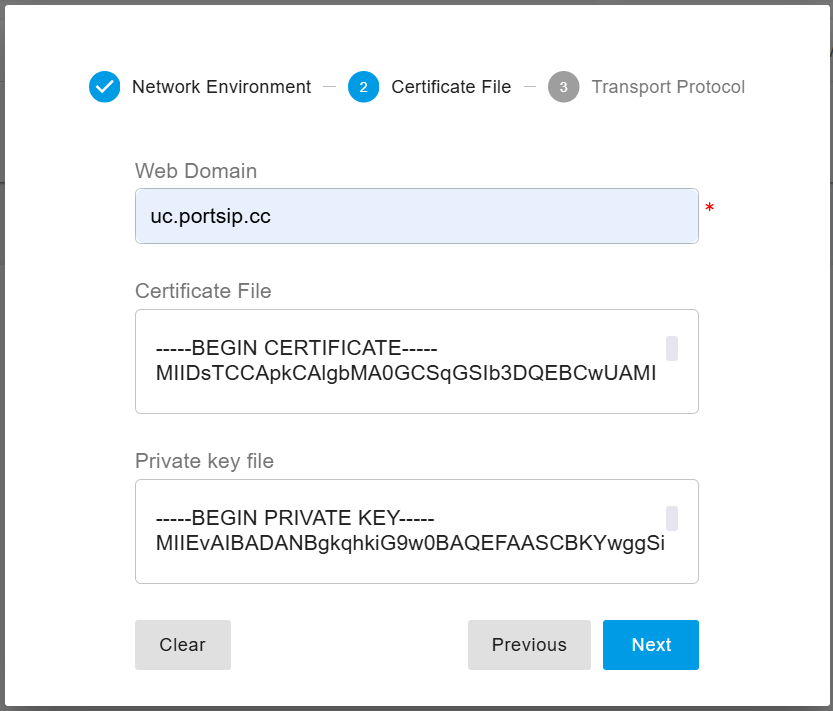
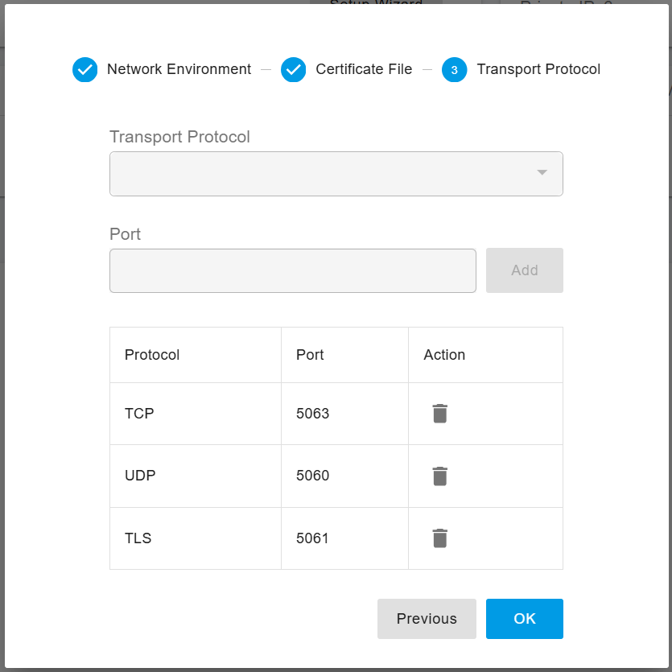

# 2 PortSIP PBX Management

### Configure PortSIP PBX

> **Note**\
> If you have already completed the [Configuring PBX in Install PortSIP PBX](../installation-of-portsip-pbx-v22.3-beta-version/install-portsip-pbx.md#configure-the-portsip-pbx), you may skip this section.

***

### Accessing the PBX Web Portal

Once the **PortSIP PBX** installation is complete, open a web browser and navigate to: https://66.175.221.120:8887

If your browser displays an SSL certificate warning, you may safely ignore it and continue. This warning occurs when a self-signed certificate is used.

<figure><figcaption></figcaption></figure>

You will be redirected to the login page.

#### Administrator Login

1. Click **Sign in as the administrator or dealer** to access the administrator login page.
2. Enter the following credentials to sign in to the PBX Web Portal
   * **Username:** `admin`
   * **Password:** `admin`

<figure><figcaption></figcaption></figure>

> ❗**Important**\
> For security reasons, you must change the default administrator password immediately after logging in.

***

After logging in for the first time, PortSIP PBX automatically launches the **Setup Wizard** to guide you through the mandatory initial configuration.

### Step 1: Network Environment

<figure><figcaption></figcaption></figure>

#### Private IPv4 Address

* Enter the **private IPv4 address** of the PBX server.
* If the server does not have a private IP address, use the **public IP address** instead.

#### Public IPv4 Address

* If the PBX server has a **static public IP address**, enter it here.
* If the server does not have a static public IP, leave this field blank.

> ❗The loopback address (`127.0.0.1`) is **not allowed**. Only use a **static IP address** assigned to the LAN where the PBX is located. **Do not use DHCP dynamic IP addresses.**

These IP addresses must be reachable by SIP clients and IP phones. The configured IP will be used as the **SIP server address** and should be configured as the **Outbound Proxy Server** on clients.

**Deployment Scenarios**

* **Cloud Deployment**\
  Both static Private IPv4 and Public IPv4 addresses must be configured. If you have only a public IP address, treat it as the private IP address as well.
* **LAN Deployment**\
  Only the Private IPv4 address is required.

***

### Step 2: SSL Certificate

To enable **TLS transport for SIP** and secure **HTTPS access** to the Web Portal and REST API, an SSL certificate must be configured.

#### Domain Setup

You need a domain name that points to your PBX server IP address.\
For example, you may purchase a domain from providers such as [GoDaddy ](https://www.godaddy.com)and configure its DNS records accordingly.

#### SSL Certificate Requirements

A **trusted SSL certificate** is strongly recommended to avoid browser security warnings.\
Common certificate providers include [DigiCert](https://www.digicert.com), [GeoTrust](https://www.geotrust.com), [GoDaddy](https://www.godaddy.com), and others.&#x20;

If you **do not have a trust domain or SSL certificate**, you may:

* Use the PBX IP address as the Web Domain
* Proceed with the **default self-signed certificate**

> ❗**Note**\
> The default self-signed certificate will cause browsers to display security warnings and may block access unless manually allowed.

#### Preparing the Certificate

Follow the guide [Preparing TLS Certificates ](../certificates-for-tls-https-webrtc/preparing-tls-certificates.md)to obtain the certificate files:

* `portsip.key`
* `portsip.pem`

#### Configuring the Certificate

In this guide, we assume the use of the domain **uc.portsip.cc** for the PBX web domain.

1. In the **Web Domain** field, enter **uc.portsip.cc**.
2. Open the **portsip.pem** file in a text editor (such as Windows Notepad), and copy the entire contents into the **Certificate File** field.
3. Similarly, open the **portsip.key** file, and copy its entire contents into the **Private Key File** field.

<figure><figcaption></figcaption></figure>

***

### Step 3: Transport Protocol

Configure the SIP transport protocols by clicking **Add**.

Default transport ports are:

* **UDP:** 5060
* **TCP:** 5063
* **TLS:** 5061

<figure><figcaption></figcaption></figure>

You may change these ports if required, provided the selected ports are not already in use by other services.

> ❗**Important**\
> After adding or modifying transport protocols, update your firewall rules to allow traffic on the configured ports.\
> IP phones and client applications will use these ports to connect to the PBX.

***

### Reboot to Apply SSL Certificate

If you uploaded a trusted SSL certificate (instead of using the default self-signed certificate), you must restart the PBX to apply the changes.

Run the following commands:

```bash
cd /opt/portsip
sudo /bin/sh pbx_ctl.sh restart
```

After the restart, access the PBX Web Portal at: https://uc.portsip.cc:8887

***

### Managing the PortSIP PBX Docker Instance

After installation, you can manage the **PortSIP PBX Docker instance** using the following commands.

```bash
cd /opt/portsip
```

#### Show PBX Status

```bash
sudo /bin/sh pbx_ctl.sh status
```

#### Start PBX

```bash
sudo /bin/sh pbx_ctl.sh start
```

#### Stop PBX

```bash
sudo /bin/sh pbx_ctl.sh stop
```

#### Restart PBX

```bash
sudo /bin/sh pbx_ctl.sh restart
```

#### Remove PBX Container

> This command does **not** delete PBX data.

```bash
sudo /bin/sh pbx_ctl.sh rm
```

***

### Managing the PortSIP IM Service Docker Instance

```bash
cd /opt/portsip
```

#### Show IM Service Status

```bash
sudo /bin/sh im_ctl.sh status
```

#### Start IM Service

```bash
sudo /bin/sh im_ctl.sh start
```

#### Stop IM Service

```bash
sudo /bin/sh im_ctl.sh stop
```

#### Restart IM Service

```bash
sudo /bin/sh im_ctl.sh restart
```

#### Remove IM Service Container

> This command does **not** delete PBX data.

```bash
sudo /bin/sh im_ctl.sh rm
```

***

### Managing the Data Flow Service Docker Instance

```bash
cd /opt/portsip
```

#### Show Data Flow Service Status

```bash
sudo /bin/sh dataflow_ctl.sh status
```

#### Start Data Flow Service

```bash
sudo /bin/sh dataflow_ctl.sh start
```

#### Stop Data Flow Service

```bash
sudo /bin/sh dataflow_ctl.sh stop
```

#### Restart Data Flow Service

```bash
sudo /bin/sh dataflow_ctl.sh restart
```

#### Remove Data Flow Service Container

> This command does **not** delete PBX data.

```bash
sudo /bin/sh dataflow_ctl.sh rm
```


