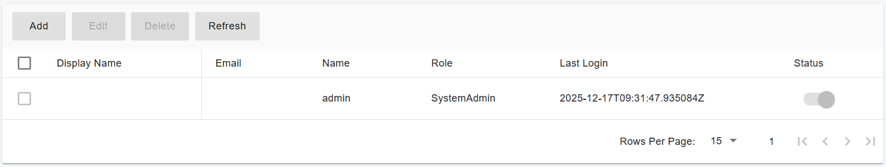
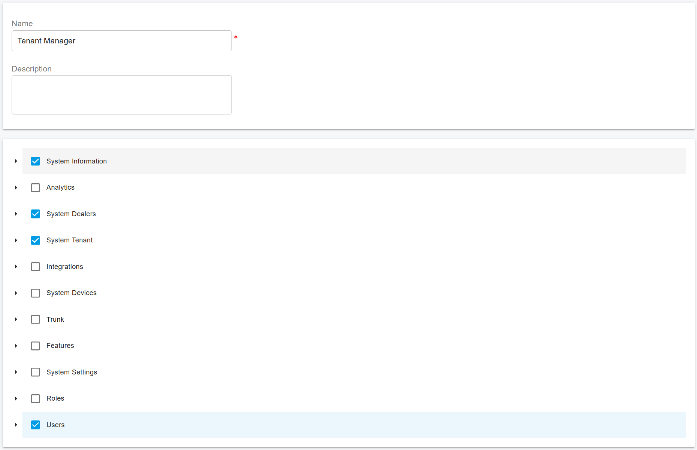

# Administrator Management

### Built-in System Administrator

By default, the PBX creates a built-in **System Administrator** account with the username **admin**.

You can view this account by navigating to **Administrators** in the PBX web portal menu. Select the **admin** account and click **Edit** to configure its **Email Address** and **Display Name**.

To change the administrator’s login name or personal profile information, click the **profile picture** in the upper-right corner of the web portal and update the profile settings.

<figure><figcaption></figcaption></figure>

***

### Administrator Roles

Starting with **PortSIP PBX v22.3**, the system supports **multiple System Administrators** and introduces **role-based access control (RBAC)** for administrators.

The PBX includes three predefined administrator roles, each designed for different operational responsibilities.

#### System Admin

The **System Admin** has the **highest level of privilege** in the PBX.

* Full access to all system functions and settings
* Can manage all administrators, roles, users, tenants, trunks, and system configurations
* Can create additional System Administrators

> ⚠️ **Best Practice:** Creating multiple System Administrators should be done with caution and limited to trusted personnel only.

***

#### Operation Admin

The **Operation Admin** has slightly fewer privileges than the System Admin and is intended for day-to-day operational management.

* Has full access to most PBX management functions
* **Does not** have access to:
  * System.Settings
  * System.Users
  * System.Roles
  * System.Integrations

All other permissions are equivalent to those of the System Admin.

***

#### Site Admin

The **Site Admin** has fewer privileges than the Operation Admin and is typically used for site-level or delegated administration.

The Site Admin has access to the following permissions:

* System.Information (View Only)
* Analytics (Full Access)
* System.Tenants
* Trunks (Full Access)
* System.Dealers
* System.Features

This role is suitable for administrators who manage specific tenants or operational areas without full system control.

***

#### Viewing Role Permissions

You can view the detailed permissions assigned to each administrator role by navigating to the menu:

**Advanced > Roles**

***

### Creating New Roles

In addition to the predefined roles, you can create **custom administrator roles** to meet your specific operational requirements.

To create a new role:

1. Navigate to **Advanced > Roles**
2. Click **Add**
3. Enter a **Role Name** and **Description**
4. Assign at least one permission to the role
5. Click **OK** to create the role

<figure><figcaption></figcaption></figure>

***

### Creating a New Administrator

You can create additional administrators and assign different roles to distribute management responsibilities more effectively.

To create a new administrator:

1. Navigate to **Administrators**
2. Click **Add**
3. Enter the **Display Name**, **Username**, **Password**, **Email Address**, and other required information
4. Select an appropriate **Role** for the administrator
5. Click **OK** to complete the creation

<figure><figcaption></figcaption></figure>

After the administrator is successfully created, they can sign in to the PBX web portal and manage the system according to the permissions granted by their assigned role.

***

### Permission List

The following section provides a **detailed explanation of each administrator permission**, including access levels and functional scope.

#### System.Information

* **View Only**\
  Allows viewing system status, version information, license details, and basic platform health data. No configuration changes are permitted.

***

#### Analytics

* **View Only**\
  Allows access to dashboards and reports for monitoring system usage, call statistics, and performance metrics.
* **Full Access**\
  Allows configuring analytics settings, creating or modifying reports, dashboards, filters, and exporting data.

***

#### System.Dealers

* **View Only**\
  Allows viewing dealers and associated information without making changes.
* **Full Access**\
  Allows creating, editing, disabling, or deleting dealers and managing dealer-related settings.

***

#### System.Tenants

* **View Only**\
  Allows viewing tenant information and configuration details without modification.
* **Full Access**\
  Allows creating, editing, disabling, and deleting tenants, as well as managing tenant-level settings.

***

#### Integrations

* **View Only**\
  Allows viewing configured integrations and their status.
* **Full Access**\
  Allows configuring, modifying, enabling, or disabling integrations with external systems and services.

***

#### System.Devices

* **View Only**\
  Allows viewing of the phone device templates.
* **Full Access**\
  Allows adding and editing phone device templates.

***

#### Trunks

* **View Only**\
  Allows viewing trunk configurations, status, and usage information.
* **Full Access**\
  Allows creating, editing, enabling, disabling, and deleting trunks settings.

***

#### Features

* **View Only**\
  Allows viewing system features such as Audit Trail, Events.
* **Full Access**\
  Allows managing system features such as Audit Trail, Events.

***

#### System Settings

* **View Only**\
  Allows viewing global system configuration and parameters.
* **Full Access**\
  Allows modifying global system settings that affect platform behavior and services.

***

#### Roles

* **View Only**\
  Allows viewing existing roles and their assigned permissions.
* **Full Access**\
  Allows creating, editing, and deleting roles and configuring permission assignments.

***

#### Users

* **View Only**\
  Allows viewing of administrators and related information.
* **Full Access**\
  Allows creating, editing, disabling, and deleting administrators, and managing their settings.

