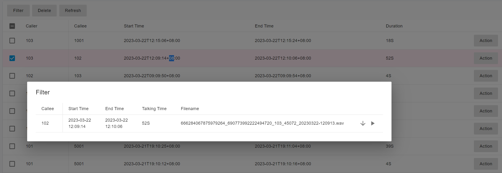
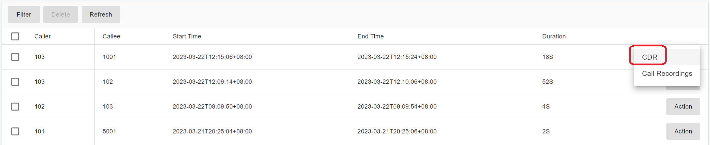

# Call Recordings

### Call Recording Overview

Businesses today must communicate with customers quickly, clearly, and reliably. A modern business phone system should include **call recording** to support quality assurance, compliance, training, and dispute resolution.

Once call recording is enabled, you can access recorded calls to review conversations and identify who called and when. Automatic call recording helps organizations:

* Maintain high service quality
* Train and evaluate new agents
* Investigate disputes or incidents
* Meet regulatory and compliance requirements

Discover how **PortSIP PBX** can help improve your business communications.

***

### Call Recording Management

The **Tenant Administrator** can manage and access call recordings by navigating to:

**Data Analytics > Call Recordings**

<figure><figcaption></figcaption></figure>

From this page:

* All recording files are listed.
* Double-click a recording to **download or play** the file.
* Click the **Action** button to open the menu and navigate directly to the **CDR** of the associated call.

<figure><figcaption></figcaption></figure>

***

### Call Recording Control Levels

PortSIP PBX allows call recording to be controlled at **two levels**: **User Level** and **Tenant Level**.

#### User Level Call Recording

To enable or disable call recording for an individual user:

1. Navigate to **Call Manager > Users**.
2. Double-click the user you want to modify.
3. Open the **Extension** tab.
4. Enable or disable:
   * **Record Audio Calls**
   * **Record Video Calls**

#### Behavior

* If **Record Audio Calls** is enabled, the user’s calls are recorded as **WAV** files, even for video calls.
* If **Record Video Calls** is enabled, video calls are recorded as **MP4** files.

***

#### Tenant Level Call Recording

The **Tenant Administrator** can enable or disable call recording for **all users within a tenant**.

1. Navigate to **Company** from the left menu.
2. Open the **General** page.
3. Under the **Options** section, enable or disable:
   * **Enable extension audio recording**
   * **Enable extension video recording**

#### Behavior

* Audio recording generates **WAV** files (even for video calls).
* Video recording generates **MP4** files for video calls.

***

### Automatically Stop Recording for Calls Between External Numbers

In some countries, privacy and security regulations prohibit recording calls made **between two external numbers**.

#### Example Scenario

* A client calls the contact center via a trunk.
* An agent answers and recording begins.
* The agent transfers the call to an external mobile number.
* At this point, the call is between two external numbers and **recording must stop**.

#### Configuration

To comply with these regulations:

1. Log in as **System Administrator**.
2. Navigate to **Advanced > Settings**.
3. Open the **General** page.
4. Disable **Record the call between external numbers**.

Once disabled, PortSIP PBX automatically stops recording when a call transitions to two external endpoints.

***

### Pause and Resume Call Recording

PortSIP PBX supports pausing and resuming call recording during an active call.

#### Using Feature Access Codes (FAC)

* Dial **\*48** to **pause** call recording
* Dial **\*49** to **resume** call recording

***

### Pause/Resume Recording via SIP MESSAGE (Out-of-Dialog)

Client apps or IP phones can pause or resume recording by sending an **out-of-dialog SIP MESSAGE** to the PBX.

```
MESSAGE sip:102@test.io SIP/2.0
Via: SIP/2.0/UDP 192.168.0.16:5568;branch=z9hG4bK-524287-1---a67ad51a25df052f;rport
Max-Forwards: 70
To: <sip:102@test.io>
From: <sip:101@test.io>;tag=fa2d6f1d
Call-ID: SFNH1yZ5c4LrG70_Tlyxgg..
CSeq: 3 MESSAGE
Allow: INVITE, ACK, CANCEL, OPTIONS, BYE, REFER, NOTIFY, MESSAGE, REGISTER, SUBSCRIBE, INFO, PUBLISH
Content-Type: application/x-media-control+json
Proxy-Authorization: Digest username="101",realm="test.io",nonce="13323933303:c8b6b255488669affb8a3e657188569a",uri="sip:102@test.io",response="da014b313dde19ff29c82043404af10f",algorithm=MD5
User-Agent: abcd
Allow-Events: hold, talk, conference, dialog
Content-Length: 21

{ "operation" : "pause-audio-recording", "session_id" : "5984923794364"}
```

#### Notes

* The message body must be **JSON**.
* `Content-Type` must be `application/x-media-control+json`.
* `operation` specifies the action (pause or resume).
* `session_id` is obtained from the `X-Session-Id` header in the SIP `INVITE` or `200 OK`.

***

### Pause/Resume Recording via SIP MESSAGE (In-Dialog)

You can also use an **in-dialog SIP MESSAGE**:

```sip
MESSAGE sip:102@test.io SIP/2.0
Via: SIP/2.0/UDP 192.168.0.16:5568;branch=z9hG4bK-524287-1---a67ad51a25df052f;rport
Max-Forwards: 70
To: <sip:102@test.io>
From: <sip:101@test.io>;tag=fa2d6f1d
Call-ID: SFNH1yZ5c4LrG70_Tlyxgg..
CSeq: 3 MESSAGE
Allow: INVITE, ACK, CANCEL, OPTIONS, BYE, REFER, NOTIFY, MESSAGE, REGISTER, SUBSCRIBE, INFO, PUBLISH
Content-Type: application/x-media-control
Proxy-Authorization: Digest username="101",realm="test.io",nonce="13323933303:c8b6b255488669affb8a3e657188569a",uri="sip:102@test.io",response="da014b313dde19ff29c82043404af10f",algorithm=MD5
User-Agent: abcd
Allow-Events: hold, talk, conference, dialog
Content-Length: 21

pause-audio-recording
```

#### Supported Commands

* `pause-audio-recording`
* `pause-video-recording`
* `resume-audio-recording`
* `resume-video-recording`

***

### Call Recording File Format

By default, PortSIP PBX records calls in **WAV** format, which provides high audio quality but consumes more disk space.

PortSIP PBX also supports **MP3** and **AMR** formats.

#### Change Recording Format

1. Open the configuration file:
   * **Linux**: `/var/lib/portsip/pbx/system.ini`
   * **Windows**: `C:/ProgramData/PortSIP/pbx/system.ini`
2.  In the `[mediaserver]` section, locate:

    ```
    recorder_file_format
    ```
3. Set the value:
   * `1` – WAV (default)
   * `2` – AMR
   * `3` – MP3
4. Save the file.

#### Restart Media Server

* **Windows**: Restart **PortSIP Media Server** from Windows Services.
*   **Linux**:

    ```bash
    cd /opt/portsip && /bin/sh pbx_ctl.sh restart -s portsip.mediaserver
    ```

> ⚠️ Recording in **AMR** or **MP3** reduces disk usage but may impact audio quality and performance.

***

### Recording File Size Calculation

Approximate recording sizes per minute:

* **WAV**: \~1 MB per minute (uncompressed, best quality)
* **AMR**: \~100 KB per minute (not playable in browsers)
* **MP3**: \~256 KB per minute (browser-playable)

Choose the format that best balances **storage requirements, performance, and audio quality** for your deployment.


