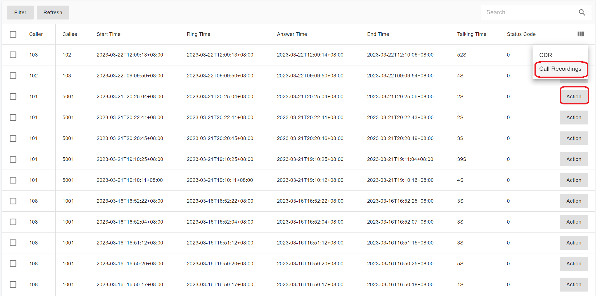

# CDR

In PortSIP PBX, **Call History** and **Call Detail Records (CDRs)** represent the same underlying call information, but they differ in data source, availability, and performance.

### Call History

Starting with **v22.3.0**, PortSIP PBX introduced the **Data Flow** service, which is built on **ClickHouse** for high-performance analytics and reporting.

* **Call History** data is queried from the **Data Flow service**.
* It provides **significantly higher query performance** and scalability, especially for large datasets.
* Call History is available **only when the Data Flow service is installed and running**.

This design enables fast, real-time analytics and efficient querying for dashboards, reports, and wallboards.

***

#### CDR (Call Detail Record)

If the **Data Flow service is not installed**, **Call History** is unavailable. However, you can still access **CDRs**.

* CDR data is queried directly from the **PostgreSQL database**.
* CDRs provide the same fundamental call information but are intended primarily for record-keeping, integrations, and historical lookup, rather than high-performance analytics.

***

### What Information Does a CDR Contain?

A **Call Detail Record (CDR)** includes detailed information about a call, such as:

* Call origination (caller)
* Call destination (callee)
* Date and time the call started
* Time the call was answered (connected)
* Time the call ended

A call is considered:

* Started (originated) when the caller goes off-hook
* Ended when either the caller or the called party goes on-hook

***

### CDR Service and Real-Time Delivery

PortSIP PBX includes a built-in **CDR service** that generates complete, real-time records for all calls.

When a call is completed:

* The CDR can be **pushed instantly** to external systems via:
  * &#x20;[WebHook](<cdr (1).md#push-cdr-to-webhook>)&#x20;
  * [WebSocket](../../../development-portsip/going-real-time-with-portsip-pbx-pub-sub.md#cdr_events)

This allows seamless integration with billing systems, CRM platforms, analytics services, and compliance tools.

***

### CDR Management

After signing in as a **Tenant Administrator**, navigate to:

**Call Statistics > CDR**

All Call Detail Records (CDRs) are displayed in the list. If **call recording** is enabled, you can **play back or download** the associated recording files directly from this page.

<figure><figcaption></figcaption></figure>

<figure><figcaption></figcaption></figure>

***

#### Viewing CDR Details

Double-click a CDR entry to view detailed call information.

For example, consider the following call flow:

* Caller **A** calls **B**
* The call is transferred to a **Virtual Receptionist (IVR)**
* The caller enters **DTMF** input
* The call is routed to a **queue**
* One of the queue agents answers the call

All stages of the call are recorded and displayed within a single CDR.

<figure><figcaption></figcaption></figure>

