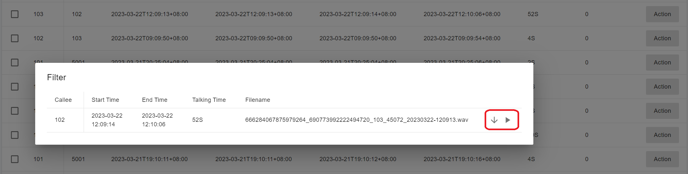
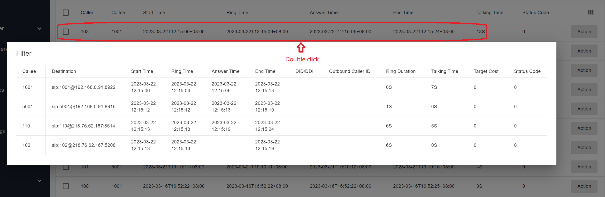
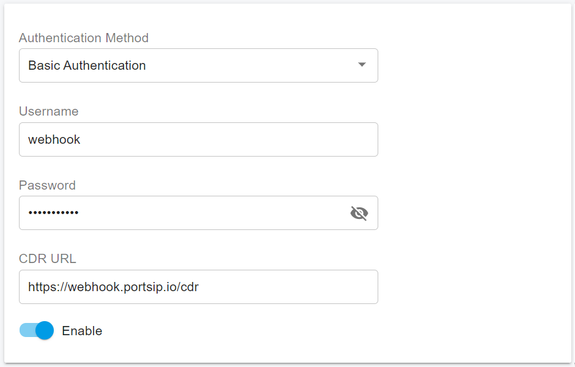

# CDR

CDRs contain information about call origination, call destination, the date and time the call was started, the time it actually connected, and the time it ended. A call is considered started or originated when the caller goes off-hook. The call is considered ended when either the caller or the called party goes on-hook.

The PortSIP PBX has an inbuilt CDR service that provides complete real-time data for all calls. When a call is completed, the call detail record can be pushed to another application instantly via [WebHook](cdr.md#push-cdr-to-webhook) and [WebSocket](../../../development-portsip/going-real-time-with-portsip-pbx-pub-sub.md#cdr\_events).

## CDR Management

After signing in as a tenant administrator, select the menu **Call Statistics > CDR**, and the CDR is listed. You can play or download the recording file if the call recording is enabled.

<figure><figcaption></figcaption></figure>

<figure><figcaption></figcaption></figure>

When you double-click a CDR, more call details are displayed. For example, if A calls B, then transfers B to a virtual receptionist, presses DTMF, and connects to a queue, and one of the queue agents answers, we can have the following CDR.

<figure><figcaption></figcaption></figure>

### Push CDR to Webhook

You can collect the CDR by making an HTTP request to an external service or application every time a call is completed.

A webhook is a mechanism that allows you to call out to an external program based on events in PortSIP PBX.

Only the tenant administrator has the ability to enable/disable this feature.

Select **Company** from the left menu. On the **Event URL** page, turn on CDR Events. Choose an Authentication Method and enter your Webhook URL. The PBX will then push CDR events to your 3rd party Webhook.

<figure><figcaption></figcaption></figure>

Below is an example of when extension 102 received a call.

```json
{
  "event_type": "call_start",
  "call_id": "Q0sXhDgxnowmQp1P9swHLw..",
  "callee": "sip:102@test.io",
  "callee_display_name": "Jason",
  "caller": "sip:101@test.io",
  "caller_display_name": "Tom",
  "cdr_id": "798119942409949185",
  "direction": "ext",
  "session_id": "798119942409949184",
  "tenant_id": "798119491077668864",
  "time": "1705051422"
}
```

Below is an example of a CDR. The call flow is **caller > trunk > PBX IVR > Queue > Agent**.

```json
{
   "event_type":"call_cdr",
   "answered_time":"1679476851",
   "call_id":"b6PEEYEcn5speSovMAybCw..",
   "callee":"5000",
   "callee_domain":"test.io",
   "caller":"1888722",
   "caller_display_name":"",
   "caller_domain":"192.168.0.16",
   "did_cid":"18800606",
   "direction":"in",
   "ended_reason":"callee_disconnect",
   "ended_time":"1679476870",
   "outbound_caller_id":"",
   "ring_time":"1679476851",
   "session_id":"690852418417594368",
   "start_time":"1679476851",
   "status_code":"0",
   "tenant_id":"690833127458734080",
   "tenant_name":"PortSIP Inc.",
   "trunk_name":"AudioCodes"
   "user_data":"",
   "call_targets":[
      {
         "answered_time":"1679476851",
         "call_type":"normal_call",
         "callee":"5000",
         "caller":"1888722",
         "destination":"sip:5000@192.168.0.16:8922",
         "end_reason":"referred",
         "ended_time":"1679476857",
         "id":"690833127458734080",
         "outbound_caller_id":"",
         "ring_time":"1679476851",
         "start_time":"1679476851",
         "status_code":0,
         "trunk_name":"AudioCodes"
      },
      {
         "answered_time":"1679476857",
         "call_type":"normal_call",
         "callee":"8000",
         "caller":"1888722",
         "destination":"sip:8000@192.168.0.16:8916",
         "end_reason":"referred",
         "ended_time":"1679476862",
         "id":"690833127458734080",
         "outbound_caller_id":"",
         "ring_time":"1679476857",
         "start_time":"1679476857",
         "status_code":0,
         "trunk_name":"AudioCodes"
      },
      {
         "answered_time":"0",
         "call_type":"normal_call",
         "callee":"102",
         "caller":"1888722",
         "destination":"sip:102@192.168.0.16:9070",
         "end_reason":"None",
         "ended_time":"1679476862",
         "id":"690833127458734080",
         "outbound_caller_id":"",
         "ring_time":"1679476858",
         "start_time":"1679476858",
         "status_code":0,
         "trunk_name":"AudioCodes"
      },
      {
         "answered_time":"1679476862",
         "call_type":"normal_call",
         "callee":"103",
         "caller":"1888722",
         "destination":"sip:103@192.168.0.16:9530",
         "end_reason":"None",
         "ended_time":"1679476870",
         "id":"690833127458734080",
         "outbound_caller_id":"",
         "ring_time":"1679476858",
         "start_time":"1679476858",
         "status_code":0,
         "trunk_name":"AudioCodes"
      }
   ]
}
```

The CDR information is in JSON format and includes the following fields:

* `answered_time`: The timestamp of when the call was answered in Unix timestamp format. In this example, this time represents when the PBX IVR answered. If the value is 0, it means the call was not answered.
* `call_id`: The call ID of the call. In this example, it is the Call-Id of the INVITE that comes from the trunk to PortSIP PBX.
* `callee`: The first callee number when the call arrived at PBX. In this example, it is PortSIP PBX IVR number 5000.
* `callee_domain`: The SIP domain (tenant’s SIP domain) of the callee.
* `caller`: The caller of the call from the trunk.
* `caller_display_name`: The display name of the FROM header in the INVITE sent from the trunk.
* `caller_domain`: The host part of the FROM header in the INVITE is sent from the trunk.
* `did_cid`: The DID number was dialed from the trunk. It is also known as the user part of the TO header in INVITE sent from the trunk.
* `direction`: Indicates whether a call is inbound or outbound. “**in**” means inbound from the trunk while “**out**” means outbound to the trunk. If a call comes from and then forwards to the trunk then the direction will be “**in2out**”.
* `end_reason`: Indicates why a call ended. Possible reasons include: caller\_disconnect, callee\_disconnect, replaced, referred, redirected, blind\_transfer\_complete, attended\_transfer\_complete and cancelled.
* `ended_time`: Time when a call ended in Unix timestamp format
* `event_type`: Indicates that this information pertains to CDR.
* `outbound_caller_id` : Outbound Caller ID for outbound calls made to the trunk with an outbound caller ID set up.
* `ring_time`: Ring time of the call; for instance ring time for PortSIP PBX IVR 5000 ringing.
* `session_id`: Session ID for calls also present in **X-session-ID** header of INVITE/200 OK message; can be used to query recording files.
* `start_time`: Call start time represented as Unix timestamp for call arrived at PortSIP PBX.
* `status_code`: If the call failed, this field indicates the status code as a SIP status code (e.g., 404 or 408). A value of 0 means there was no error.
* `tenant_id`: When a call arrives at PBX, it is matched with all tenant inbound rules by DID. Once a rule is matched, the call is routed to that tenant and this field indicates the ID of the tenant who handles the call.
* `tenant_name`: The name of the tenant who handles the call.
* `trunk_name`: The name of the trunk through which the call was made.
* `user_data`: If a call is launched via REST API, this field contains any user data passed in string format.

A call may have multiple targets. For example, if extension 101 is registered to PBX from both an IP Phone and an App simultaneously and someone calls 101, there will be two targets: one for the IP Phone and one for the App. Another example is when someone calls 101 and it rings but goes unanswered. After a while, the call is forwarded to 102 which rings and is answered. In this case, there are two targets: one for 101 and another for 102.

In our example, when a call comes in from the trunk, the first target is IVR 5000. The caller then presses DTMF 1 and the call is forwarded to Queue 8000 which becomes the second target. While waiting in the queue, agents 102 and 103 rang as third and fourth targets.

The target of the IVR 5000:

```json
      {
         "answered_time":"1679476851",
         "call_type":"normal_call",
         "callee":"5000",
         "caller":"1888722",
         "destination":"sip:5000@192.168.0.16:8922",
         "end_reason":"referred",
         "ended_time":"1679476857",
         "id":"690833127458734080",
         "outbound_caller_id":"",
         "ring_time":"1679476851",
         "start_time":"1679476851",
         "status_code":0,
         "trunk_name":"AudioCodes"
      }
```

* `answered_time`: The answer time of that call target in Unix timestamp format. A value of 0 means the call was not answered.
* `call_type`: The type of call. Possible values include normal\_call, queue\_call, ring\_group\_call, callback and queue\_callback.
* `callee`: The callee of this target.
* `caller`: The caller of this call.
* `destination`: The IP address and port of this target.
* `end_reason`: The reason why this target ended. In this case, since the caller pressed DTMF and the call was referred to the queue and this target (IVR) hung up, the end reason is "referred".
* `end_time`: The time when this target ended in Unix timestamp format.
* `id`: The ID of this target CDR in the database.
* `outbound_caller_id`: If the target is a trunk and an outbound caller ID is set up for the call, this field will contain that outbound caller ID.
* `ring_time`: The ring time for this target.
* `start_time`: The time when a call to this target started is represented as a Unix timestamp.
* `status_code`: If a call to this target failed then the status code will be SIP status code (e.g., 404 or 408). A value of 0 means there was no error.
* `trunk_name`: Name of the trunk through which a call to this target was made.

### Push CDR to WebSocket Subscriber

You can collect the CDR by subscribing to the CDR event from an external service or application every time a call is completed.

A WebSocket subscription is a mechanism that allows you to receive the events in an external program from the PortSIP PBX.

Only the tenant administrator has the ability to subscribe to this event.

For more details please refer to this [topic](../../../development-portsip/going-real-time-with-portsip-pbx-pub-sub.md#cdr\_events).

