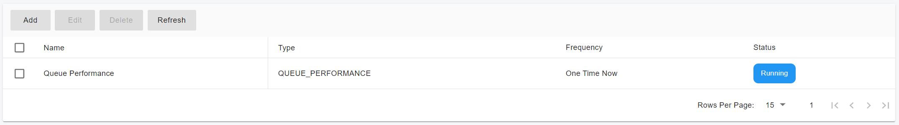
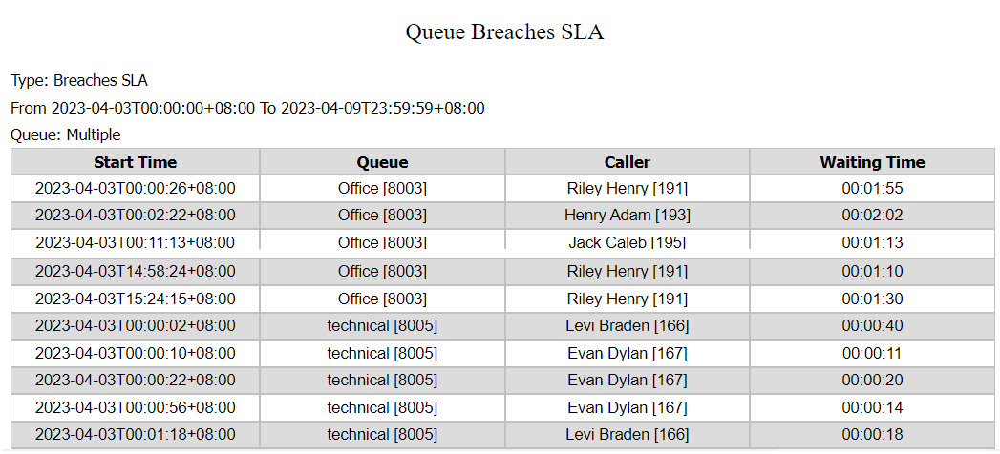

# Call Reports(Legacy)

### Create and Run a Report

To create a new report:

1. Navigate to **Call Statistics > Call Reports**.
2. Click **Add**.
3. Configure the report using the available parameters.
4. Click **OK** to generate the report.

***

### Report Configuration Parameters

#### Report Type

* **Type**: Select the report template that will serve as the basis for the report.

#### Date Range

* **Range**: Select a predefined range or define a custom date range.
  * Supported ranges include: Today, Yesterday, Last Week, Last 7 Days, Last Month, Last 30 Days, and Custom Range.

#### Scheduling

* **Frequency**: Choose how often the report runs:
  * One Time Now
  * Daily
  * First Day of the Week
  * First Day of the Month

#### General Settings

* **Name**: Assign a descriptive name to the report.
* **Mail To**: Specify an email address to receive the report download link.
  * Note: The SMTP server must be configured correctly.
* **Export As**: Select the report format.
  * Supported formats: CSV, HTML

> These parameters are available for all report types.

***

### Report Filters

Filters allow you to refine the data displayed in a report.

* Each report type supports its own set of filters.
* Filters apply only to the specific report being generated.

For example, to view only answered calls, apply a filter based on **Call Status = Answered**.

After configuring the filters, click **OK** to generate the report.

<figure><figcaption></figcaption></figure>

> ⚠️ If the selected date range contains a large number of calls, report generation may take longer.\
> A single **Normal Call Report** is limited to **20,000 calls**. Other report types do not have this limitation.

***

### Report Status and Saved Reports

While a report is being generated, its status is displayed as **Running**.

<figure><figcaption></figcaption></figure>

Once completed:

1. Click **Refresh**.
2. Locate the report in the list.
3. Click the **link icon** to download it.

***

### Normal Call Report

This report provides basic call-level details and supports the following filters:

**From**

Filter by caller number:

* Extension / Extension Range (e.g., `101` or `101-110`)
* Number (e.g., `003321456783`)
* Numbers Start With (prefix match, e.g., `035`)
* Numbers Contain (substring match, e.g., `327`)
* Internal Extensions
* External Numbers

**To**

Filter by callee number (same options as **From**).

**Call Status**

* Answered
* Not Answered

**Duration**

* Talking Time
* Ring Time

<figure><figcaption></figcaption></figure>

**Additional Fields**

* **Cost** – Call cost
* **CLI** – Outbound caller ID
* **DID / DDI** – DID/DDI number for inbound trunk calls
* **End Reason** – Who ended the call (caller or callee)
* **Trunk Name** – Trunk used for the call
* **User Data** – Custom data passed via REST API

***

### Extension Group Call Cost Report

This report calculates call costs for a specified user group.

<figure><figcaption></figcaption></figure>

#### Filters

* **Type**:
  * Any
  * Local
  * National
  * Mobile
  * International
* **Group Name** – User group associated with the call
* **Call Type** – Billing type matched by the billing rule
* **Prefix** – Billing rule prefix

***

### Queue Performance Report

This report summarizes service levels for one or more queues, including:

* Total calls received
* Calls handled
* Calls not handled

Statistics are also broken down by agent, making it easy to identify high and low performers.

<figure><figcaption></figcaption></figure>

#### Filters

* Exclude Calls Dropped Before (Seconds)
* Call Queue – Select one or more queues

#### Metrics

* Queue
* Received
* Serviced
* Unanswered

***

### Queue Detailed Statistics

Provides comprehensive queue metrics, including

<figure><figcaption></figcaption></figure>

* **Calls**: Answered, abandoned, total, % serviced
* **Ring Time**: Total and average
* **Talk Time**: Total and average

***

### Queue Abandoned Calls Report

Helps identify potential causes of abandoned calls by showing:

<figure><figcaption></figcaption></figure>

* Waiting time
* Caller information
* Assigned agent
* Number of polling attempts

***

### Queue SLA Statistics

<figure><figcaption></figcaption></figure>

Displays:

* Total calls received per queue
* Number and percentage of calls missed based on SLA thresholds

***

### Queue Breaches SLA Report

Shows calls that exceeded the configured SLA, including:

<figure><figcaption></figcaption></figure>

* Call time
* Caller ID
* Waiting duration

You can exclude calls dropped before a specified time threshold.

***

### Queue Callbacks Report

<figure><figcaption></figcaption></figure>

Displays:

* Number of calls received
* Callback requests
* Successful and unsuccessful callbacks

***

### Team Queue General Statistics

Focuses on **queue performance at the team level**, including:

<figure><figcaption></figcaption></figure>

* Call handling behavior
* Number of agents assigned to each queue

***

### Ring Group Statistics Report

Displays call statistics for one or more ring groups, including:

* Calls received
* Calls answered

<figure><figcaption></figcaption></figure>

Statistics are broken down by agent extension, helping identify performance trends and improvement areas.

