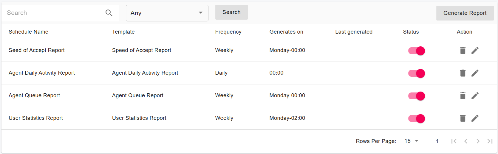
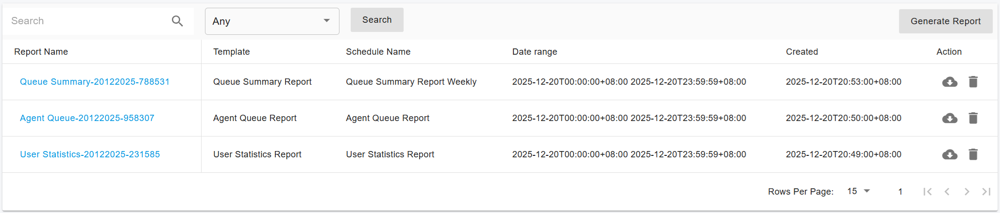

# Call Reports

### Call Reports Overview

**PortSIP Call Reports** deliver the power of a full-featured call analytics tool directly on top of your call data. They enable you to create highly customized reports and analyses, providing the exact metrics you need, in the format you prefer, and delivered to the right stakeholders.

With Call Reports, you can turn raw call data into actionable insights for operational monitoring, performance optimization, and strategic decision-making.

***

### Key Features

PortSIP Call Reports offer the following capabilities, and more:

* **Advanced filtering and logic**\
  Access more filters and more complex filter logic than other Analytics features in PortSIP PBX. This includes filtering by business hours, multiple users or contact centers simultaneously, and additional advanced conditions.
* **Custom calculations and formatting**\
  Apply automated calculations and formatting to your data, eliminating the need for manual spreadsheet work to derive specific metrics or insights.
* **Custom reports and scorecards**\
  Create tailored reports or scorecards for the metrics you routinely track. Save and schedule these reports and automatically distribute them to internal and/or external recipients at a frequency of your choice.
* **Aggregated, at-a-glance insights**\
  Build custom filters and aggregations to view core metrics across multiple groups and users in a single report, including custom date/time intervals, subtotals, and totals.
* **Agent activity timelines**\
  Visualize a timeline of contact center agent activity throughout their shifts for auditing, analysis, or troubleshooting purposes.
* **Metric drill-down and data export**\
  Drill down into specific metrics and download the underlying call records, including detailed call metadata.

***

### Create a Scheduled Report

Automating scheduled reports eliminates the need to manually generate reports at the last minute. It also helps administrators continuously track team performance and proactively adjust strategies.

#### Steps to Create a Scheduled Report

<figure><figcaption></figcaption></figure>

1. Sign in to the **PortSIP PBX Web Portal**.
2. Navigate to **Data Analytics > Reports**.
3. Click **Generate Report** in the upper-right corner.

***

#### Report Configuration

#### General Settings

* **Report Type:** Select the type of report you want to generate.
* **Name:** Enter a name for the report. This name will be used as the **email subject** when the report is sent.
* **Frequency:** Choose how often the report should run (for example, daily or monthly).
* **Date Range:** Specify the period during which this scheduled report is active.

***

#### Filters

Use filters to control which call data is included in the report.

* **Range**: The time range from which call data is collected.
* **Direction**: The call direction (Any, Inbound, Outbound, Internal).
* **Call Status**: The call status (Any, Answered, Unanswered).
* **Users**: The extensions included in the report; leave empty to include all users.\
  Supported formats:
  * Range: `1000-2000`
  * Single number: `1600`
  * Mixed: `1000-2000;1600;2500-2600`

***

#### Recipients

* Enter one or more email addresses to receive the scheduled reports. Use the semicolon to separate multiple addresses.
* If left empty, the report will still be generated and can be downloaded from the web portal.

***

#### Save the Report

Click **OK** to save the configuration and activate the scheduled report.

***

### Report Schedules

This tab displays a list of reports that are configured to run **recurrently**.&#x20;

<figure><figcaption></figcaption></figure>

For each scheduled report, you can view key details, including:

* **Report Name**
* **Generation Frequency**
* **Scheduled Run Day**
* **Last Generated Time**
* **Schedule Status**

You can temporarily pause or resume a scheduled report by toggling the **Status** switch.

***

### Report List

This tab displays a list of generated reports that are ready for download. If you subscribed to a report when scheduling it, you will receive an **email notification** when the report is available.

<figure><figcaption></figcaption></figure>

You can:

* Click the **Download** icon to download a report.
* Click the **Delete** icon to remove a report from the list.

