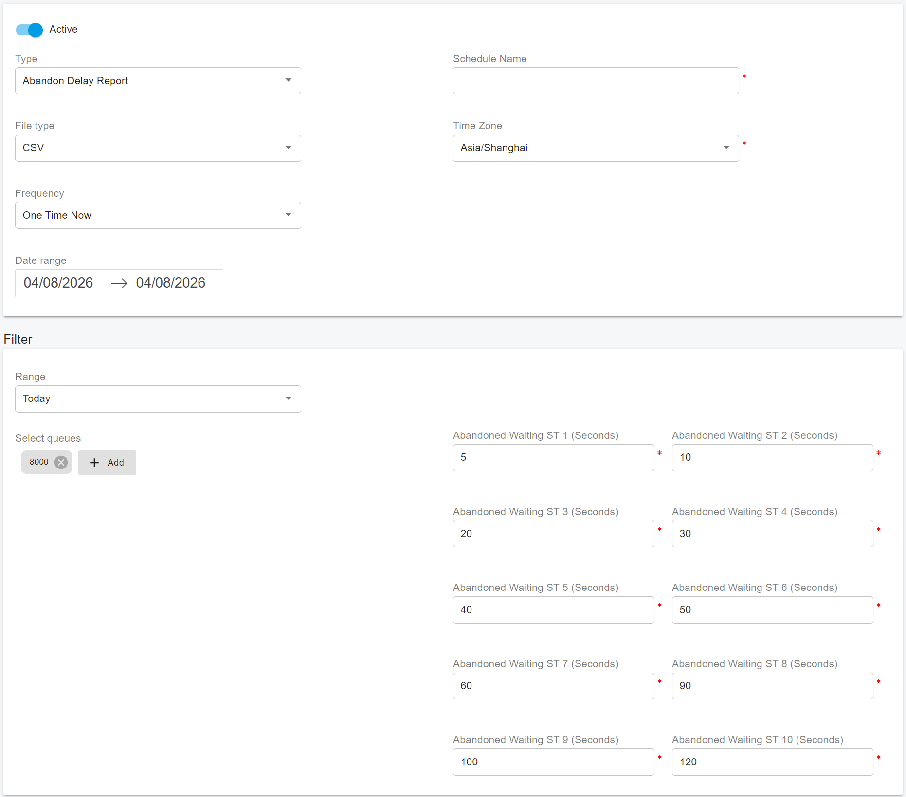

# Abandon Delay Report

### Overview

The **Abandon Delay Report** helps you understand how long interactions waited in a queue before they were abandoned.

This report measures service quality by showing:

* The total number of interactions that were abandoned while waiting in the selected queues
* The percentage of interactions that were abandoned while queued
* The distribution of abandoned interactions across defined waiting time intervals

The report groups abandoned interactions into one of ten service time buckets based on how long each interaction waited in the selected queue before it was abandoned or disconnected.

It also shows the percentage of abandoned interactions in each bucket relative to the total number of abandoned interactions in the selected queue during the reporting interval.

This report reflects data for the selected queues only. It does not include any time that interactions may have spent waiting in other unselected queues before reaching the selected queue.

***

### Filters

The **Abandon Delay Report** supports the following filters:

* **Range**: Select the date and time range for the report.
* **Select Queues**: Select the queues that you want to include in the report.
* **Abandoned Waiting ST1 (Seconds) - Abandoned Waiting ST10 (Seconds)**: Define the waiting time intervals, in seconds, used to group abandoned interactions into service time buckets. For example, if **Abandoned Waiting ST1** is set to 5 seconds and **Abandoned Waiting ST2** is set to 15 seconds, interactions abandoned within 5 seconds are counted in **Abandoned Waiting ST1**, while interactions abandoned after 5 seconds but within 15 seconds are counted in **Abandoned Waiting ST2**.

***

### Metrics Used in the Abandon Delay Report

| **Metric**                                               | **Description**                                                                                                                                                                                                                                                                                                                                                                                                                                                                                                          |
| -------------------------------------------------------- | ------------------------------------------------------------------------------------------------------------------------------------------------------------------------------------------------------------------------------------------------------------------------------------------------------------------------------------------------------------------------------------------------------------------------------------------------------------------------------------------------------------------------ |
| **Abandoned Waiting ST1**                                | The total number of interactions that entered this queue and were subsequently abandoned while waiting in the queue before the first service time interval threshold.                                                                                                                                                                                                                                                                                                                                                    |
| **Abandoned Waiting ST2 ... Abandoned Waiting ST10**     | The total number of interactions that entered this queue and were subsequently abandoned while waiting in the queue within the service time interval bounded by the two indicated service time thresholds. If the lower service time threshold is not defined, this metric returns 0.                                                                                                                                                                                                                                    |
| **% Abandoned Waiting ST1**                              | The percentage of interactions that entered this queue and were subsequently abandoned while waiting in the queue before the first service time interval threshold, relative to the total number of abandoned interactions in the queue.                                                                                                                                                                                                                                                                                 |
| **% Abandoned Waiting ST2 ... % Abandoned Waiting ST10** | The percentage of interactions that entered this queue and were subsequently abandoned while waiting in the queue within the service time interval bounded by the indicated service time thresholds, relative to the total number of abandoned interactions in the queue. For example, **% Abandoned Waiting ST10** represents the percentage of interactions abandoned within the interval bounded by the ninth and tenth service time thresholds, relative to the total number of abandoned interactions in the queue. |

### Notes

* The **Abandon Delay Report** reflects abandoned interactions for the selected queues only.
* The **ST1 to ST10** buckets help you identify how long callers typically wait before abandoning the queue.
* This report can help you evaluate queue performance and identify whether excessive wait times may be contributing to caller abandonment.
* To ensure accurate reporting, define the **Abandoned Waiting ST1 - ST10** thresholds in a logical ascending order.

<figure><figcaption></figcaption></figure>
