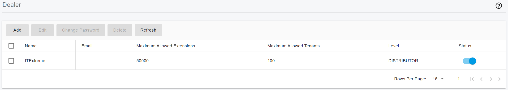
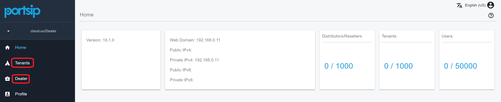

# 22 Dealers

Cloud PBX and UCaaS enable businesses to scale, remain agile, and focus on their core operations without the burden of managing IT infrastructure. Service providers prioritize hosting reliable, stable services, while distributors and resellers handle sales to end-users, creating a seamless connection between providers and customers.

PortSIP PBX is a multi-tenant solution tailored for modern service providers. Its Dealers feature simplifies the management of distributors and resellers, driving operational efficiency and business growth.

## Dealer Levels

PortSIP PBX provides three levels for dealers:

* Distributor
* Sub-Distributor
* Reseller

<figure><figcaption></figcaption></figure>

Each level of the dealer can create, modify, or delete the lower-level dealer.&#x20;

* The service provider can create the Distributor, Sub-Distributor, and Reseller.&#x20;
* The Distributor can only create the Sub-Distributor and Reseller.&#x20;
* The Sub-Distributor can only create the Reseller.&#x20;

All levels of dealers can create and manage their end-users - tenants.

## Add a Dealer

Please follow the below steps to add the dealer to the PortSIP PBX.

* Sign in to the PortSIP PBX web portal as the **system administrator**.
* Click the menu **Dealers**, all dealers will be listed.
* Click the **Add** button.

<figure><figcaption></figcaption></figure>

Enter the appropriate values for the necessary fields, then click the **OK** button to create the dealer. In the **Level** field, you can choose the level for this dealer: Distributor, Sub-Distributor, or Reseller.

You can limit that distributor capability by specifying the maximum of tenants, and the maximum of extensions.

After the dealer is successfully created, that dealer can sign in to the PortSIP PBX web portal to manage its tenants and dealers.

## Sign in the Dealer

A dealer can sign in to the PortSIP PBX web portal by entering the username and password. Please see the below screenshot for an example:

<figure><figcaption></figcaption></figure>

Once the dealer signs in to the PortSIP PBX web portal, they can access the Dealers and Tenants menus which allow them to manage the sub-dealers and tenants they created.

<figure><figcaption></figcaption></figure>

