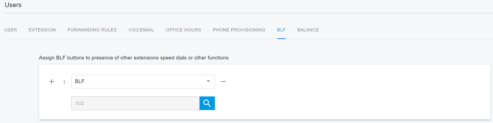
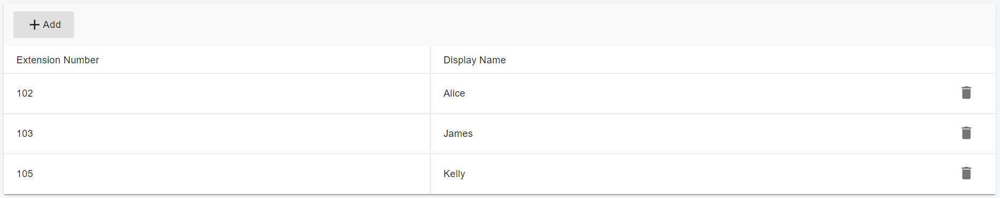

# 24 Call Pickup

### Overview

**Call Pickup** allows users to answer calls that are ringing on another extension. This ensures calls are not missed when the intended recipient is unavailable.

PortSIP PBX supports:

* **Directed Call Pickup**
* **BLF (Busy Lamp Field) Call Pickup**
* **Group Call Pickup**

***

### Directed Call Pickup

Directed Call Pickup allows a user to answer a call ringing on a specific extension by dialing a **Feature Access Code (FAC)** followed by the extension number.

* Default FAC: **\*97**
* Format: **\*97 + extension number**

#### How It Works

If the target extension is ringing, the call is immediately answered on the dialing phone.

The pickup will fail if:

* The call has already been answered
* The extension has no active ringing call
* The extension number is invalid

#### Example

Alice’s extension number is **102**.\
Her phone is ringing while she is away from her desk.

Another user can answer the call by dialing:

**\*97102**

Alice herself can also pick up the call from a nearby phone using the same code.

> **Note**\
> Directed Call Pickup is **enabled by default** for PortSIP PBX users.

***

### BLF Call Pickup (Monitoring Phone)

BLF Call Pickup allows users to answer calls on a **monitored extension** directly from their phone, without dialing a FAC.

#### How It Works

* The monitoring phone has a BLF key configured for another extension
* When the monitored extension is ringing, the BLF key flashes
* The user presses the flashing BLF key to pick up the call

This method eliminates the need to remember or dial **\*97**.

<figure><figcaption></figcaption></figure>

***

### Group Call Pickup

**Group Call Pickup** allows users within the same pickup group to answer calls ringing on other group members’ extensions.

#### Key Behavior

* Any group member can answer a ringing call within the group
* If multiple phones are ringing, the call ringing **the longest** is picked up
* Once the call is answered, the original extension becomes available for new calls

Group Call Pickup helps ensure calls are answered promptly and improves team collaboration and customer service.

* Default Group Pickup FAC: **\*98**

***

### Group Call Pickup Rules

The following conditions apply:

* A user can belong to **only one** call pickup group
* All group members must belong to the **same tenant**
* A tenant can have **multiple** call pickup groups
* Call pickup group names must be **unique**

***

### Configuring a Group Call Pickup Group (Tenant Level)

To create and configure a call pickup group:

1. Sign in to the PortSIP PBX Web Portal as a **Tenant Administrator**\
   (or as a **System Administrator**, then select the tenant).
2. Navigate to **Advanced Services > Call Pickup**.
3. Click **Add**.
4. Enter a **Group Name**.
5. Open the **Group Members** tab.
6. Add the extensions that should belong to the group.
7. Click **OK** to save the configuration.

***

### Using Group Call Pickup

When a call is ringing on any group member’s extension, other group members can answer the call by dialing: **\*98**

<figure><figcaption></figcaption></figure>

