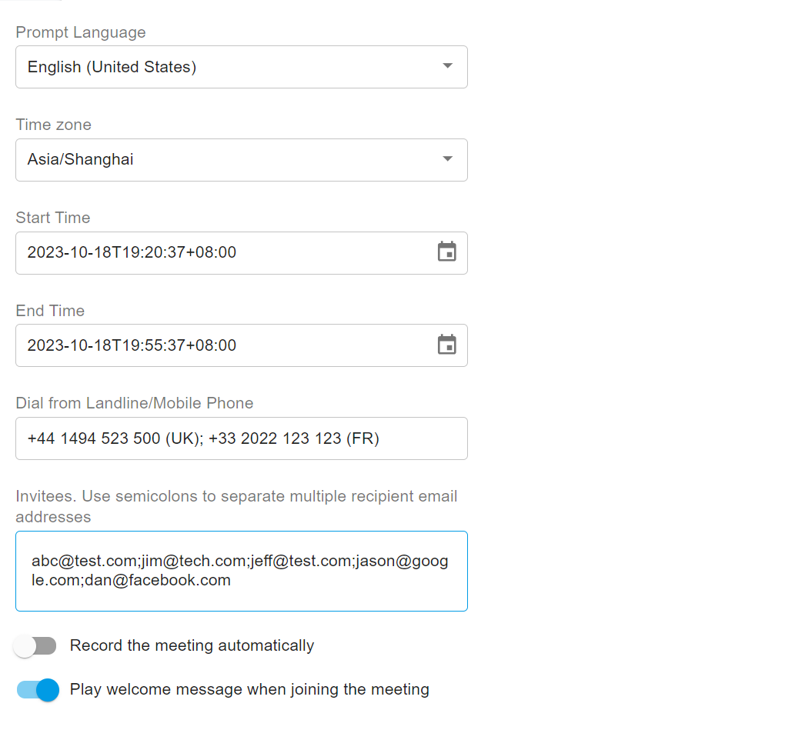
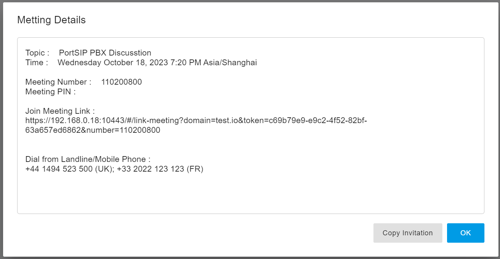
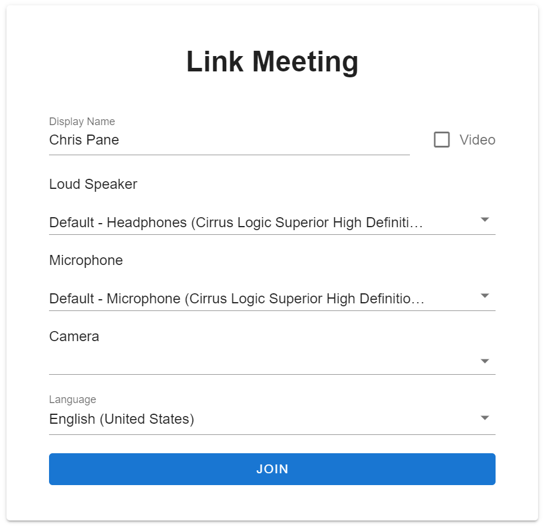

# Joining a Meeting with the Invite Link

### Creating a Meeting and Sending Invitations

This article explains how to create a meeting in **PortSIP PBX** and send meeting invitations to participants.

Participants can join a PortSIP meeting using an **invite link**, which may be delivered via email, instant message, or directly by the meeting host. The invite link is a web URL that contains the meeting ID and may also include an embedded passcode. This allows participants to join the meeting quickly without manually entering credentials.

When a participant clicks the invite link, their web browser opens a dialog prompting them to join the meeting.

***

### How Participants Join a Meeting

* The invite link opens the meeting join page in a web browser.
* The link may automatically include:
  * Meeting ID
  * Passcode (if configured)
* Participants can join the meeting with minimal interaction, depending on browser and device permissions.

***

### Prerequisites

Before creating meetings or sending invitations, ensure the following requirements are met:

#### WebRTC Support

* **PortSIP SBC** must be installed and properly configured to support **WebRTC**.
* For detailed instructions, refer to: [Configuring SBC for WebRTC](../9-configuring-portsip-sbc/configuring-sbc-for-webrtc.md)

#### Email Invitations (Optional)

* To send meeting invitations via email, an **SMTP server** must be configured.
* For configuration details, refer to: [Configuring Email Notifications](../configuring-email-notifications.md)

***

### Create a Meeting

To create a meeting in **PortSIP PBX** and send invitations to participants, follow these steps:

#### Steps

1. **Sign in** to the PortSIP PBX Web Portal as a **Tenant Admin**.
2. Navigate to **Advanced Services > Meeting**.
3. Click **Add**.
4. Enter the required meeting information (such as topic, meeting extension, PINs, time settings, and participant options).
5. Click **OK** to create the meeting.

<figure><figcaption></figcaption></figure>

***

#### After the Meeting Is Created

After you click **OK**, a dialog box appears displaying the meeting details (as shown in the screenshot below).

From this dialog, you can:

* **Copy the invitation**\
  Click **Copy Invitation** to copy the meeting information (including join details) and share it manually via email, chat, or other messaging tools.
* **Send email invitations automatically**\
  If an **SMTP server** is configured, the PBX automatically sends meeting invitation emails to all invitees you specified when creating the meeting.

<figure><figcaption></figcaption></figure>

***

### Joining a Meeting by Clicking the Link

To join a meeting using the invitation link, follow these steps:

1. **Click the invitation link** provided in the email, message, or chat.
2. Your **web browser** opens the meeting join page automatically.
3. On the join page:
   * Enter your **display name**.
   * Select the appropriate **speaker**, **microphone**, and **camera**.
4. Review your device settings to ensure audio and video are configured correctly.
5. Click **Join** to enter the meeting.

<figure><figcaption></figcaption></figure>

***

### Join the Meeting by Dialing the Meeting Number

Participants can join a meeting by dialing the **meeting number** directly from a SIP endpoint.

#### Join from an IP Phone or PortSIP App

As shown in the example above, invitees can dial the meeting number **110200800** from any of the following clients:

* IP phones
* PortSIP mobile app
* PortSIP Windows desktop app
* PortSIP WebRTC client

Once the number is dialed, the caller is connected directly to the meeting.

***

### Join the Meeting by Dialing from the PSTN

Participants can also join the meeting from a **mobile phone or landline** using PSTN dial-in numbers.

#### Example PSTN Dial-In Numbers

* United Kingdom: **+44 1494 523 500**
* France: **+33 2022 123 123**

***

#### PSTN Dial-In Configuration Requirements

To enable PSTN access to a meeting:

1. Configure a **SIP trunk** capable of handling inbound PSTN calls.
2. Create **inbound rules** to route the DID numbers to the meeting number.

**Direct Routing to the Meeting**

* Route:
  * `44 1494 523 500` → `110200800`
  * `33 2022 123 123` → `110200800`
* When a caller dials either PSTN number, the PBX routes the call directly into the meeting.

***

#### Alternative: PSTN Access via Virtual Receptionist

As an alternative approach, you can route the PSTN numbers to a **Virtual Receptionist** instead of directly to the meeting.

**Call Flow**

1. Caller dials:
   * `44 1494 523 500` or
   * `33 2022 123 123`
2. The Virtual Receptionist answers and plays voice prompts.
3. The caller is instructed to enter the **meeting number** using DTMF.
4. When the caller enters **110200800**, the PBX routes the call into the meeting.

This approach allows multiple meetings to share the same PSTN dial-in numbers.

