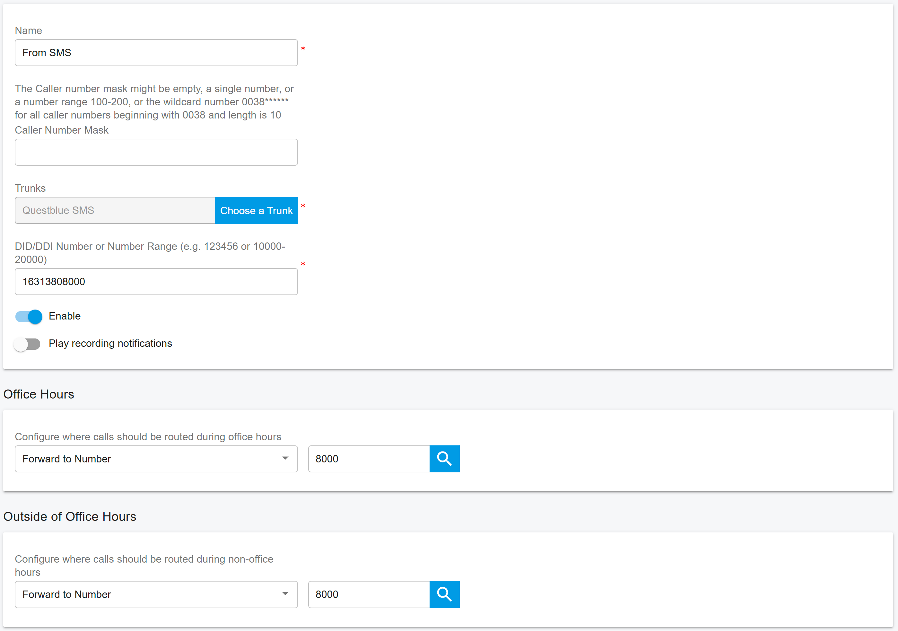
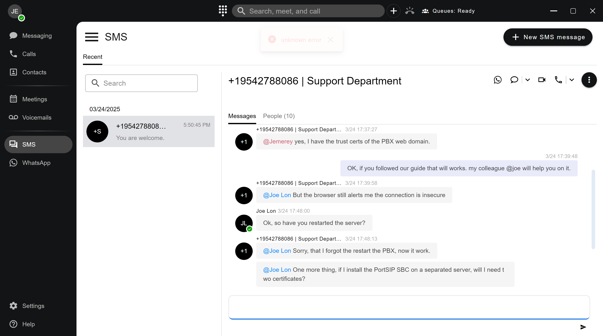
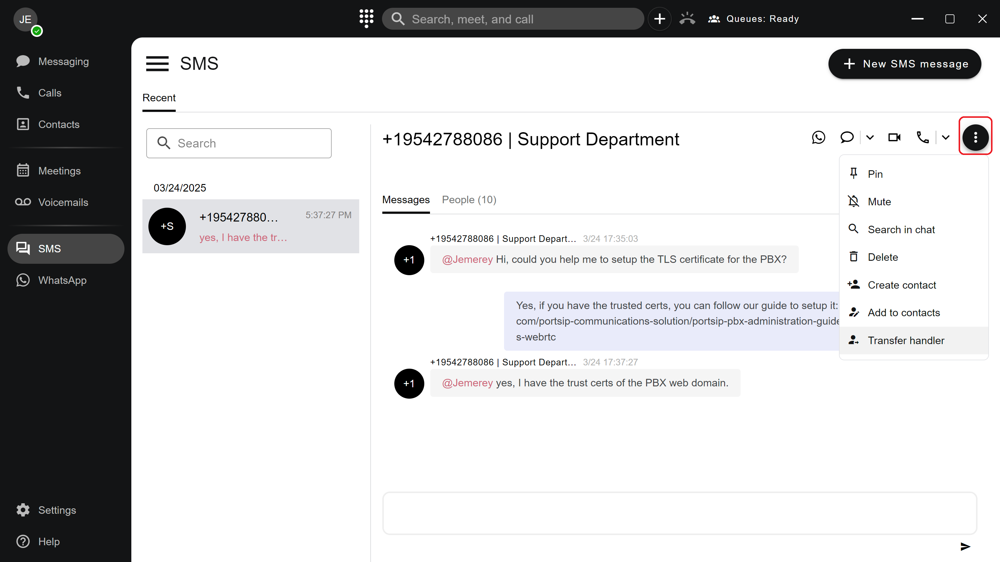
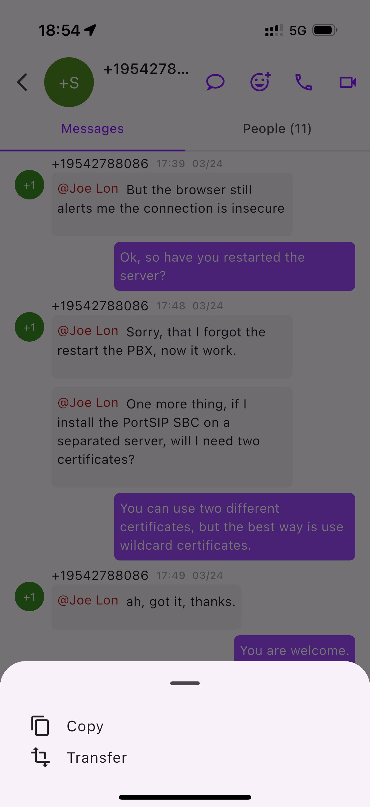
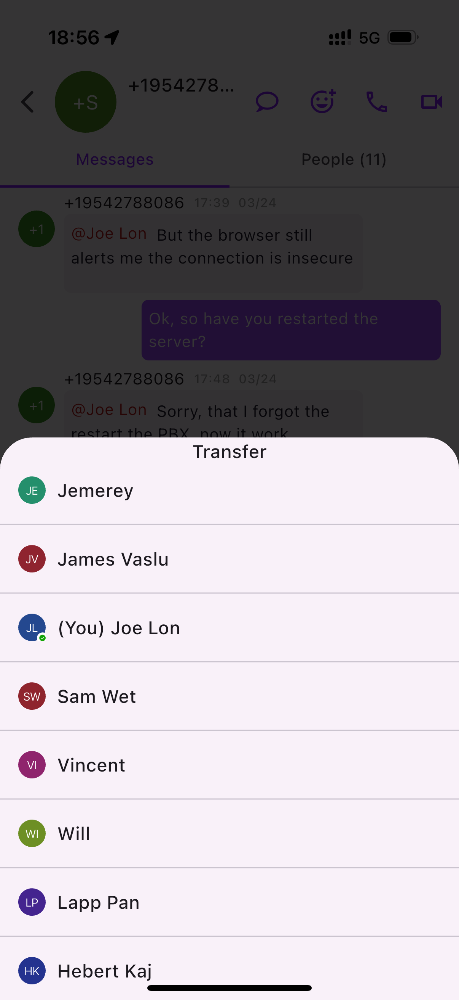
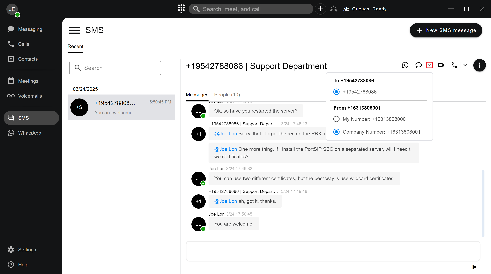
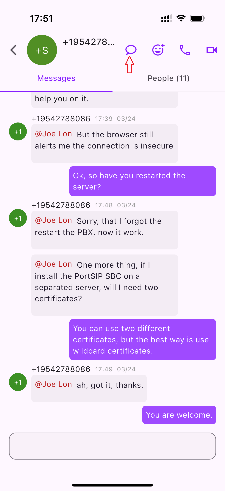
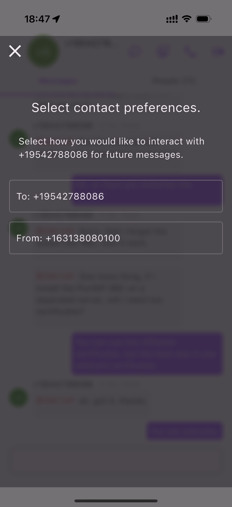

# Manage SMS/WhatsApp Message Conversations

The **SMS** and **WhatsApp** channels allow customers to contact your business easily by sending a message from virtually anywhere—even in environments with limited or no data connectivity (for SMS).

Customers can reach your agents using:

* **Long codes**
* **Short codes**
* **Toll-free numbers**

When a customer sends an SMS or WhatsApp message, a **new chat conversation** is automatically created in the **SMS/WhatsApp conversation list**. Agents can then view the conversation, respond to the customer, and manage the interaction directly from the Digital Engagement interface.

***

### Creating Message Routing Rules

To route inbound SMS or WhatsApp messages to a **ring group** or **call queue**, you must create a corresponding **inbound message rule** in **PortSIP PBX**.

#### Example Scenario

In the example shown in the screenshot:

* A customer sends an SMS to the DID **16313808000**
* The inbound rule routes the message to the **queue with extension 8000**

<figure><figcaption></figcaption></figure>

This ensures that inbound messages are handled by a group of agents rather than a single extension, enabling scalable and efficient customer engagement.

***

### Agent Assignment and Message Visibility

When SMS or WhatsApp messages are routed to a **ring group or call queue**:

* **All agents** in the group can view the full conversation and message history
* The PBX automatically selects and assigns a **designated agent** to handle the customer interaction
* The assigned agent receives an **@mention notification**, indicating responsibility for responding
* Other agents are **not actively alerted**, but can still monitor the conversation if needed

#### Notification Indicators

As illustrated in the screenshot:

* **Red @mention text** indicates the agent who has been assigned and notified to respond
* **Blue text** indicates another agent who has been referenced or alerted within the conversation

<figure><figcaption></figcaption></figure>

This approach ensures clear agent ownership while maintaining full visibility and collaboration within the team.

***

### Transferring a Message Conversation

If an agent is unable to fully resolve a customer inquiry or needs to escalate the issue, the active message conversation can be **transferred to another agent** for continued handling.

> ❗**Note**\
> Only the **currently assigned (designated) agent** is authorized to transfer a message conversation.

#### To transfer a conversation:

1. In the message conversation window, click the **⋯ (More Options)** icon.
2. Select **Transfer Handler** from the menu.
3. In the pop-up window, choose the target agent.
4. Click **CONFIRM** to complete the transfer.

#### Transfer Behavior

Once the transfer is completed:

* The selected agent becomes the **new designated handler** for the conversation.
* All **subsequent messages** from the customer—sent to the same ring group or queue—are automatically routed to the newly assigned agent.
* The conversation history remains intact, ensuring full context is preserved for the new agent.

This transfer mechanism ensures seamless escalation, clear agent ownership, and a consistent customer experience without requiring the customer to restart the conversation.

<figure><figcaption></figcaption></figure>

In the **PortSIP ONE** mobile app, the **currently assigned agent** can **tap and hold their own message**, then select **Transfer** from the pop-up menu to initiate a conversation transfer.

<figure><figcaption></figcaption></figure>

From there, the agent can **select another agent** to whom the conversation will be transferred.

<figure><figcaption></figcaption></figure>

***

### Selecting the Destination Number and Outbound Caller ID

When replying to a customer, you can control **which phone number is used as the destination** and **which outbound caller ID is presented**, depending on your configuration and available numbers.

If the customer is saved as a contact with multiple phone numbers, or if you want to present a different outbound caller ID:

* Click the **down arrow** icon next to the phone number field.
* Select the desired **destination phone number** or **outbound Caller ID** from the list.

This flexibility allows agents to ensure replies are sent to the correct number while presenting the appropriate caller identity to the customer.

Refer to the screenshot below for an example of this selection in the user interface.

<figure><figcaption></figcaption></figure>

In the **PortSIP ONE** mobile app, tap the **message** icon at the top of the conversation to open the selection window, where you can choose the **destination phone number** and the **outbound Caller ID**.

<figure><figcaption></figcaption></figure>

As shown in the screenshot below, tap the **drop-down list** to select the **destination number** or choose a different **outbound Caller ID**.

<figure><figcaption></figcaption></figure>

