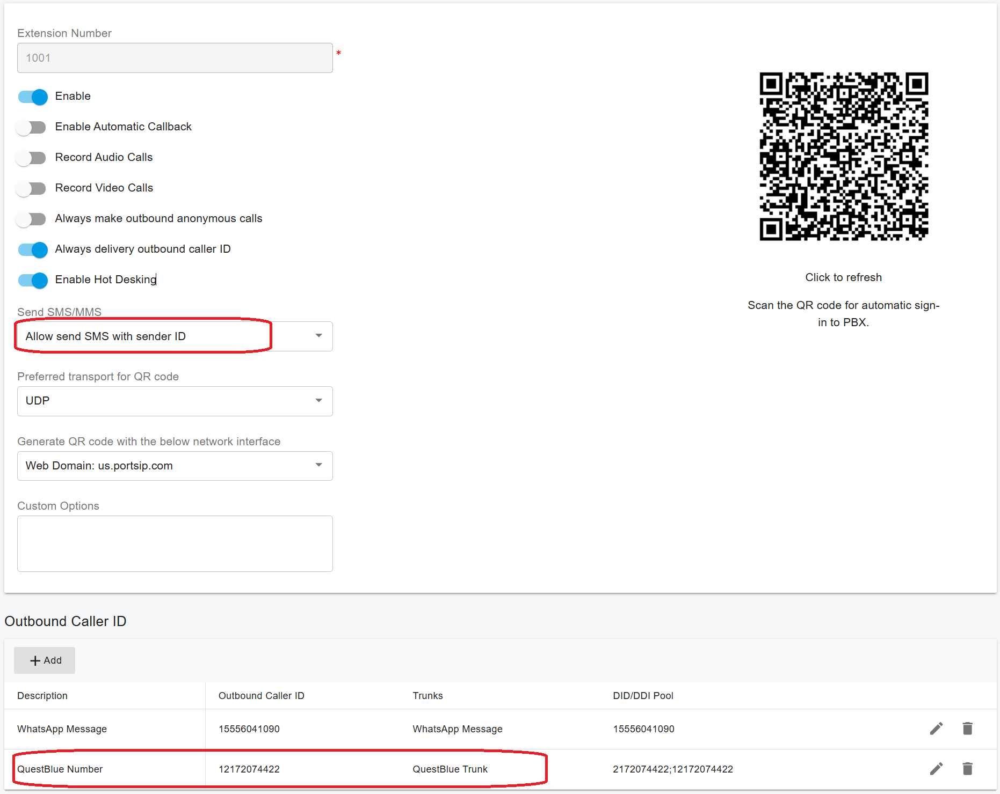

# SMS Channel

PortSIP PBX provides native SMS integration with the following SIP trunk providers:

* [Vonage](https://www.vonage.com/)
* [QuestBlue](https://questblue.com/)
* [VoIP.ms](https://voip.ms/)
* [Voxtelesys](https://voxtelesys.com/)
* [Bandwidth](https://www.bandwidth.com/)
* [Flowroute](https://flowroute.com/)
* [Wavix](https://wavix.com/)
* [Twilio](https://www.twilio.com/en-us)
* [Telnyx](https://telnyx.com/)
* [VoIP Innovations](https://carrierservices.sangoma.com/)
* [Aire Networks](https://airenetworks.es/)
* [VoiceMeUp](https://www.voicemeup.com/)

If you are using one of the supported providers listed above, **configuring the SMS channel in PortSIP PBX is quick and straightforward**.

If your preferred SIP trunk provider is not currently supported, please contact us via [email with](mailto:support@portsip.com) your request. Our team will evaluate the integration and explore adding support in a future release.

***

### 1. Preparing to Configure SMS in PortSIP PBX

Before configuring the SMS channel, ensure that SMS services are fully enabled and operational with your SIP trunk provider.

Please complete all required steps in the [Configuring SIP Trunks](../../configuring-sip-trunks/) guide, including:

* SIP trunk registration or IP authentication
* DID number assignment
* SMS enablement on the provider side

Failure to complete provider-side SMS configuration may result in inbound or outbound messaging failures.

***

### 2. Full-Chain SSL Certificate Requirement

To allow the SMS provider to successfully **verify webhooks**, your PortSIP PBX must be configured with a **trusted, full-chain SSL certificate**.

You can verify whether your SSL certificate is valid and includes the complete certificate chain using one of the following tools:

* [SSL Checker](https://www.sslchecker.com/sslchecker)
* [SSL Shopper](https://www.sslshopper.com/ssl-checker.html)
* [Key CDN SSL Che](https://tools.keycdn.com/ssl)

If your certificate does not include the full chain, contact your SSL certificate provider and request a corrected **full-chain certificate**. This step is critical for secure webhook communication and message delivery.

***

### 3. Configuring the SMS Channel in PortSIP PBX

This section demonstrates how to configure SMS integration using [QuestBlue ](https://www.questblue.com)as an example.

In this scenario:

* The DID number **12172074422** is used for SMS
* Inbound SMS messages are routed to **extension 1001**

Before proceeding, ensure you have completed the following setup:

* [QuestBlue SMS Integration](../../configuring-sip-trunks/questblue-sip-trunk/questblue-sms-integration.md) guide

***

### 4. Creating an Inbound Rule for SMS

Follow the steps below to route inbound SMS messages to an extension:

1. Sign in to the PortSIP PBX Web Portal as an administrator.
2. Navigate to **Call Manager > Inbound Rules**.
3. Click **Add** to create a new inbound rule.
4. Configure the rule as follows:
   * **Name**: Enter a descriptive rule name
   * **Trunk**: Select the configured QuestBlue trunk
   * **DID/DDI Number or Number Range**: Enter `12172074422`
   * **Destination**: Select **Extension 1001**
5. Click **OK** to save the configuration.

<figure><figcaption></figcaption></figure>

Once completed, inbound SMS messages sent to the DID number will be delivered directly to the specified extension.

Next, register the **PortSIP ONE** client application to the PBX using **extension 1001**.

Once the extension is successfully registered:

* Any SMS messages sent to **+1 217 207 4422** will be **delivered directly to extension 1001** and displayed in the **PortSIP ONE** app.
* Inbound voice calls to the DID **+1 217 207 4422** will also be **routed to extension 1001**, based on the inbound rule configured earlier.

This configuration ensures that **both voice calls and SMS messages** associated with the same DID are handled consistently by a single extension, providing a unified communication experience for end users.

***

### 5. Sending Outbound SMS

The **PortSIP ONE** app allows users to send outbound SMS messages through **PortSIP PBX**, using the SMS capabilities provided by the configured SIP trunk provider.

If your SMS provider supports and requires a **Sender ID** (for example, an alphanumeric sender name), and you want outbound messages from an extension to display this Sender ID, you must configure it in the PBX:

1. Sign in to the **PortSIP PBX Web Portal**.
2. Navigate to the **SMS settings** for the relevant extension or tenant.
3. Specify the **Sender ID** exactly as registered with your SIP trunk provider.

> ❗**Important**\
> The Sender ID must be **pre-registered and approved** by your SMS provider. Unsupported or unregistered Sender IDs may cause outbound messages to fail or be rejected.

For guidance on Sender ID formats and restrictions, refer to  [The Alphanumeric Sender ID](https://www.twilio.com/docs/glossary/what-alphanumeric-sender-id) documentation and consult your SMS provider for provider-specific requirements, supported regions, and compliance rules.

<figure><figcaption></figcaption></figure>

### 5.1 Granting SMS Permissions to an Extension

By default, extensions are **not authorized to send outbound SMS messages**. To enable SMS sending for an extension, the **tenant administrator** must explicitly grant permission.

To allow an extension to send SMS:

1. Sign in to the PortSIP PBX Web Portal as a tenant administrator.
2. Navigate to **Call Manager > Users**.
3. Double-click the target extension and open the **Extension** tab.
4. Locate the **Send SMS/MMS** option and select one of the following:
   * **Allow** – Enables outbound SMS using the extension’s DID.
   * **Allow Send SMS with Sender ID** – Enables outbound SMS using a configured Sender ID.
5. Save your changes.

> ❗**Note**\
> If you choose **Allow Send SMS with Sender ID**, ensure that the Sender ID has already been registered and approved by your SMS provider. Otherwise, outbound messages may be rejected.

***

### 5.2 Configuring the Outbound Caller ID for SMS

The **Outbound Caller ID** determines which DID or identity is used when an extension sends SMS messages. Each extension can be associated with one or more outbound SMS caller IDs.

To configure an outbound Caller ID for SMS:

1. In the extension settings, locate the **Outbound Caller ID** section.
2. Click **Add** to create a new outbound Caller ID entry.
3. Select the **SIP trunk** that is configured for SMS delivery.
4. Enter a descriptive name in the **Description** field (for example, _Sales SMS_ or _Support SMS_).
5. Enter a **DID number** from the SIP trunk’s DID pool that is enabled for SMS.
6. Save the configuration.

Once configured, outbound SMS messages sent from the extension will use the specified Caller ID or DID, depending on the selected permissions and provider capabilities.

Refer to the accompanying screenshot for a visual walkthrough of the configuration steps.

<figure><figcaption></figcaption></figure>

***

> ❗**Important**\
> Some SMS providers, such as **Telnyx**, require phone numbers to be configured in **E.164 format** for SMS delivery.
>
> When configuring outbound Caller ID or Sender ID for SMS, ensure that the phone number is entered in full E.164 format (for example, `+12172074422`).
>
> Refer to the screenshot below for an example configuration, and **confirm the required number format with your SMS provider**, as formatting rules may vary by provider and region.

<figure><figcaption></figcaption></figure>

### 5.3 Sending an SMS to a Contact

Users can send SMS messages to contacts directly from the **PortSIP ONE** app using the following steps:

1. **Open Contacts**\
   In the PortSIP ONE app, navigate to the **Contacts** menu, select the desired contact, and click the **SMS** icon to open the SMS conversation interface.

<figure><figcaption></figcaption></figure>

2. **Send the Message**\
   Enter your message in the text field, just as you would in a standard chat application.\
   If multiple numbers are available, you can:

* Select the **destination number** associated with the contact
* Choose the **sender number or Caller ID** that will be displayed to the recipient

<figure><figcaption></figcaption></figure>

Once sent, the message will be delivered through **PortSIP PBX** using the configured SMS provider.

***

### 5.4 Sending an SMS Directly to a Phone Number

The **PortSIP ONE** app allows users to send SMS messages directly to a phone number, even if the number is not saved as a contact.

To send an SMS to a phone number:

1. **Start a New Message**\
   In the PortSIP ONE app, click the **+** button at the top of the interface and select **Send a Message**.
2. **Select the Message Target**\
   In the pop-up window, you can:
   * Select an **extension** to send an internal instant message (IM), or
   * Select an **existing contact** to send an SMS, or
   * Enter a phone number directly in the provided field to send an SMS to an unsaved number.
3. **Open the SMS Chat**\
   Click the green **message** icon to open the SMS conversation interface.

<figure><figcaption></figcaption></figure>

4. **Send the Message**\
   Type your message in the chat window, as you would in a standard messaging application.\
   If applicable, you can:

* Select the **destination phone number**, and
* Specify the **sender number or Caller ID** that will be displayed to the recipient.

Once sent, the message is delivered through **PortSIP PBX** using the configured SMS provider.

For more details please refer to the guide [Manage SMS/WhatsApp Message Conversations](manage-sms-whatsapp-message-conversations.md).

