# WhatsApp Channel

With over 2 billion monthly users, WhatsApp stands as one of the most popular consumer messaging and communication platforms worldwide. This guide will walk you through the process of configuring your WhatsApp Business account on PortSIP PBX, enabling your extension users to communicate directly with customers via WhatsApp.

## **Prerequisites**

To integrate WhatsApp Business with PortSIP PBX, ensure the following requirements are met:

1. **WhatsApp Business Platform Account**
   * You must have a WhatsApp Business Platform account set up with an associated phone number.
   * The phone number must not be registered with any other WhatsApp account, whether on a device or virtually.
   * If you wish to use a number already linked to an existing WhatsApp account, you must first delete the account. [Read more here](https://faq.whatsapp.com/605464643328528/?locale=en_US).
2. **Inbound Messaging Only**
   * WhatsApp integration with PortSIP PBX supports responding to inbound messages only.
   * A WhatsApp user must initiate the conversation by sending you a message.
   * Once a message is received, you have a 24-hour window to respond.
3. **Full Chain SSL Certificates**
   *   To ensure successful webhook verification by the WhatsApp (Meta) platform, your PortSIP PBX must be configured with a **trusted, full-chain SSL certificate**.

       You can verify whether your SSL certificate is trusted and includes the complete certificate chain using one of these tools:

       * [SSL Checker](https://www.sslchecker.com/sslchecker)
       * [SSL Shopper](https://www.sslshopper.com/ssl-checker.html)

       If your certificate is not a full-chain SSL certificate, contact your SSL certificate provider to have it corrected.

## Configuring WhatsApp

### Register for an Official Account on WhatsApp

To set up your WhatsApp Business account for integration, follow these steps:

1. **Log In to the Meta Developers Portal**
   * Navigate to [https://developers.facebook.com](https://developers.facebook.com) and click **Log In** at the top right.
2. **Create a New App**
   * Go to **My Apps** and click on **Create App**.
   * Select **Other** and click **Next**.
   * Choose **Business** as the app type, then click **Next**.
3. **Set Up App Details**
   * Enter a **Display Name** for your app.
   * Use the drop-down menu to select your **Business Account**.
   * Click **Create App**.
   * Re-enter your password when prompted, then click **Submit**.
4. **Add WhatsApp to Your App**
   * On the next screen, scroll down to the **WhatsApp** section and click **Set Up**.
   * In the "Welcome to the WhatsApp Business Platform" section, click **Start Using the API**.
5. **Configure Your Phone Number**
   * Use the drop-down menu to select the phone number you will use for sending and receiving messages.
   * Copy the **Phone Number ID** and save it for later use.

### Setting Up an Admin User

1. **Access Business Settings**
   * Click on the menu icon in the top-left corner of the [Meta Business Settings](https://business.facebook.com/settings/) page.
   * Select **Business Settings** from the menu.

<figure>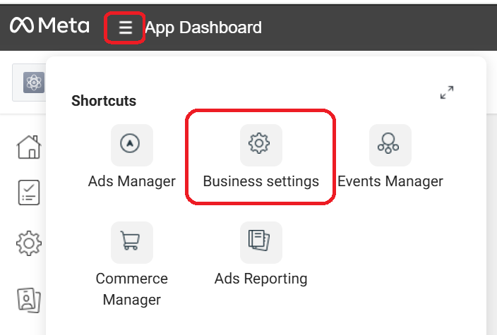<figcaption></figcaption></figure>

2. **Add a System User**
   * Navigate to **Users > System Users** and click **Add**.
   * Accept the non-discrimination policy and click **Done**.
3. **Configure the System User**
   * Set a name for the system user (e.g., `portsip`).
   * Assign the **Admin** role to the user and click the **Create system user** button.

<figure>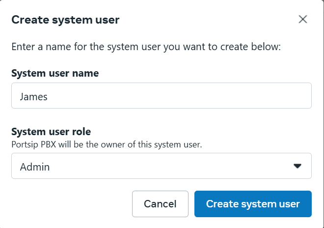<figcaption></figcaption></figure>

4. **Add Assets to the System User**
   * Click **Add Assets**.
   * In the pop-up box, select **Apps**, then choose your app from the list.
   * Enable the **Manage App** option.
   * Click **Save Changes** to confirm.
5. **Link the WhatsApp Business Account**
   * From the left-hand menu, navigate to **Accounts > WhatsApp Accounts**.
   * Select your WhatsApp Business account and click **Add People** to assign the user to the account.
6. Select the system user you created, enable the **Full Control** option, and click **Assign** to save the changes.

### Generate a New Token

1. Click the _Business Settings_.

<figure>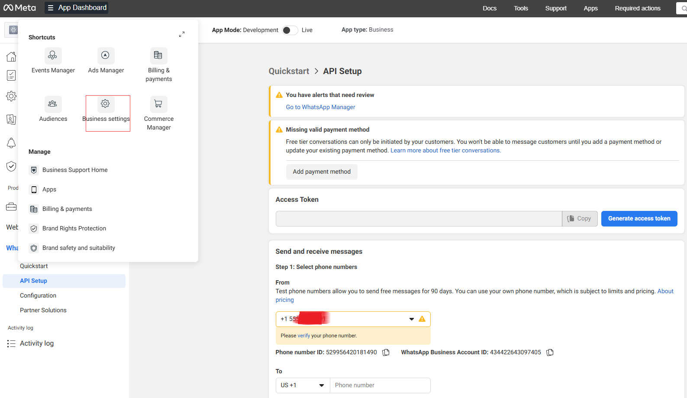<figcaption></figcaption></figure>

2. Navigate to **Users > System Users** from the left-hand menu and click **Generate New Token**.

<figure>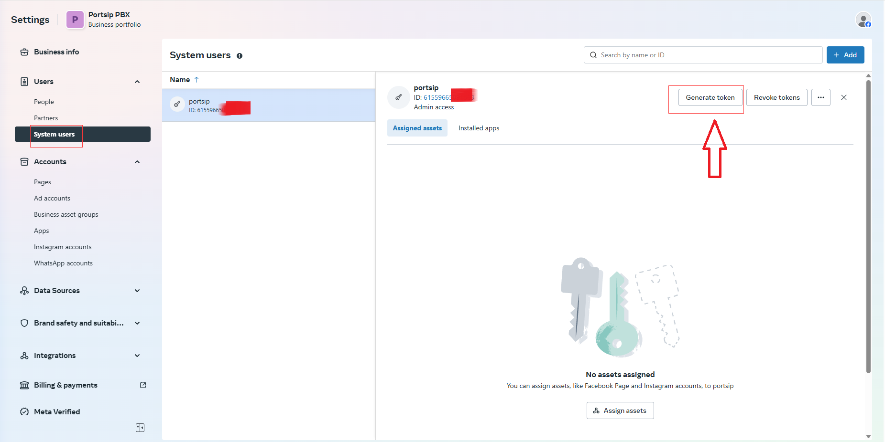<figcaption></figcaption></figure>

3.  **Choose how long the token should remain valid.**\
    We recommend selecting "**Never"** so the token does not expire.

    If the token expires, the PBX will no longer be able to send outbound WhatsApp messages. You will then need to generate a new token and update it in the PortSIP PBX web portal before messaging can resume.

<figure>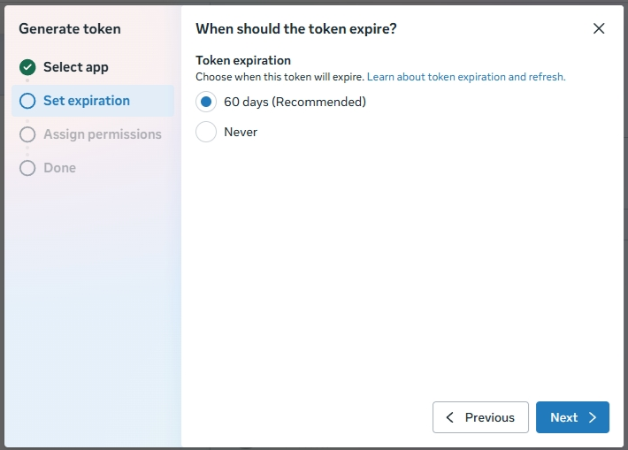<figcaption></figcaption></figure>

4. In the pop-up, select your app from the drop-down list.

<figure>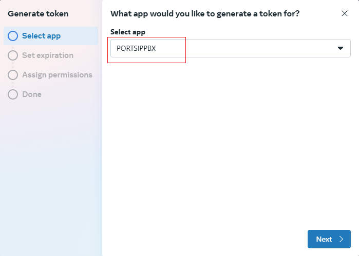<figcaption></figcaption></figure>

5. Check the permissions for **whatsapp\_business\_messaging** and **whatsapp\_business\_management**.

<figure>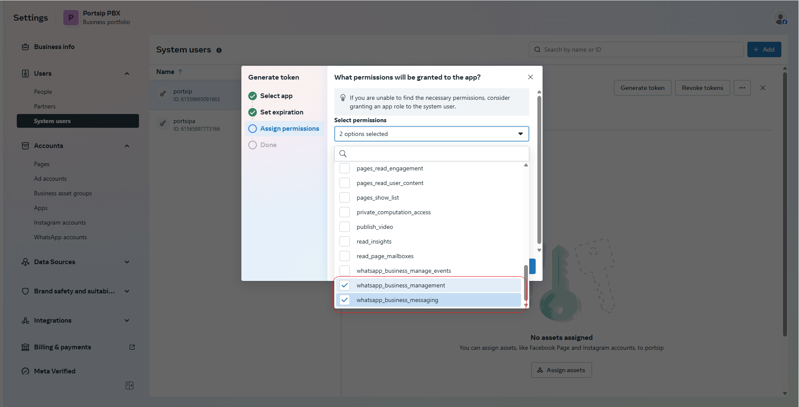<figcaption></figcaption></figure>

6. Click **Generate Token**.
7. Copy the access token displayed in the pop-up box and save it securely, as it will not be accessible again. This is a permanent token that will remain valid unless you click the **Revoke Token** button.

### Verify your Phone number


This step is mandatory, don't ignore it, otherwise you can't to receive the inbound WhatsApp messages.


Once you have successfully generated the token, if your WhatsApp phone number status is still pending,  you will need to use the REST API to verify your phone number. For detailed instructions, please follow this guide: [**Register a Business Phone Number**](https://developers.facebook.com/docs/whatsapp/cloud-api/reference/registration#register-phone).

## Configuring PortSIP PBX

To integrate the WhatsApp account you created with PortSIP PBX, follow these steps:

### **Add WhatsApp as a SIP Trunk**

1. Access the PortSIP PBX web portal and log in as a **Tenant Manager**.
2. Navigate to the menu **Call Manager > Trunks, c**lick the **Add** button, and select **WhatsApp** as the trunk type.
3. **Configure the Trunk**
   * Enter a name for the trunk (e.g., **WhatsApp Message**).
   * In the **DID Pool** field, enter the phone number associated with your WhatsApp account.
4. Click the **OK** button to save changes.

<figure>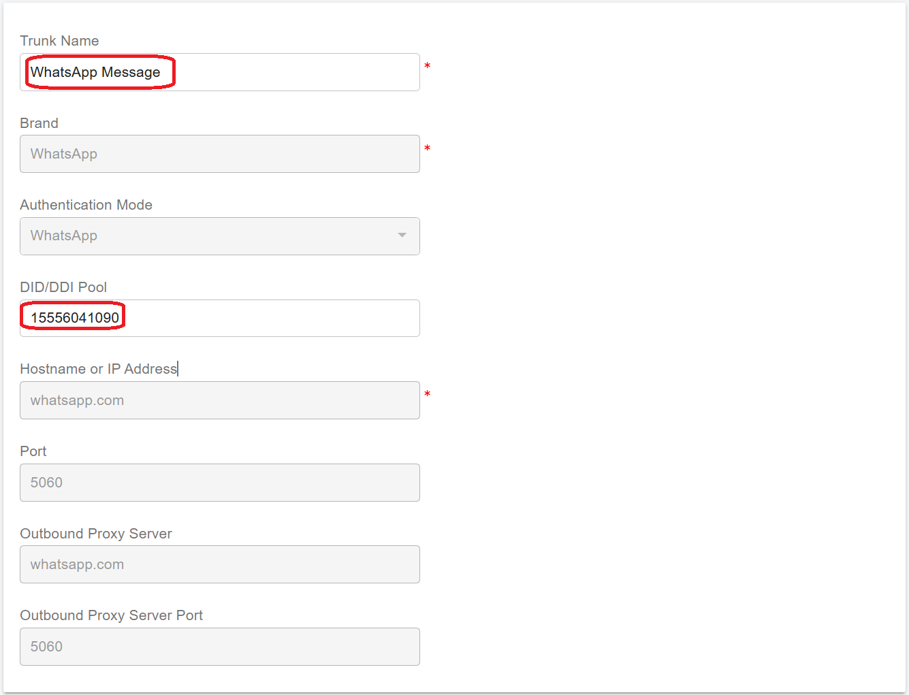<figcaption></figcaption></figure>

### Add a WhatsApp Channel

1. Navigate to **Message Channels > WhatsApp** and click **Add**.
2. Enter a name for the channel (e.g., **WhatsApp Channel**) and select the WhatsApp trunk you added earlier.
3. Input the phone number associated with your WhatsApp account in the **Phone Number** field.
4. Paste the **Access Token** from the [_Generate a New Token_](whatsapp-channel.md#generate-a-new-token) section.
5. Ensure the **Enable** option is turned on, then click **OK** to save your changes.

<figure>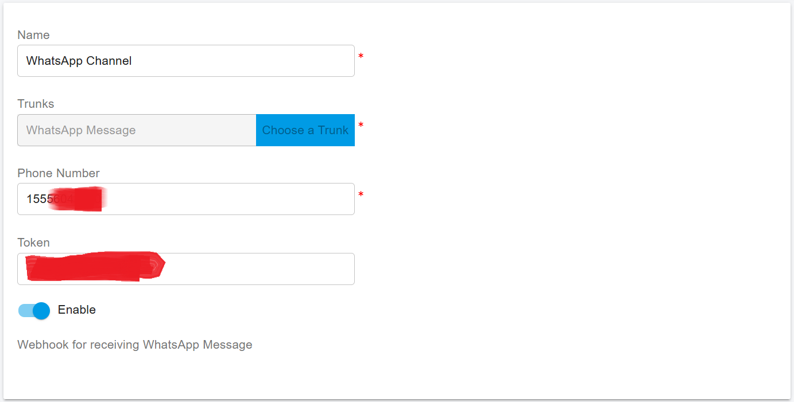<figcaption></figcaption></figure>

## Configure Webhook in WhatsApp

To enable PortSIP PBX to receive inbound WhatsApp messages, follow these steps:

1. **Copy the Webhook URL**
   * Go to **Message Channels > WhatsApp** in the PortSIP PBX Web portal.
   * Select the WhatsApp Channel and click the **Copy Webhook** button to copy the Webhook URL.

<figure>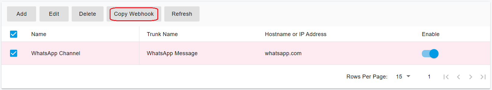<figcaption></figcaption></figure>

2. **Access the Meta Developer Portal**
   * Log in to the [Meta for Developers](https://developers.facebook.com) portal and locate your app.
   * Navigate to **WhatsApp > Configuration**, and paste the Webhook URL copied from the PortSIP PBX.
   * In the token verification field, enter a random string of letters and numbers. (This token is used only for verification and doesn’t need to be saved for future use.)
   * Click **Verify and Save** to confirm the configuration.

<figure>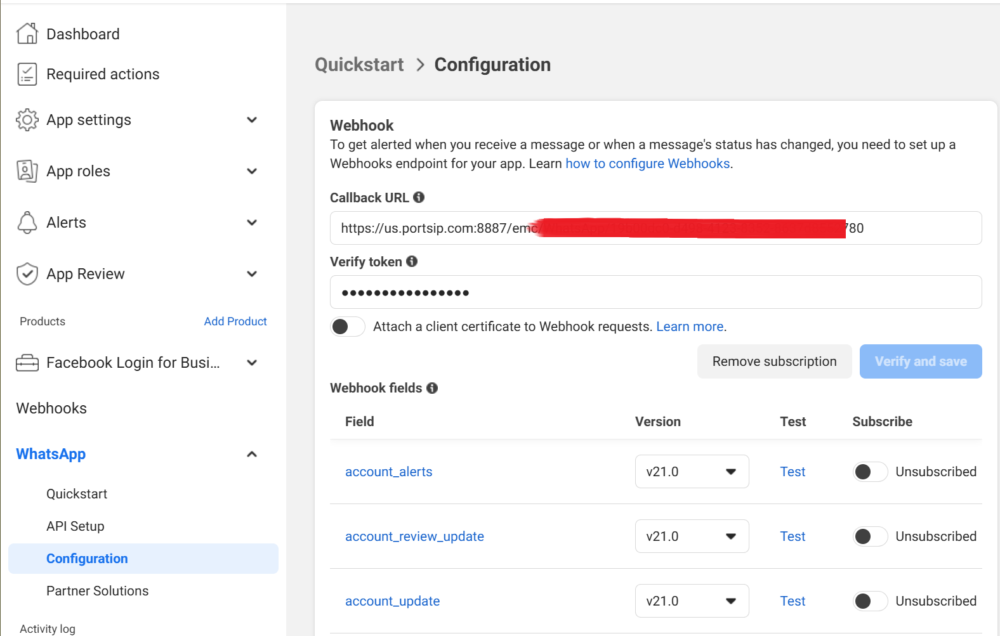<figcaption></figcaption></figure>

3. **Enable Webhook Fields**
   * In the **Webhook Fields** section, toggle the switch to **Subscribed**.
   * A notification will confirm that the subscription was successful.

<figure>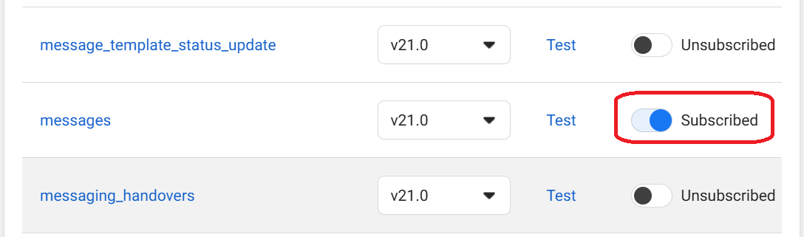<figcaption></figcaption></figure>

## Creating an Inbound Rule for WhatsApp

1. Sign in to the PortSIP PBX web portal.
2. Navigate to **Call Manager > Inbound Rules** and click the **Add** button.
3. Complete the inbound rule setup as follows:
   * Enter a descriptive name for the rule.
   * Select the **WhatsApp** trunk you configured in the previous steps.
   * In the **DID/DDI Number or Number Range** field, enter the DID number that you configured while configuring the WhatsApp trunk-in fact it's the phone number associated with your WhatsApp account.
   * Set the destination to extension **1001**. You can also set the destination extension as a ring group number or queue number as well.
4. Click **OK** to save your changes.

<figure>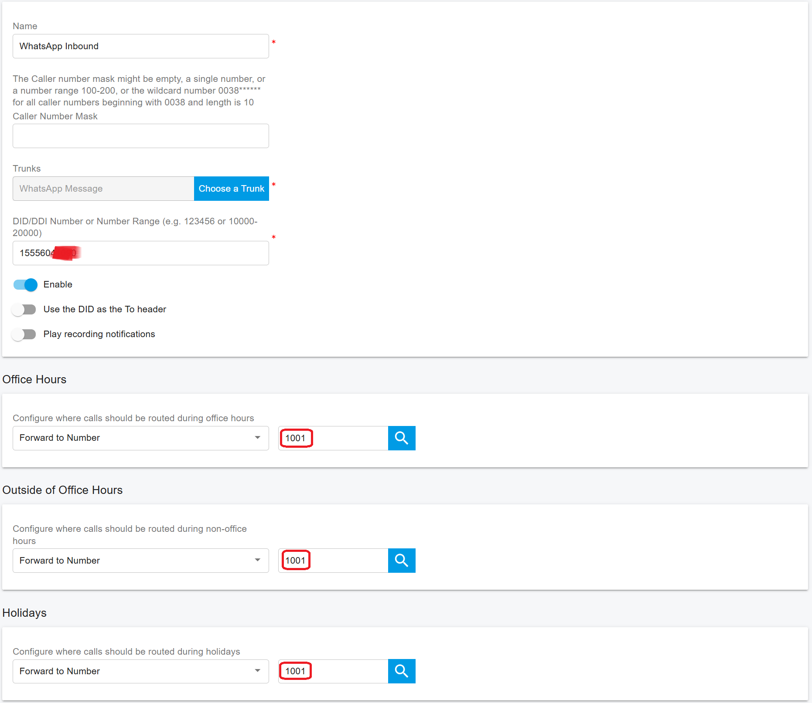<figcaption></figcaption></figure>

Now you can send a WhatsApp message to your business phone number to verify the integration.

