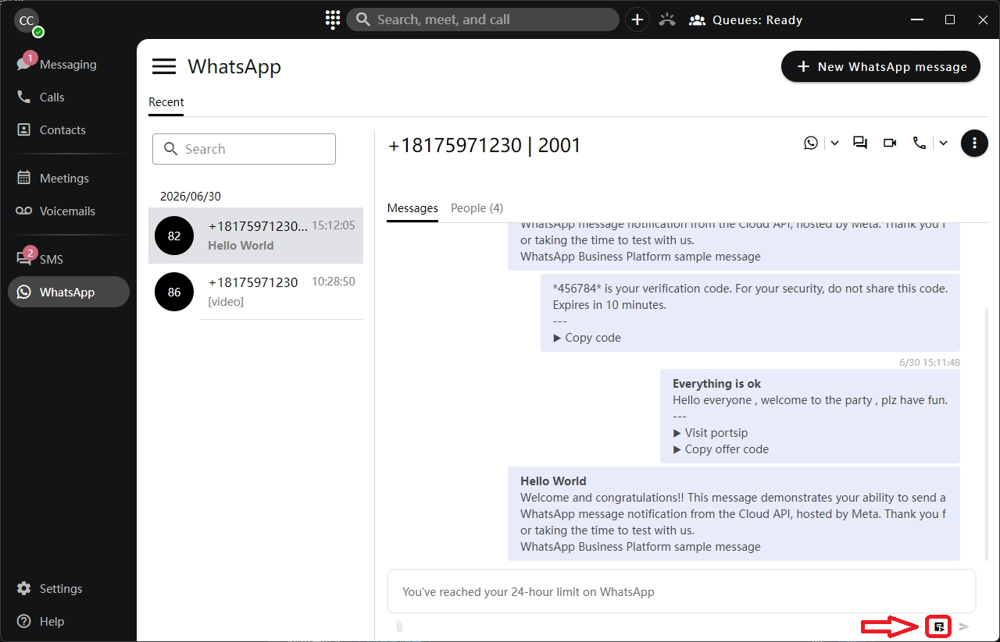
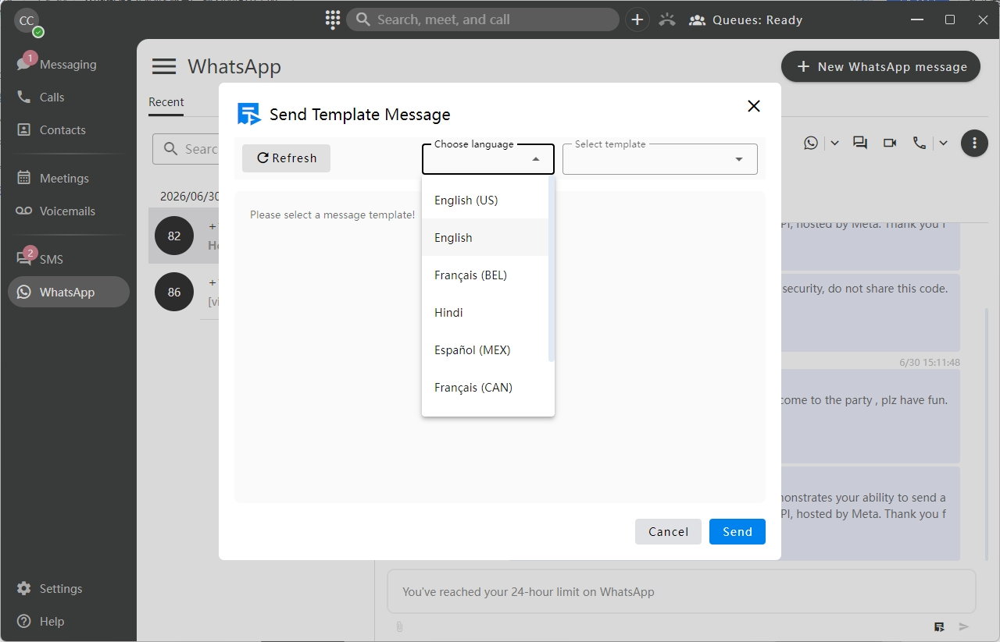
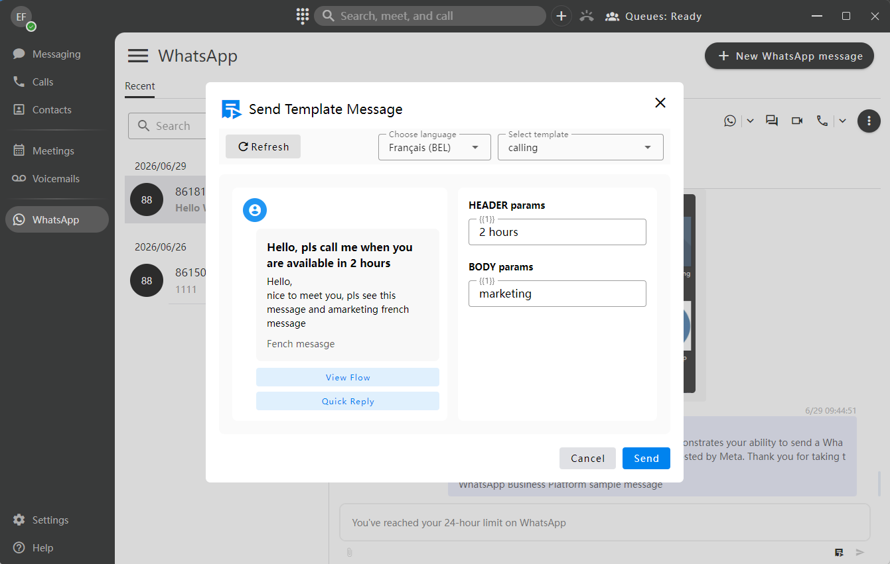

# WhatsApp Message Templates

### 1. Feature Overview

#### 1.1 What Are WhatsApp Message Templates?

WhatsApp message templates are pre-approved message formats required by Meta. They allow a business to proactively send WhatsApp messages to users when a standard free-form message is not allowed.

WhatsApp message templates are commonly used in the following scenarios:

* **First contact with a new customer:** A business account cannot send free-form text as the first outbound message. The first conversation must be initiated by using an approved message template.
* **After the 24-hour customer service window has expired:** If more than 24 hours have passed since the user’s last inbound message from WhatsApp to PortSIP PBX, the business can only re-engage the user by sending an approved message template.
* **Marketing broadcasts:** Templates can be used for campaign promotions, holiday offers, and similar marketing scenarios, subject to Meta’s messaging policies and applicable customer consent requirements.

This guide does not cover creating, editing, or submitting WhatsApp message templates for review directly from the PortSIP PBX Web Portal. Template creation and approval must be completed through Meta’s official tools, such as WhatsApp Manager.

> **Important**\
> WhatsApp message templates must be created and approved through Meta’s official tools before they can be used in PortSIP PBX. For detailed instructions, refer to the official Meta guide: [Create message templates for your WhatsApp Business account](https://www.facebook.com/business/help/2055875911147364?id=2129163877102343).

***

### 2. Client App Operations

#### 2.1 Automatic Conversation Status Detection

When the client app opens the conversation details page for a WhatsApp contact, it automatically checks the timestamp of the contact’s most recent inbound message and determines whether the conversation is still within the 24-hour customer service window.

| Status                     | Condition                                                                      | UI Behavior                                                                                                                                                              |
| -------------------------- | ------------------------------------------------------------------------------ | ------------------------------------------------------------------------------------------------------------------------------------------------------------------------ |
| Within the 24-hour window  | The most recent inbound WhatsApp message was received less than 24 hours ago.  | The message input box is available. Users can send free-form messages, including text, images, audio, videos, and other supported message types.                         |
| Outside the 24-hour window | The most recent inbound WhatsApp message was received 24 hours ago or earlier. | The message input box is disabled and displays the prompt: **“You've reached your 24-hour limit on WhatsApp.”** Users can only send approved WhatsApp message templates. |

> **Note**\
> The 24-hour window is calculated based on the most recent inbound message received from the WhatsApp user.

#### 2.2 Selecting and Sending a Template Message

When the conversation is **outside the 24-hour customer service window**, users can send an approved WhatsApp message template.

**Step 1: Open the template selection page**

1. In the WhatsApp conversation, click **Select Template**.
2. The system retrieves the list of available templates for the current WhatsApp channel.

<figure><figcaption></figcaption></figure>

**Expected result:** The template selection dialog opens and displays the templates available for the selected WhatsApp channel.

**Step 2: Filter templates**

1. Use the **Language** filter to narrow down the template list.
2. Select the required language to quickly find the target template.

<figure><figcaption></figcaption></figure>

**Expected result:** The template list is filtered by the selected language.

**Step 3: Preview the template and enter variables**

1. Select the required template.
2. The system displays a full preview of the selected template.
3. If the template contains variables, such as `{{a}}` or `{{b}}`, the system automatically displays them as input fields.
4. Enter the required value for each variable.

<figure><figcaption></figcaption></figure>

**Expected result:** The template preview shows the selected template, and all required variables are completed.

**Step 4: Send the template message**

1. After all required variables are completed, click **Send**.
2. The system sends the template message to the WhatsApp user by using the selected `template_id`, language, and variable values.

**Expected result:** The selected WhatsApp message template is sent to the user through the configured WhatsApp channel.

