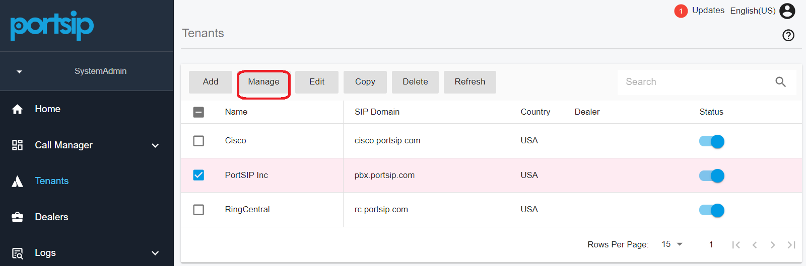
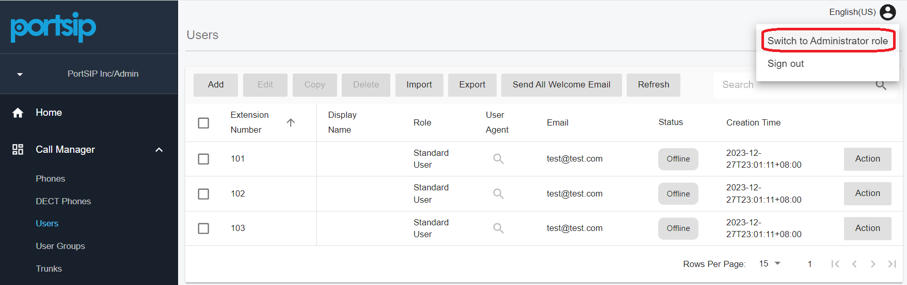

# Managing Tenants

After completing the **Configuration Wizard**, you can manage **PortSIP PBX** through the **Web Portal**. From here, administrators can configure and manage all core PBX features, including:

* Tenants
* Users (extensions)
* Call routing and call forwarding
* Feature Access Codes (FAC)
* SIP trunks
* Queues and ring groups
* And more

***

### Creating a Tenant

To create a new tenant:

1. Sign in to the **PBX Web Portal** as a System Administrator.
2. Navigate to **Tenants** from the left-hand menu.
3. Click **Add**.

When creating a tenant, you can configure key tenant profile settings such as Name, SIP Domain, Office Hours, and Storage quotas.

Once created, a tenant’s profile can be modified at any time by a System Administrator through the Web Portal.

***

#### Tenant General Settings

The **General** tab allows you to define the tenant’s identity and resource limits.

**Basic Information**

* **Name**\
  The display name used to identify the tenant (for example, _ABC Company_).
*   **SIP Domain**\
    A unique SIP domain used to distinguish extensions across tenants.\
    This domain **does not need to exist or be resolvable** and may be a dummy domain.

    **Example:**

    * Tenant A SIP domain: `test1.com` → Extension URI: `sip:101@test1.com`
    * Tenant B SIP domain: `test2.com` → Extension URI: `sip:101@test2.com`

    This mechanism ensures complete SIP namespace isolation between tenants.

    > ❗**Important**\
    > Do **not** configure the PBX server IP address as a tenant SIP domain.

**Capability (Resource Limits)**

The **Capability** section allows you to control how many resources a tenant may consume, including:

* Maximum number of extensions
* Maximum concurrent calls
* Maximum ring groups
* Maximum call queues
* Maximum meetings
* Maximum virtual receptionist
* Other tenant-level limits

This enables precise capacity control in multi-tenant environments.

**AI Transcription**

* **AI Transcription:** Enable or disable AI transcription for the tenant.
* **Daily Transcription Quota:** Define daily usage limits to control costs and resource consumption.

***

#### Tenant Options

The **Options** tab allows you to configure operational and regional settings.

* **Enable This Tenant:** If disabled, the tenant and all associated extensions become inactive.
* **Allow Concurrent Logins:** Allows tenant administrators to sign in from multiple devices simultaneously.
* **Country:** Specifies the tenant’s country.
* **Timezone:** Defines the tenant’s timezone for call routing, reports, and logs.
* **Currency:** Used for billing and reporting purposes.
* **Enable Extension Audio Recording:** Forces audio recording for all extensions, regardless of individual extension settings.
* **Enable Extension Video Recording:** Forces video recording for all extensions.
* **Night Mode:** When enabled, all IVRs, queues, and ring groups follow night-mode routing rules.
* **Office Hours:** Defines global office hours for the tenant.\
  If extensions, inbound rules, or outbound rules are set to _follow global office hours_, call routing will respect these settings.
* **Holidays:** Defines tenant-wide holidays.\
  When the current date falls within a holiday period, call routing follows the configured holiday rules.

***

#### Storage Settings

The **Storage** tab allows administrators to manage tenant-level storage usage.

* **Disk Quota (MB):** Maximum total storage allocated to the tenant.
* **Chat File Quota:** Configure chat file limits per user and per tenant.

**Auto Cleaning**

You can define automatic cleanup policies for:

* Call recordings
* Call reports
* Chat files
* Voicemail messages

This helps maintain predictable storage usage.

***

#### Apps Control

The **Apps** tab allows you to control which client applications tenant extensions may use:

* PortSIP ONE App
* PortSIP Team Phone App
*   Limit App Logins

    * Disabled: No application usage limits
    * Enabled: Specify how many extension users may use each app

    Setting a value to **0** means no users in that tenant may use the corresponding app.

***

#### Tenant Feature Management

The **Features** tab allows you to enable or disable major functional modules per tenant, including:

* Billing
* Call Statistics
* Contact Center
* Message Channels
* Trunks
* Microsoft Teams Integration
* CRM Integration

This provides flexible service packaging for different customer tiers.

***

### Deactivating a Tenant

To deactivate or reactivate a tenant:

1. Navigate to **Tenants** in the left menu.
2. Locate the tenant in the list.
3. Toggle the **ON/OFF** switch in the **Status** column.

When deactivated, all extensions and services under the tenant are disabled.

***

### Deleting a Tenant

To delete a tenant:

1. Navigate to **Tenants**.
2. Select the tenant.
3. Click **Delete**.

> ❗**Note**\
> Deleting a tenant may take some time, as all associated resources (extensions, recordings, reports, messages, etc.) must be removed.\
> The tenant **will remain visible** in the list until the deletion process is fully completed.

***

### Managing a Tenant

A **System Administrator** can manage tenants and their extensions directly.

1. Sign in to the **PBX Web Portal**.
2. Navigate to **Tenants**.
3. Select the tenant and click **Manage**.

<figure><figcaption></figcaption></figure>

This allows the System Administrator to temporarily assume the role of the tenant administrator and configure tenant settings and extensions.

#### Switching Back to System Administrator

After completing tenant management tasks:

1. Click the profile picture in the top-right corner.
2. Select **Switch to Administrator**.

This returns you to the System Administrator role **without requiring logout and re-login**.

<figure><figcaption></figcaption></figure>

