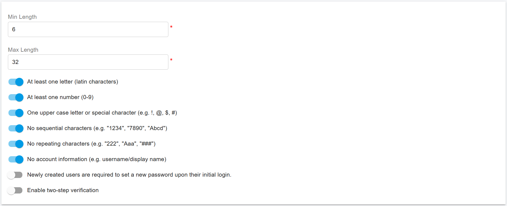
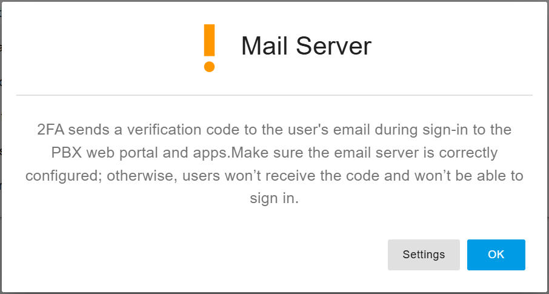

# Password and Sign-In Security

This section allows administrators to configure password policies and sign-in security settings for extension users of the tenant. These settings help protect user accounts and prevent unauthorized access. Options may include minimum password length, complexity requirements, two-factor authentication (2FA).

## Password Policy

Select the left menu Company, click on the Password Policy tab, you can customize the password policy for example, the minmum lenght, and maximum lenght, complexity, etc.

<figure><figcaption></figcaption></figure>

## 2FA

PortSIP PBX supports two-factor authentication (2FA) by sending a verification code via email.

If you enable the **"Enable two-step verification"** option, all extension users under this tenant will be required to enter a verification code sent to their email address in order to sign in.

Since 2FA relies on email delivery, you **must ensure that the Mail Server settings are correctly configured and functioning**. If the mail server is not properly set up, users will not receive the verification code and will be unable to log in.

After enabling 2FA and clicking the **OK** button to save your changes, the PBX web portal will display a warning message prompting you to verify the mail server configuration.

<figure><figcaption></figcaption></figure>

