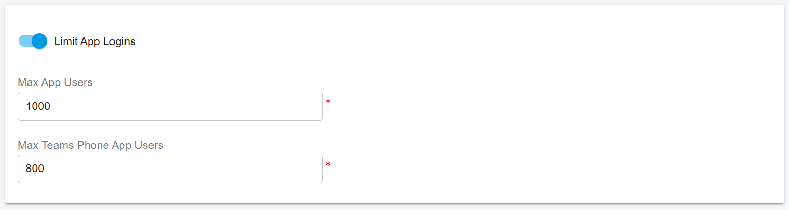
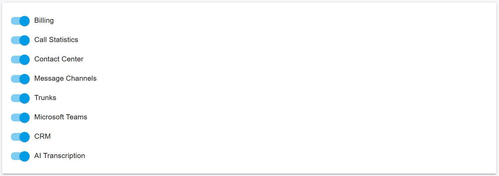

# Tenant Feature Management

**T**enant Feature Management allows the PBX Administrator to centrally activate or deactivate specific features for individual tenants. This provides the PBX owner with a flexible and scalable way to manage tenant capabilities, control resource usage, and offer value-added features as paid options to increase revenue.

By enabling or disabling features at the tenant level, service providers can easily implement service tiers, add-on features, or usage-based charging models.

The PBX Administrator can activate or deactivate the following features for each tenant.

***

### AI Transcription

Controls tenant access to the **AI transcription** feature and its usage limits.

* **Activate / Deactivate**\
  When deactivated, the tenant cannot use AI transcription under any circumstances.
* **Daily Quota Limit**\
  When activated, a daily transcription quota can be assigned to the tenant.\
  Once the tenant reaches the daily quota, AI transcription is automatically suspended until the **next day**, when the quota resets.

This allows precise cost control and supports usage-based billing models.

You can access this option by navigating to **Tenants**, selecting the desired tenant, and then either **double-clicking the tenant** or clicking **Edit**.\
In the **General** tab, scroll to the bottom to locate the **AI Transcription** section. From there, you can **enable or disable AI Transcription** and configure the **daily quota**, as shown in the screenshot below.

<figure><figcaption></figcaption></figure>

***

### App Usage

Controls how many users within a tenant can register using the **PortSIP ONE UC App** and **PortSIP ONE Teams Phone App**.

* If **disabled** or the maximum user count is set to **0**, no extensions under the tenant can register using these applications.
* If a maximum value (for example, **100**) is configured, only that number of extension users are allowed to register using the PortSIP ONE apps.

This feature is commonly used to enforce **per-user licensing limits**.

You can access this option by navigating to **Tenants**, selecting the desired tenant, and then either **double-clicking the tenant** or clicking **Edit**.\
In the **Apps** tab, enable **App Usage Limitation** and specify the maximum number of users allowed to use the applications. A value of **0** means that no extension users are permitted to use the apps.\
Refer to the screenshot below for details.

<figure><figcaption></figcaption></figure>

***

To limit other features for a tenant, navigate to **Tenants**, select the desired tenant, and then either **double-click the tenant** or click **Edit**.\
In the **Features** tab, you can enable or disable features as required.\
Refer to the screenshot below for details.

<figure><figcaption></figcaption></figure>

### Billing

Controls access to **billing and charging features** for the tenant.

* When **deactivated**, the tenant cannot configure or access any billing-related settings.
* When **activated**, billing features become available to the tenant administrator.

***

### Call Statistics and Data Analytics

Controls tenant access to **call statistics and analytics features**, including:

* Call Reports
* Call Detail Records (CDRs)
* Call Recordings
* Data Analytics dashboards

When this option is deactivated, the tenant cannot access any analytics or reporting data.

***

### Contact Center

Controls access to **Contact Center features**, such as:

* Wallboards
* Queue monitoring
* Contact Center analytics

When deactivated, all Contact Center–related features are unavailable to the tenant.

***

### Message Channels

Controls tenant access to **messaging channels**, including:

* SMS configuration
* WhatsApp integration

When this option is deactivated, the tenant cannot configure or use messaging features.

***

### Trunks

Controls whether a tenant can manage its **own SIP trunks**.

* When deactivated, the tenant cannot access trunk configuration or create tenant-level trunks.
* When activated, the tenant can configure and manage its own trunk settings.

This is commonly used when trunks are **centrally managed by the service provider**.

***

### Microsoft Teams

Controls access to **Microsoft Teams Direct Routing** configuration.

* When deactivated, the tenant cannot configure Microsoft Teams Direct Routing.
* When activated, Teams integration options become available.

***

### CRM Integrations

Controls access to **CRM integration features**.

* When deactivated, the tenant cannot configure or use CRM integrations.
* When activated, supported CRM platforms can be configured and used.

***

### Best Practice Recommendation

> It is recommended to enable only the features required by each tenant and offer advanced capabilities as **optional, chargeable add-ons**. This approach improves security, simplifies tenant management, and maximizes service revenue.

