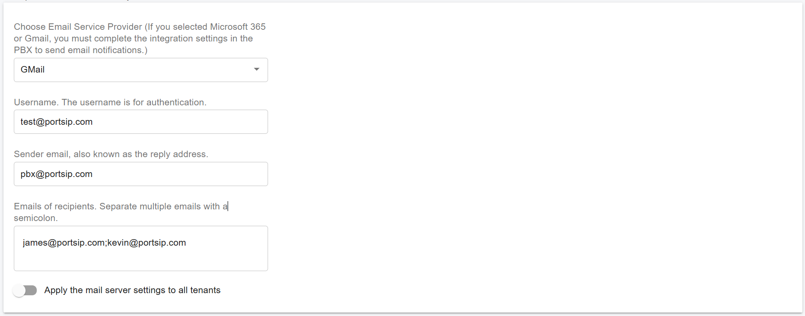
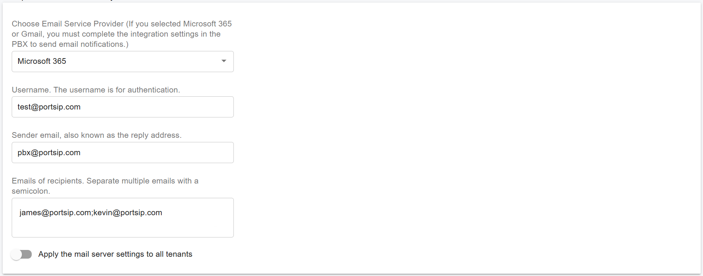

# Configure System Email Notifications

Follow the steps below to configure **system-level email notifications** in PortSIP PBX.

***

### Set Up the Mail Server

To send email notifications for **system events** to the System Administrator, you must first configure an **outbound mail server**.

#### Steps

1. Sign in to the **PortSIP PBX Web Portal** as a **System Administrator**.
2. Navigate to **Advanced > System Notifications**.
3. Open the **Mail Server** tab.
4. Configure the mail server according to your email service provider.

***

### Mail Server Provider Options

#### Generic SMTP (Non-Google / Non-Microsoft)

Use this option for SMTP providers other than Google or Microsoft.

* Enter the SMTP settings exactly as provided by your email service provider, including:
  * SMTP server
  * Port
  * Encryption method
  * Sender information
* Some providers authenticate by **source IP address** instead of a username and password.\
  In this case, set **Authentication Mode** to **None**.

<figure><figcaption></figcaption></figure>

***

#### Google Gmail

Select **Google Gmail** as the provider, then enter the following information:

* Username (typically your Gmail address)
* Sender Email
* Recipient Email(s)

Because Google no longer allows basic SMTP authentication using only a username and password, after saving the settings you must complete the [Google Integration](../integrations/google-workspace-integration.md) to authorize the PBX to send emails using **OAuth**.

<figure><figcaption></figcaption></figure>

***

#### Microsoft 365

Select **Microsoft 365** as the provider, then enter the following information:

* Username (typically your Microsoft 365 email address)
* Sender Email
* Recipient Email(s)

Because Microsoft no longer allows basic SMTP authentication using only a username and password, after saving the settings you must complete the [Microsoft 365 Integration](../integrations/microsoft-365-integration.md) to authorize the PBX to send emails using **OAuth**.

<figure><figcaption></figcaption></figure>

***

#### Apply Mail Settings to All Tenants

Enable Apply the mail server settings to all tenants if you want tenants to inherit the System Administrator’s mail server configuration.

When enabled, PortSIP PBX uses the system-level mail server settings to send notification emails for any tenant that has not configured its own mail server.

***

### Configure Notification Events

After configuring the mail server, you can enable or disable system-level notification events.

#### Steps

1. Navigate to **Advanced > System Notifications**.
2. Open the **Notifications** tab.
3. Enable or disable notifications for the events you want to monitor.

Email notifications are sent to the configured recipients when the corresponding event occurs.

***

#### Threshold Monitoring

The following threshold-based alerts are supported:

**Hard Disk Threshold**\
Sends an email alert when disk usage exceeds the configured threshold.\
Set this value to **0** to disable disk usage monitoring.

**CPU Threshold**\
Sends an email alert when CPU usage exceeds the configured threshold.\
Set this value to **0** to disable CPU usage monitoring.

**Memory Threshold**\
Sends an email alert when memory usage exceeds the configured threshold.\
Set this value to **0** to disable memory usage monitoring.

***

#### Event Notifications (Enable / Disable)

The following system-level events can be individually enabled or disabled:

**Hard Disk Usage Exceeds Threshold**\
Sends an email notification when disk usage exceeds the configured threshold.

**CPU Usage Exceeds Threshold**\
Sends an email notification when CPU usage exceeds the configured threshold.

**Memory Usage Exceeds Threshold**\
Sends an email notification when memory usage exceeds the configured threshold.

**IP Blacklisting**\
Sends an email notification when an IP address is blacklisted.

**License Limit Reached**\
Sends an email notification when the PBX reaches its license limit.

**PBX Services Stopped or Failed**\
Sends an email notification when any PBX service stops or fails.

**Failed to Update iOS Push Notification Certificate**\
Sends an email notification when the PBX fails to update the iOS push notification certificate.

