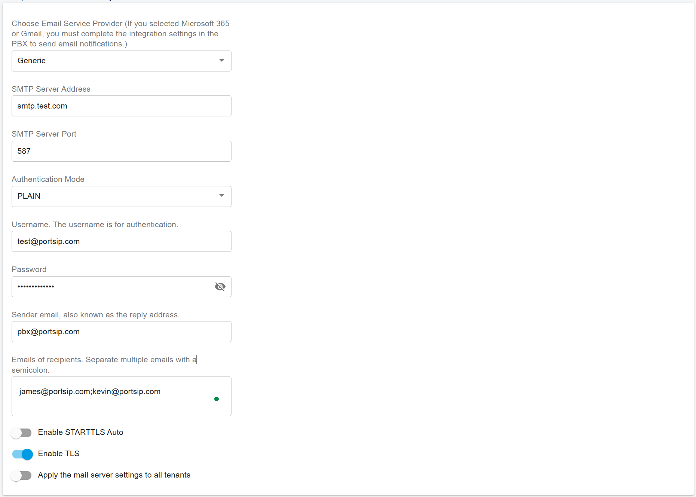

# Configure System Email Notifications

Please follow the steps below to configure system-level email notifications.

### Set up the mail server

To send email notifications for system events to the System Administrator, you must configure an outbound mail server first.

1. Sign in to the PBX Web Portal as **System Administrator**.
2. Go to **Advanced > System Notifications**, then open the **Mail Server** tab.
3. Configure the mail server based on your email service provider.

***

#### Generic SMTP (non-Google / non-Microsoft)

Use this option for SMTP providers other than Google or Microsoft.

* Enter the SMTP settings exactly as provided by your email provider (server, port, encryption, sender, etc.).
* Some providers authenticate by **source IP address** rather than a username and password. In this case, set **Authentication Mode** to **None**.

<figure><figcaption></figcaption></figure>

***

#### Google Gmail

Select **Google Gmail** as the provider, then enter:

* **Username** (usually your Gmail address)
* **Sender Email**
* **Recipient Email(s)**

Because Google no longer allows basic SMTP authentication using only a username and password, after saving the settings you must complete the [Google Integration](../integrations/google-workspace-integration.md) to allow the PBX to send emails via **OAuth**.

<figure><figcaption></figcaption></figure>

***

**Microsoft 365**

Select **Microsoft 365** as the provider, then enter:

* **Username** (usually your Microsoft 365 email address)
* **Sender Email**
* **Recipient Email(s)**

Because Microsoft no longer allows basic SMTP authentication using only a username and password, after saving the settings you must complete the [Microsoft 365 Integration](../integrations/microsoft-365-integration.md) to allow the PBX to send emails via **OAuth**.

<figure><figcaption></figcaption></figure>

***

#### Apply mail settings to all tenants

Enable **Apply the mail server settings to all tenants** if you want tenants to inherit the System Administrator’s mail server settings.

When enabled, the PBX uses the system-level email settings to send notification emails for any tenant that **has not configured its own mail server**.

***

### Configure notification events

1. Go to **Advanced > System Notifications**.
2. Open the **Notifications** tab.
3. Enable or disable notifications for the events you want.

These email notifications are sent to the configured recipients when the corresponding event occurs.

#### Threshold monitoring

* **Hard Disk Threshold**: Sends an alert when disk usage exceeds the configured threshold.
  * Set to **0** to disable disk monitoring.
* **CPU Threshold**: Sends an alert when CPU usage exceeds the configured threshold.
  * Set to **0** to disable CPU monitoring.
* **Memory Threshold**: Sends an alert when memory usage exceeds the configured threshold.
  * Set to **0** to disable memory monitoring.

#### Event notifications (enable/disable)

* **Hard Disk Usage Exceeds Threshold**: Sends an email when disk usage exceeds the configured threshold.
* **CPU Usage Exceeds Threshold**: Sends an email when CPU usage exceeds the configured threshold.
* **Memory Usage Exceeds Threshold**: Sends an email when memory usage exceeds the configured threshold.
* **IP Blacklisting**: Sends an email when an IP address is blacklisted.
* **License Limit Reached**: Sends an email when the PBX reaches its license limit.
* **PBX Services Stopped or Failed**: Sends an email when any PBX service stops or fails.
* **Failed to update iOS push notification certificate**: Sends an email when the PBX fails to update the iOS push notification certificate.

