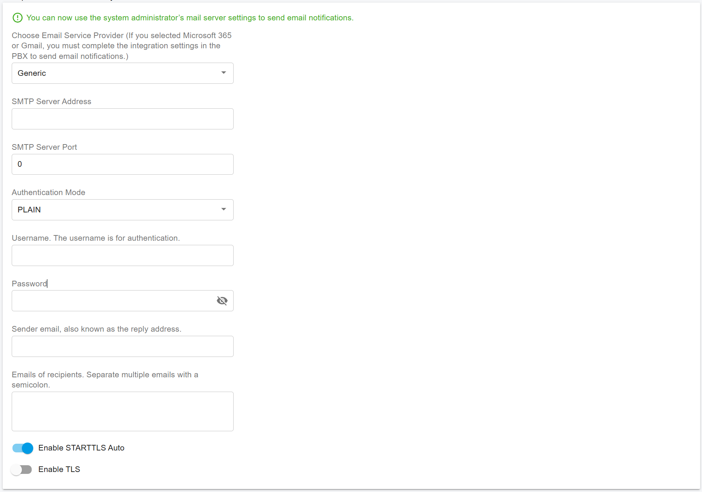

# Configure Tenant Email Notificationis

Follow the steps below to configure tenant-level email notifications in PortSIP PBX.

***

### About Tenant-Level Email Notifications

PortSIP PBX supports email notifications for tenant administrators, primarily for call-related and tenant-specific events. These notifications are separate from system-level events, which are managed by the PBX System Administrator.

Each tenant can configure its own mail server to send email notifications. Alternatively, if permitted by the System Administrator, tenants may use the system-level mail server settings.

For more information, see [Apply Mail Settings to All Tenants](configure-system-email-notifications.md#apply-mail-settings-to-all-tenants).

***

### Configure the Tenant Mail Server

#### Prerequisites

* You are signed in as a **Tenant Administrator**, or
* You have switched to the tenant from the **System Administrator** workspace.

#### Steps

1. Sign in to the **PortSIP PBX Web Portal** as a Tenant Administrator, or switch to the desired tenant from the System Administrator workspace.
2. If the SMTP server has not yet been configured, the Web Portal displays a pop-up prompt.
3. Click **Settings** in the pop-up dialog to configure the mail server.

You can also configure the tenant mail server manually by navigating to:

**Advanced > Notifications > Mail Server**

<figure><figcaption></figcaption></figure>

***

#### Using the System Administrator’s Mail Server

If the PBX System Administrator has enabled  [Apply Mail Settings to All Tenants](configure-system-email-notifications.md#apply-mail-settings-to-all-tenants), the following message appears in green:

> “You can now use the system administrator's mail server settings to send email notifications.”

This indicates that you do not need to configure a mail server at the tenant level. The tenant will use the System Administrator’s mail server to send email notifications.

#### Note

> You must still specify at least one recipient email address in the **Emails of Recipients** field to define where notifications will be delivered.

<figure><figcaption></figcaption></figure>

***

#### Overwrite System Mail Server Settings (Optional)

If you prefer to use your own mail server, follow the steps in  [Set up the mail server](configure-system-email-notifications.md#set-up-the-mail-server) to set it up at the tenant level.

Once configured, PortSIP PBX will use the tenant’s mail server settings to send email notifications, even if [Apply Mail Settings to All Tenants](configure-system-email-notifications.md#apply-mail-settings-to-all-tenants) is enabled at the system level.

***

### Configure Notification Events

After configuring the mail server, you can enable or disable specific notification events.

#### Steps

1. Navigate to **Advanced > Notifications**.
2. Open the **Notifications** tab.
3. Enable or disable notifications for the desired events.

***

#### Supported Tenant-Level Email Notifications

The following tenant-level email notifications are supported and will be sent to the configured recipients:

**A new user was created**\
Sends a welcome email containing the user’s extension number, password, PBX domain, login IP address, and a QR code for client login.

**When queue SLA time has been breached**\
Sends an email notification when a queue’s SLA threshold is exceeded.

**When a queue callback has been made**\
Sends an email notification when a queue callback is successfully completed.

**When the queue callback is unsuccessful**\
Sends an email notification when a queue callback attempt fails.

**When a queue call is lost**\
Sends an email notification when a call is abandoned in a queue.

