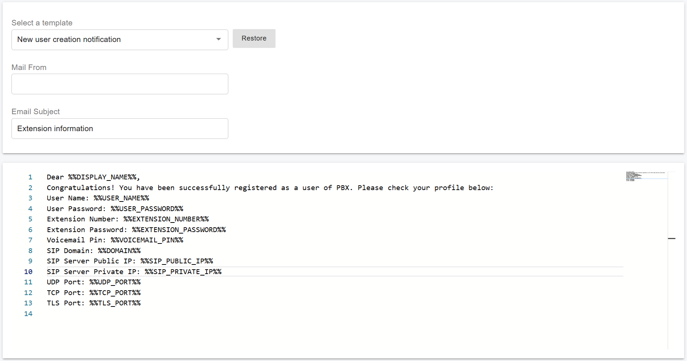
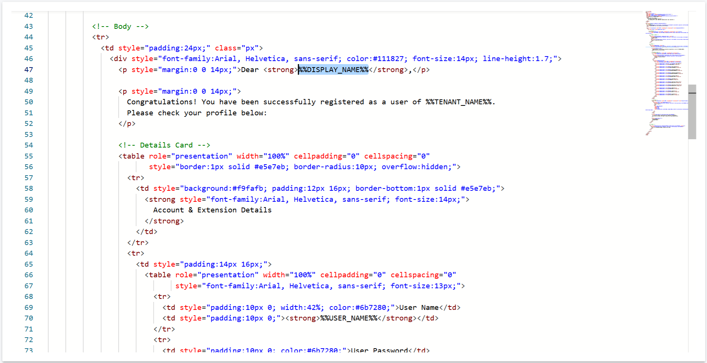

# Customizing Email Templates

### Introduction to Email Templates

PortSIP PBX allows you to customize email notification templates, giving you full control over the content, appearance, and sender details of system-generated emails.

With this feature, you can tailor each email template to match your organization’s branding, tone, and operational requirements. For example, you can:

* Add your own logos or branding text
* Include links to internal or external resources
* Personalize messages using recipient-specific information and other dynamic fields

A common use case is customizing the **Welcome Email**, which is automatically sent when a new extension is created. You can modify this template to include your own messaging, custom links, and dynamic content such as the recipient’s first and last name. You can also customize the **From (Display Name)** shown to recipients.

In the following sections, you will learn how to:

* Set a custom sender display name
* Automatically insert the recipient’s first and last name into the email content

***

### Add a Display Name to Your Email

You can configure a custom **sender display name** for outgoing emails by editing the email template.

#### Steps

1. Sign in to the PortSIP PBX Web Portal.
2. Navigate to **Advanced > Email Templates**.
3. Select the email template you want to modify.
4. In the **Mail From** field, enter the desired sender display name.
5. Click **Save**.

#### Result

The value entered in the **Mail From** field appears as the **From** name in the Welcome Email and in any other notifications that use this template.

***

### Using a Dynamic Sender Name

PortSIP PBX supports dynamic values in the **Mail From** field.

You can use the following variable:

```
%%TENANT_NAME%%
```

When this variable is used, the PBX automatically replaces it with the tenant’s name at runtime. This allows the sender display name to dynamically match the tenant without requiring manual changes to the template.

<figure><figcaption></figcaption></figure>

***

### Customize the Welcome Email Sent to an Extension

By default, PortSIP PBX sends email notifications in **plain-text format**.

You can freely edit the template content using the built-in editor. This includes:

* Adding or removing text
* Reordering sections
* Inserting or removing supported template variables

This flexibility allows you to tailor the Welcome Email to match your organization’s messaging and onboarding requirements.

A complete list of supported variables is available here:\
[Supported Template Variable Parameters](supported-template-variable-parameters.md)

***

### Customize Email Notifications Using HTML Templates

PortSIP PBX also supports **HTML-formatted email notifications**, allowing you to create more visually appealing and professional emails.

You can:

* Design your own HTML email template
* Include any supported template variables
* Copy and paste the HTML source code directly into the template editor

You are free to modify the **layout, styling, and content** to suit your branding and communication standards.

<figure><figcaption></figcaption></figure>

#### Tip: Preview Your HTML Email

Before using an HTML template in production, it is recommended to preview it using an online HTML editor, such as:

[HTML Code Editor – Instant Preview](https://htmlcodeeditor.com/)

This allows you to verify formatting, layout, and variable placement before applying the template in PortSIP PBX.

### Default HTML Templates

PortSIP provides a set of **default HTML email templates** that you can use as a starting point.

You are welcome to download these templates and customize them to meet your branding and notification requirements. These templates are designed to demonstrate best practices and help you get started quickly.


