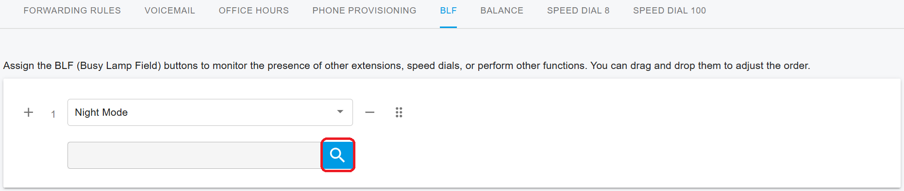
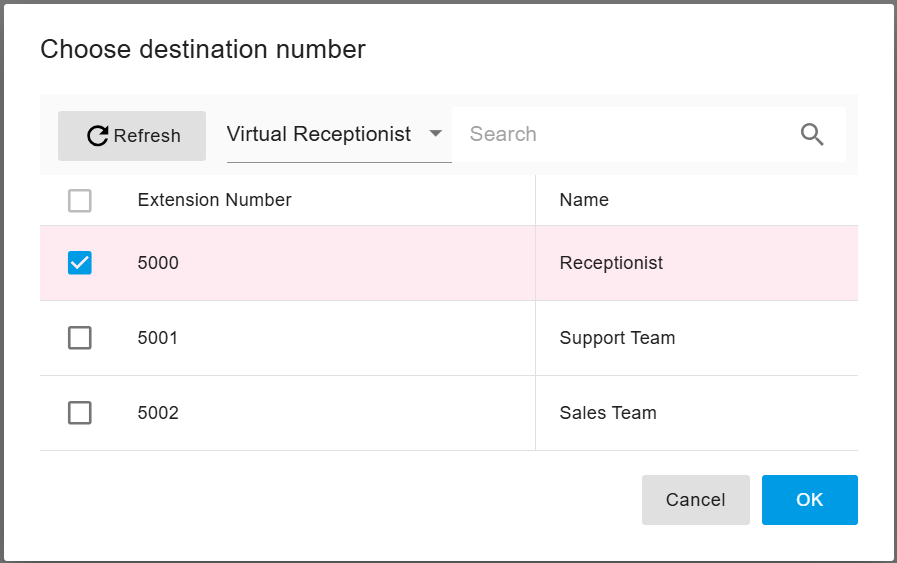
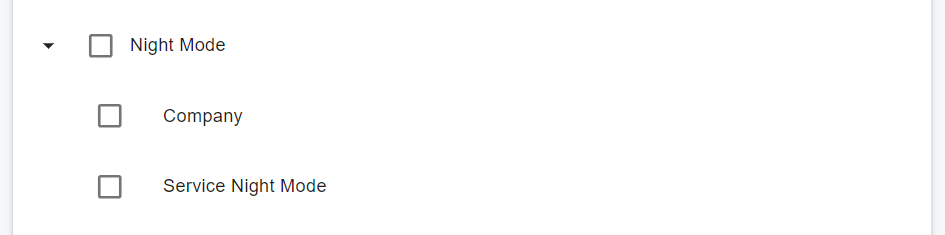

# 32 Night Mode

PortSIP PBX includes a **Night Mode** feature that allows you to automatically redirect incoming calls during **non-business hours**. This is particularly useful for services such as **Virtual Receptionists**, **Ring Groups**, and **Call Queues**, enabling calls to be routed to alternative destinations—such as a mobile number, answering service, or voicemail—when your business is closed.

***

### Activating Tenant-Level Night Mode from the Web Portal

You can easily enable or disable **Night Mode** at the **tenant level** using the PortSIP PBX web portal.

When Night Mode is enabled at the tenant level, all incoming calls to queues, ring groups, and virtual receptionists are handled according to the Destination for Night Mode settings.

#### To activate or deactivate Night Mode:

1. Sign in as a **System Administrator** and select the tenant you want to manage,\
   **or** sign in directly as the **Tenant Administrator**.
2. Navigate to the **Company** menu.
3. Open the **General** tab.
4. Toggle the **Night Mode** switch to enable or disable the feature.

<figure><figcaption></figcaption></figure>

***

### Activating Tenant-Level Night Mode from an IP Phone (BLF Key)

If you are using **provisioned IP phones**, you can assign a **BLF (Busy Lamp Field) key** to allow users to control **Night Mode** directly from the phone.

1. During phone provisioning, configure a **Night Mode BLF key** as shown in the example below.

<figure><figcaption></figcaption></figure>

2.  Once the phone is successfully registered with the PBX, the **BLF key status** indicates the current Night Mode state:

    * **Green light** – Night Mode is **deactivated** (business hours)
    * **Red light** – Night Mode is **activated** (after hours)

    #### Using the BLF Key

    * When leaving work early, press the **BLF key** to activate **Night Mode**. The key turns **red**.
    * If the business starts earlier than usual, press the **BLF key** again to deactivate **Night Mode**. The key turns **green**.

***

### Activating Service-Level Night Mode from the Web Portal

You can enable or disable **Night Mode** at the **service level** for individual services such as **Ring Groups**, **Call Queues**, and **Virtual Receptionists** using the PortSIP PBX web portal.

When Night Mode is enabled at the service level, incoming calls to that specific service are handled according to its **Destination for Night Mode** settings.

#### To activate or deactivate Service-Level Night Mode:

1. Sign in as a **System Administrator** and select the tenant you want to manage,\
   **or** sign in directly as the **Tenant Administrator**.
2. Navigate to the **Advanced Services** menu.
3. Select the service type (**Virtual Receptionist**, **Call Queue**, or **Ring Group**) to list the corresponding **Virtual Receptionist**, **Call Queue**, or **Ring Group**.
4. Double-click the desired service to edit it.
5. Toggle the **Night Mode** switch to enable or disable the feature.

***

### Activating Service-Level Night Mode from an IP Phone (BLF Key)

If you are using **provisioned IP phones**, you can assign a **BLF (Busy Lamp Field) key** to control **Night Mode** for a specific service, such as a **Ring Group**, **Call Queue**, or **Virtual Receptionist**.

#### BLF Key Configuration

During phone provisioning:

1. Assign a **Night Mode BLF key**.
2. Click the **search icon** and select the desired service type (**Ring Group**, **Call Queue**, or **Virtual Receptionist**).

<figure><figcaption></figcaption></figure>

2. Choose the specific service(**Virtual Receptionist**, **Call Queue**, or **Ring Group**) and click **OK**.

<figure><figcaption></figcaption></figure>

3. Complete phone provisioning.

Once the phone is successfully registered with the PBX, the BLF key indicates the Night Mode status for the selected service:

* **Green light** – Night Mode of that service is **deactivated** (business hours)
* **Red light** – Night Mode of that service is **activated** (after hours)

#### Using the BLF Key

* When leaving work early for a specific service, press the **BLF key** to activate **Night Mode**. The key turns **red**.
* If the service resumes earlier than usual, press the **BLF key** again to deactivate **Night Mode**. The key turns **green**.

***

### Setting Night Mode Destinations for Call Queues and Ring Groups

PortSIP PBX allows you to define **specific call routing behavior** for **Call Queues** and **Ring Groups** when **Night Mode** is enabled.

Within the **Call Queue** and **Ring Group** settings, you can configure a **Night Mode Destination**. When Night Mode is active at the tenant or service level, incoming calls to the queue or ring group are automatically redirected to the configured destination.

The Night Mode destination can be any valid target, such as:

* Voicemail
* An external phone number
* A Virtual Receptionist (Auto Attendant)

This ensures that calls are handled appropriately outside of normal business hours.

<figure><figcaption></figcaption></figure>

***

### Setting Night Mode Destinations for Virtual Receptionists

PortSIP PBX allows you to define **specific call routing behavior** for **Virtual Receptionists** when **Night Mode** is enabled.

Within the **Virtual Receptionist** settings, you can configure a **Night Mode Destination**. When Night Mode is active at the tenant or service level, incoming calls to the virtual receptionist are automatically redirected to the configured destination.

The Night Mode destination can be any valid target, such as:

* Voicemail
* An external phone number
* Another Virtual Receptionist (Auto Attendant)

This ensures that calls are handled appropriately outside of normal business hours.

<figure><figcaption></figcaption></figure>

***

### Activating Night Mode by dialing FAC

PortSIP PBX also allows you to use a **Feature Access Code (FAC, default is \*16)** to toggle **Night Mode** on or off.

* If tenant-level Night Mode is currently disabled, dialing this FAC enables it.
* If tenant-level Night Mode is currently enabled, dialing this FAC disables it.

To enable or disable Night Mode for a **specific service**, dial **\*16xxx**, where **xxx** is the number of the ring group, virtual receptionist, or queue.

#### Assign Permissions to Control Night Mode via FAC

To prevent accidental or unauthorized activation of **Night Mode**, PortSIP PBX restricts which roles can control Night Mode using **Feature Access Codes (FAC)**.

By default, the following role-based permissions apply:

* **Admin:** Can control tenant-level Night Mode via FAC.
* **Queue Manager:** Can control service-level (queue) Night Mode via FAC.

These defaults help ensure that Night Mode is only managed by authorized users.

***

#### Custom Role Configuration

If you need to grant Night Mode control to additional users, you can create a **custom role** and assign the appropriate permissions.

**Available Night Mode Permissions**

When configuring a custom role, the following permissions are available:

* **Night Mode > Company**
  * Allows the user to control tenant-level Night Mode via FAC.
* **Night Mode > Service Night Mode**
  * Allows the user to control service-level (queue) Night Mode via FAC.

Assign one or both permissions based on the level of Night Mode control the user requires.

<figure><figcaption></figcaption></figure>

