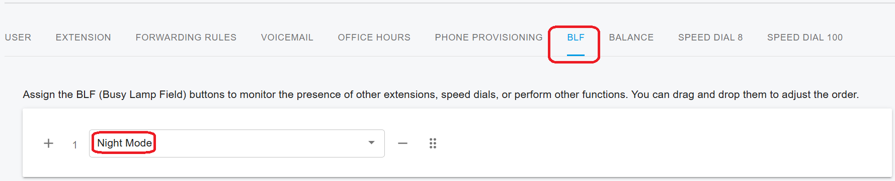

# 32 Night Mode

PortSIP PBX includes a **Night Mode** feature that allows you to automatically redirect incoming calls during non-business hours. This is especially useful for services like **Virtual Receptionist**, **Ring Group**, and **Call Queue**, enabling you to forward calls to different destinations such as a mobile number, answering service, or voicemail when your business is closed.

## Activating Night Mode from the Web Portal

You can easily enable or disable Night Mode from the PortSIP PBX web portal.

1. **Sign in** as a **System Administrator** and select the tenant you want to manage.\
   Or sign in directly as the **Tenant Administrator**.
2. Go to the **Company** menu.
3. Click the **General** tab.
4. Toggle the **Night Mode** switch to **activate** or **deactivate** the feature.

<figure><figcaption></figcaption></figure>

## Activating Night Mode from an IP Phone (BLF Key)

If you're using provisioned IP phones, you can assign a **BLF (Busy Lamp Field)** key for Night Mode control.

1. During phone provisioning, assign the Night Mode BLF key as shown in the example below.

<figure><figcaption></figcaption></figure>

2. Once the phone is registered successfully with the PBX, the BLF key will:

* **Light green** when Night Mode is **deactivated** (business hours).
* **Light red** when Night Mode is **activated** (after hours).

To use the BLF key:

* When leaving work early, simply **press the BLF key** to activate Night Mode. The key will turn red.
* If your company starts work early, **press the BLF key** again to deactivate Night Mode. The key will turn green.

## Setting Night Mode Destination for Call Queue and Ring Group

PortSIP PBX allows you to configure specific call routing behavior during Night Mode for both **Call Queues** and **Ring Groups**.

Within the **Call Queue** and **Ring Group** settings, you'll find an option to define the **Night Mode Destination**. This destination is used when **Night Mode is enabled** for the tenant. Incoming calls will automatically be redirected to the specified destination—such as a voicemail, external number, or auto attendant number—ensuring proper handling of calls outside business hours.

<figure><figcaption></figcaption></figure>

## Setting Night Mode Destination for Virtual Receptionist

PortSIP PBX allows you to configure specific call routing behavior during Night Mode for **Virtual Receptionist.**

Within the **Virtual Receptionist** settings, you'll find an option to define the **Night Mode Destination**. This destination is used when **Night Mode is enabled** for the tenant. Incoming calls will automatically be redirected to the specified destination—such as a voicemail, external number, or auto attendant number—ensuring proper handling of calls outside business hours.

<figure><figcaption></figcaption></figure>

