# HubSpot CRM

### HubSpot CRM Integration Overview

Improve your team’s productivity with **PortSIP PBX’s native HubSpot CRM integration**. This integration automatically matches incoming and outgoing calls with **HubSpot contacts, leads, and accounts**, and logs call activities—including **call records, call recordings, and AI transcriptions**—to the appropriate CRM records.

By eliminating manual data entry and providing agents with real-time customer context, this integration helps teams work more efficiently and deliver a consistently superior customer experience.

***

### Key Capabilities

#### Caller ID to Contact Name

Inbound calls automatically trigger a **HubSpot** CRM lookup to identify the caller and display the associated contact name.

#### Contact Lookup from PortSIP ONE

When searching by name in **PortSIP ONE for Windows, macOS, or Web Client**, the system queries **HubSpot** CRM and matches contacts based on phone numbers.

#### Automatic Call Journaling

All trunk calls are automatically logged in the HubSpot Contact Card as CRM call activities. Agents can also append call notes at any time.

#### Create New Contacts Automatically

For calls from unknown numbers, agents can create new HubSpot contacts or leads directly from the PortSIP PBX client.

#### Recording and AI Transcription Logging

Call recording links and AI transcription links are automatically attached to the corresponding Zoho CRM activity.

***

### 1. Install Node.js and Configure the HubSpot CLI

1. Go to the [Node.js website](https://nodejs.org/en), download the **LTS** version, and install it.
2. After the installation is complete, open a terminal or Command Prompt.
3.  Run the following command to install the HubSpot CLI:

    ```bash
    npm install -g @hubspot/cli
    ```
4.  After the installation is complete, run:

    ```bash
    hs account auth
    ```

<figure>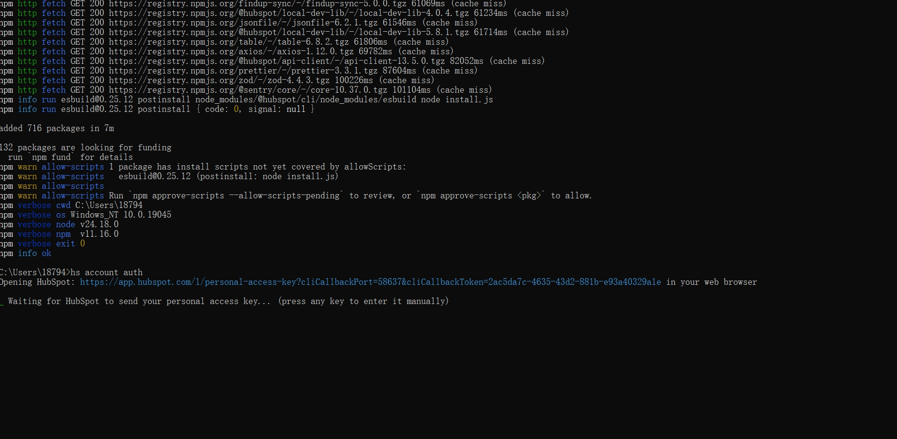<figcaption></figcaption></figure>

5. Press **Enter** when prompted. HubSpot opens automatically in your default browser.
6. Sign in to your HubSpot account, and then click **Continue with this account**.

<figure>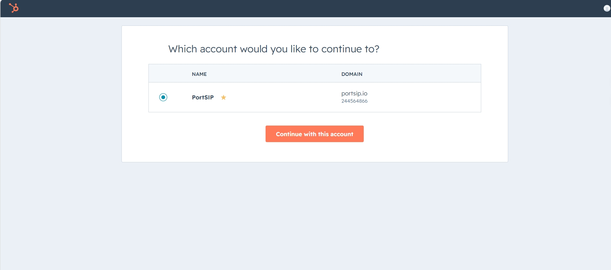<figcaption></figcaption></figure>

7. On the **Personal Access Key** page, scroll to the bottom and click **Generate and send to CLI**.

<figure>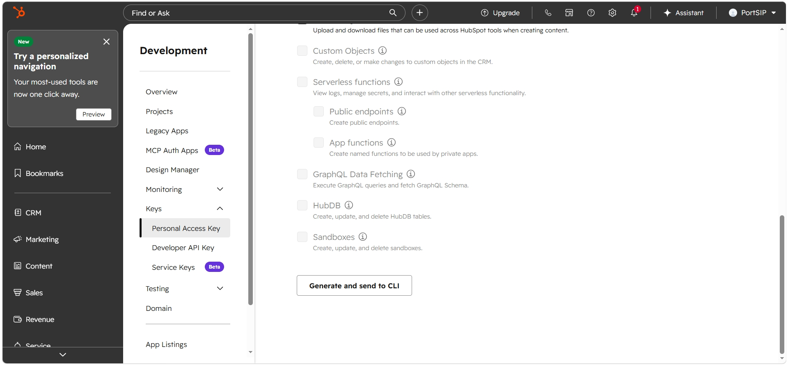<figcaption></figcaption></figure>

7. Wait until the terminal displays a message confirming that the **CLI is connected**.
8. Return to the terminal and follow the prompts to complete the account configuration, as shown in the following screenshot.

<figure>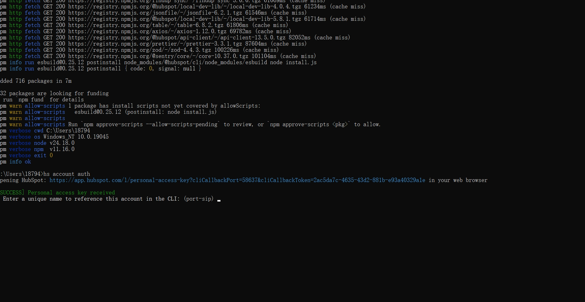<figcaption></figcaption></figure>

For more information, refer to the HubSpot documentation: [Install the HubSpot CLI](https://developers.hubspot.com/docs/developer-tooling/local-development/hubspot-cli/install-the-cli).

***

### 2. Create a New Project and App

1.  In the terminal, go to the directory where you want to create the project.

    For example:

    ```powershell
    cd D:\HubSpot
    ```
2.  Run the following command:

    ```bash
    hs project create
    ```
3. Follow the prompts and configure the project as follows:
   * Enter a project name.
   * Select the directory in which to create the project. The current directory is selected by default.
   * For the project type, select **App**.
   * For the distribution method, select **Privately**.
   * For the authentication method, select **OAuth**.
   * Select any required features by pressing the Spacebar. You can also press **Enter** without selecting any features.

<figure>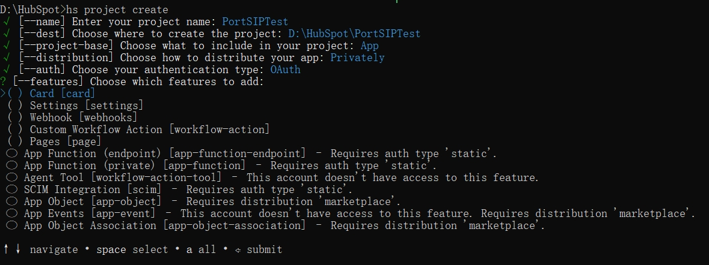<figcaption></figcaption></figure>

4. After the project is created, locate the project folder on your computer and open the entire folder in a text editor such as Visual Studio Code.
5. In the `src` directory, locate and open the `app-hsmeta.json` file.
6. In the `redirectUrls` section, replace the existing value with the HubSpot CRM redirect URL provided by PortSIP PBX.
7.  Add the following permissions to the `requiredScopes` section:

    ```json
    "crm.objects.companies.read",
    "crm.objects.companies.write",
    "crm.objects.owners.read",
    "timeline"
    ```
8. Save the `app-hsmeta.json` file.

<figure>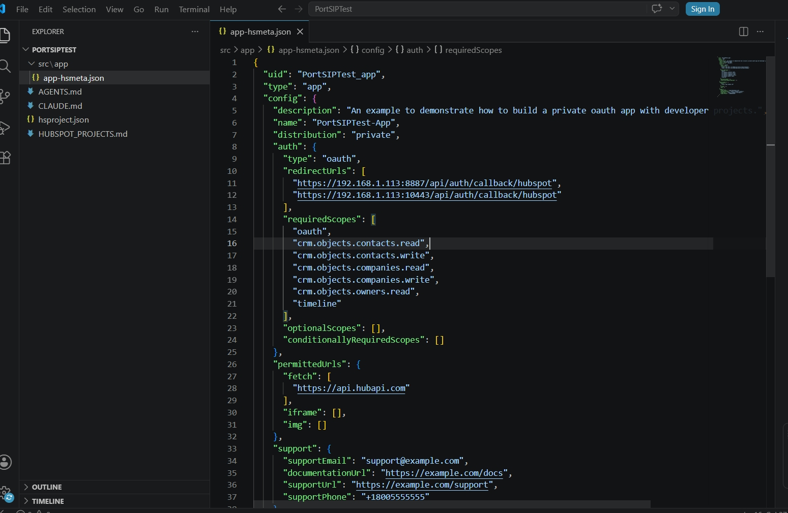<figcaption></figcaption></figure>

9. Return to the terminal and go to the project directory.

For example:

```powershell
cd D:\HubSpot\PortSIPTest
```

10. Run the following command to upload the project and follow the prompts to complete the upload:

```bash
hs project upload
```

11. Sign in to HubSpot and go to **Development > Projects**. Select the project uploaded in the previous step.

<figure>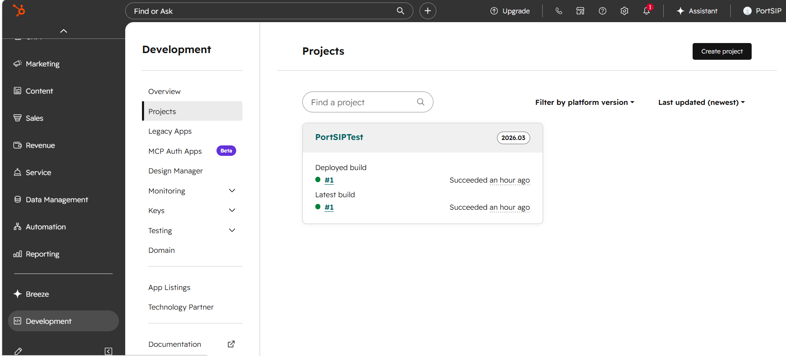<figcaption></figcaption></figure>

11. Select the app, and then open the **Auth** tab.
12. Copy the **Client ID** and **Client secret**. You will need these values when configuring the HubSpot CRM integration in PortSIP PBX.

<figure>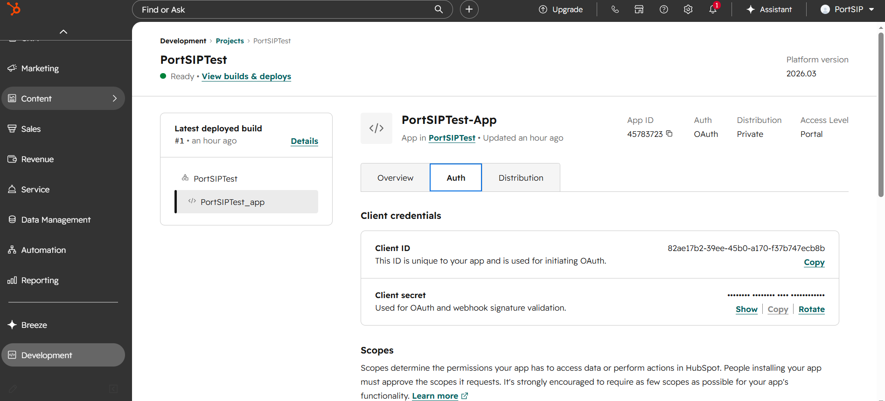<figcaption></figcaption></figure>

For more information, refer to the HubSpot documentation: [Create a new app using the CLI](https://developers.hubspot.com/docs/apps/developer-platform/build-apps/create-an-app).

***

### Step 2: Configure PortSIP PBX

#### Enable CRM at the Tenant Level

Log in to the **PortSIP PBX Web Portal** as a **System Administrator**, then navigate to **Tenants**, select the target tenant, and click **Edit**.

Open the **Features** tab and ensure that the **CRM** option is enabled.

> **Important:** CRM integration will not function unless this feature is enabled for the tenant by a System Administrator.

Alternatively, you may sign in directly as the **Tenant Administrator** for the desired tenant.

***

#### Configure HubSpot CRM Integration

1. Navigate to **Integrations > CRM**.
2. From the **Select a CRM solution** dropdown, choose **HubSpot**.
3. Enter the **Client ID** and **Client Secret** obtained in Step 1.

***

### Configure CRM Behavior

<figure>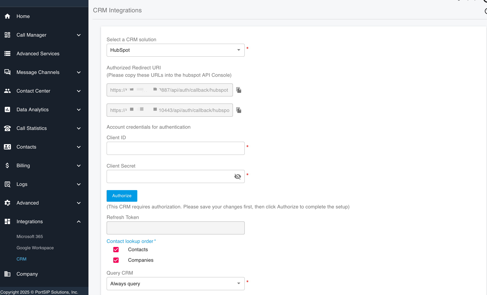<figcaption></figcaption></figure>

#### Contact Lookup Order

Define the priority for HubSpot CRM searches:

* Contacts
* Companies

#### Query CRM

Specify when PortSIP PBX should query HubSpot CRM:

* **Always query**
* **Only when not found in PBX CRM contacts**

#### Log Calls as Activities

Enable this option to automatically log calls as HubSpot CRM activities.

When enabled, a call recording link can be included in the activity:

* **Private Recording Link** – Authentication with PortSIP PBX is required to access the recording.
* **Public Recording Link** – Authentication with PortSIP PBX is not required.

#### Create Contacts for New Numbers

Allow agents to create CRM records when calls come from unknown numbers.

***

### Authorize HubSpot Access

1. Click **Authorize**. A new browser tab will open.
2. Sign in using the **HubSpot user account** that should grant access _(do not use a developer account)_.

<figure>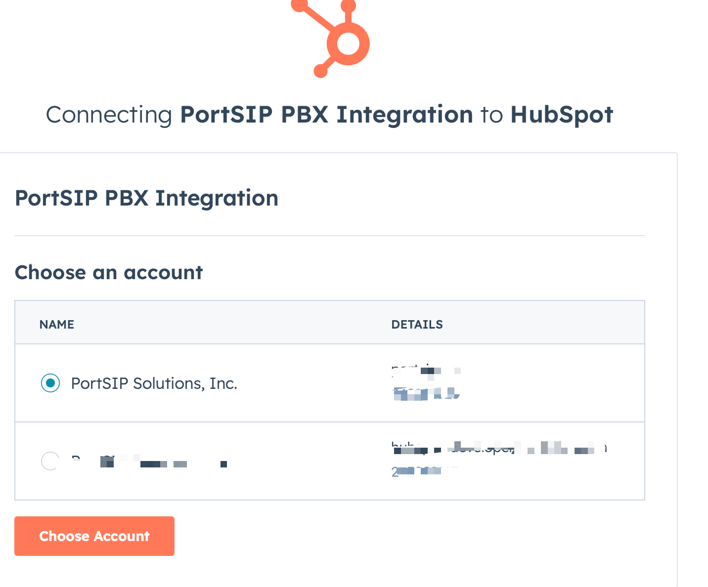<figcaption></figcaption></figure>

During that, HubSpot will ask you to confirm the integration. Please complete the verification as per the prompt below.

<figure>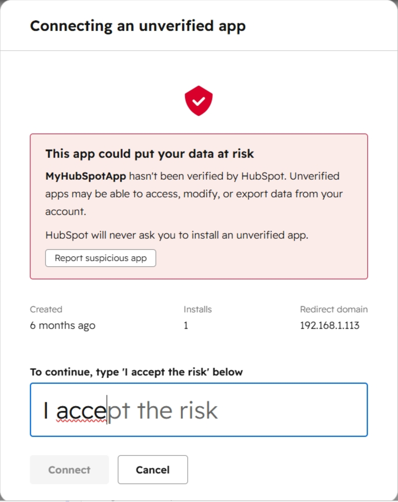<figcaption></figcaption></figure>


3. Click **Connect app** to authorize PortSIP PBX to access HubSpot CRM data.

<figure>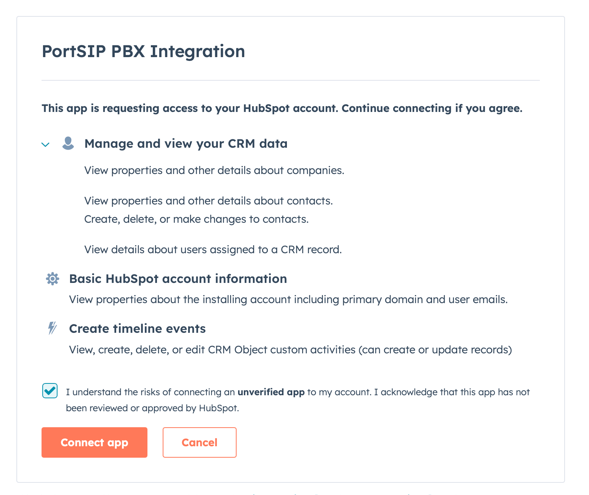<figcaption></figcaption></figure>


Once authorization is complete, the integration becomes active immediately.

