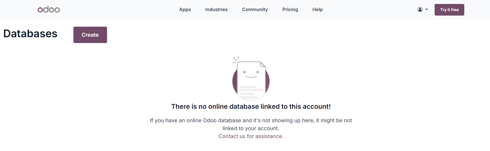
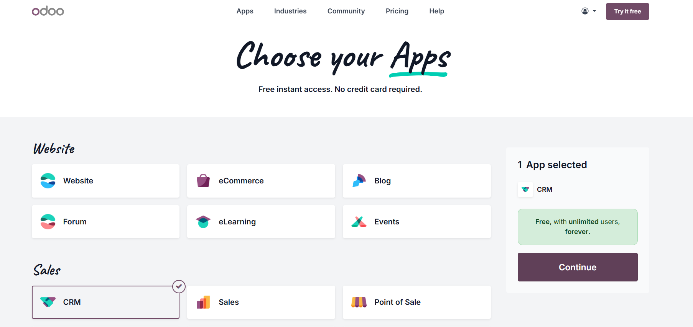
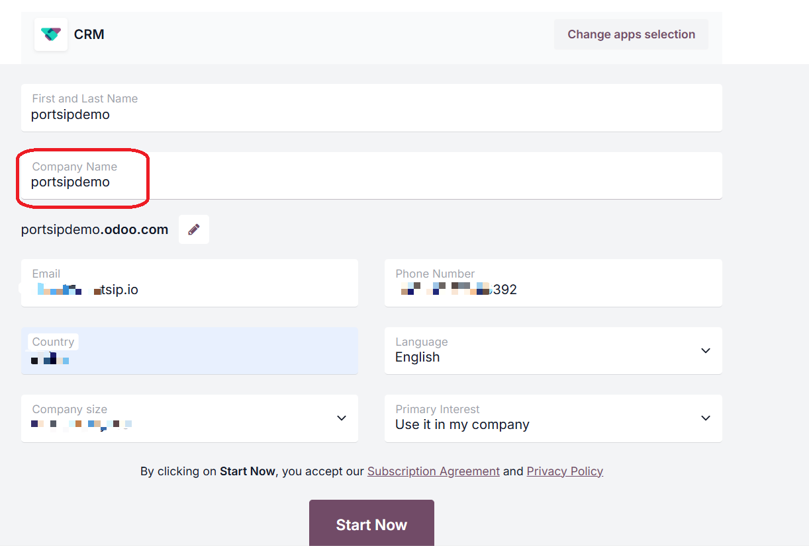
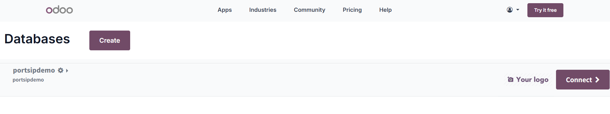
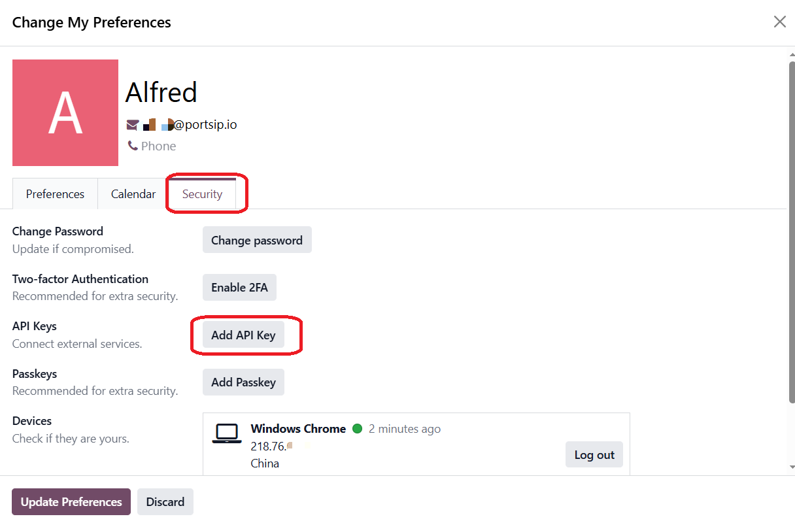
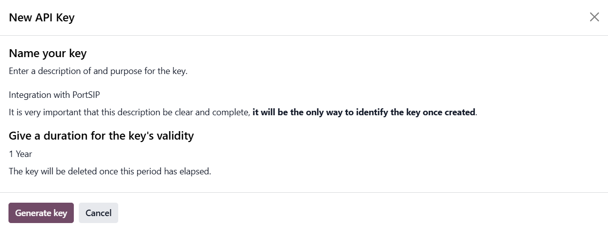
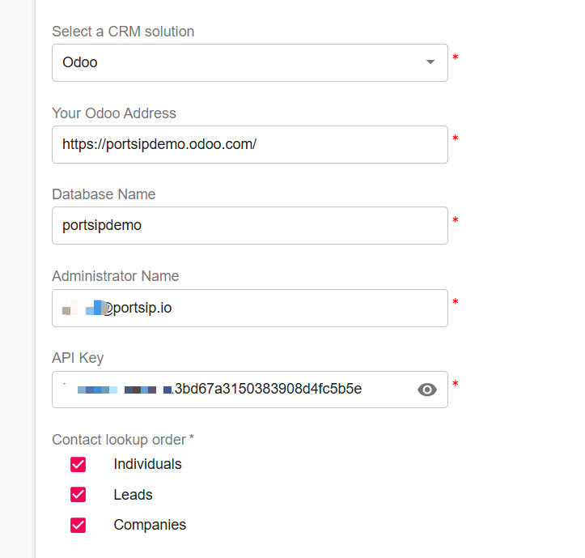

# Odoo CRM

### Odoo CRM Integration Overview

Improve your team’s productivity with **PortSIP PBX’s native Odoo CRM integration**. This integration automatically matches incoming and outgoing calls with **Odoo contacts, leads, and accounts**, and logs call activities—including **call records, call recordings, and AI transcriptions**—to the appropriate CRM records.

By eliminating manual data entry and providing agents with real-time customer context, this integration helps teams work more efficiently and deliver a consistently superior customer experience.

***

### Key Capabilities

#### Caller ID to Contact Name

Inbound calls automatically trigger an Odoo CRM lookup to identify the caller and display the associated contact name.

#### Contact Lookup from PortSIP ONE

When searching by name in **PortSIP ONE for Windows, macOS, or Web Client**, the system queries Odoo CRM and matches contacts based on phone numbers.

#### Automatic Call Journaling

All **trunk calls** are automatically logged in the Odoo Contact Card as CRM call activities. Agents can also append call notes at any time.

#### Create New Contacts Automatically

For calls from unknown numbers, agents can create new **Odoo contacts or leads** directly from the PortSIP PBX client.

#### Recording and AI Transcription Logging

Call recording links and AI transcription links are automatically attached to the corresponding Odoo CRM activity.

***

### Supported Odoo Editions

The PortSIP PBX Odoo CRM integration is supported for the following Odoo CRM cloud online editions.

***

### Step 1: Configure the Odoo Application

#### Create an Odoo Database

1. Sign in to the [Odoo website](https://www.odoo.com/).
2. Click the **Create** button.

<figure><figcaption></figcaption></figure>

3. Choose **CRM**, then click **Continue**.

<figure><figcaption></figcaption></figure>

4. **Enter database information.**\
   Fill in the required fields as shown in the screenshot below.

*   **Company Name**\
    This value is also used as the **database name**.

    > **Important:**\
    > The database name will be required in later configuration steps.\
    > Record it exactly as entered (including capitalization).

5. Click **Start Now** to begin the database creation process.

<figure><figcaption></figcaption></figure>

***

#### Activate the Odoo Account

1. Odoo sends an activation email to the registered email address.
2. Follow the instructions in the email to complete account activation.

***

#### Connect to the Database

1. After activating your account, open the **Odoo dashboard**.
2. Select your database, and click **Connect** to access the database.

<figure><figcaption></figcaption></figure>

***

#### Generate an API Key

1. In the upper-right corner of the Odoo interface, click your **profile image**, then select **My Preferences**.
2. In the preferences window, open the **Security** tab, click **Add API Key**.

<figure><figcaption></figcaption></figure>

3. In the window, enter a **description** for the key (for example, _PortSIP PBX Integration_). Set an **expiration date** according to your security policy.
4. Click **Generate Key**.

<figure><figcaption></figcaption></figure>

5. Copy the generated API key and store it in a secure location.

> ⚠️ **Warning:**\
> The API key is displayed **only once** at creation time.\
> If you lose it, you must generate a new key—you cannot view it again later.

***

### Step 2: Configure PortSIP PBX

#### Enable CRM at the Tenant Level

Log in to the **PortSIP PBX Web Portal** as a **System Administrator**, then navigate to **Tenants**, select the target tenant, and click **Edit**.

Open the **Features** tab and ensure that the **CRM** option is enabled.

> **Important:** CRM integration will not function unless this feature is enabled for the tenant by a System Administrator.

Alternatively, you may sign in directly as the **Tenant Administrator** for the desired tenant.

***

#### Configure Odoo CRM Integration

1. Navigate to **Integrations > CRM**.
2. From the **Select a CRM solution** dropdown, choose **Odoo**.
3. Enter the required Odoo connection details. Use the Odoo URL and database name created in the previous step, along with your Odoo account email address and the API key you generated.

***

#### Configure CRM Behavior

<figure><figcaption></figcaption></figure>

#### Contact Lookup Order

Define the priority for Zoho CRM searches:

* Individuals
* Leads
* Companies

#### Query CRM

Specify when PortSIP PBX should query Zoho CRM:

* Always query
* Only when not found in PBX CRM contacts

#### Log Calls as Activities

Enable this option to automatically log calls as Odoo CRM activities.

When enabled, a call recording link can be included in the activity:

* **Private Recording Link** – Authentication with PortSIP PBX is required to access the recording.
* **Public Recording Link** – Authentication with PortSIP PBX is not required.

#### Create Contacts for New Numbers

Allow agents to create CRM records when calls come from unknown numbers.

Choose the record type to create:

* Individuals
* Lead

