# Salesforce CRM

### Salesforce CRM Integration Overview

Improve your team’s productivity with PortSIP PBX’s native Salesforce CRM integration. This integration automatically matches incoming and outgoing calls with Salesforce contacts, leads, and accounts, and logs call activities, including call records, call recordings, and AI transcriptions, to the appropriate CRM records.

By eliminating manual data entry and providing agents with real-time customer context, this integration helps teams work more efficiently and deliver a consistently superior customer experience.

> ❗This feature is supported in PortSIP PBX v22.8.0 and later.

***

### Key Capabilities

#### Caller ID to Contact Name

Inbound calls automatically trigger a Salesforce CRM lookup to identify the caller and display the associated contact name.

#### Contact Lookup from PortSIP ONE

When searching by name in **PortSIP ONE for Windows, macOS, or Web Client**, the system queries Salesforce CRM and matches contacts based on phone numbers.

#### Automatic Call Journaling

All **trunk calls** are automatically logged as Salesforce CRM call activities. Agents can also append call notes at any time.

#### Create New Contacts Automatically

For calls from unknown numbers, agents can create new **Salesforce contacts or leads** directly from the PortSIP PBX client.

#### Recording and AI Transcription Logging

Call recording links and AI transcription links are automatically attached to the corresponding Salesforce CRM activity.

***

### Supported Salesforce Editions

The PortSIP PBX Salesforce CRM integration requires Salesforce API access. API access is enabled by default for the following Salesforce editions:

* Enterprise
* Performance
* Unlimited
* Developer

Professional Edition can also be used if API access has been enabled for the Salesforce organization.

***

### Step 1: Configure the Salesforce Application

1. Sign in to the **PortSIP PBX Web Portal** using either of the following methods:
   * Sign in as a **System Administrator**, then select the tenant to manage.
   * Sign in directly as the **Tenant Administrator**.
2. Navigate to **Integrations > CRM**.
3. From the **Select a CRM solution** dropdown, choose **Salesforce**.
4. Copy and securely save the **Redirect URI** displayed by PortSIP PBX.&#x20;

<figure>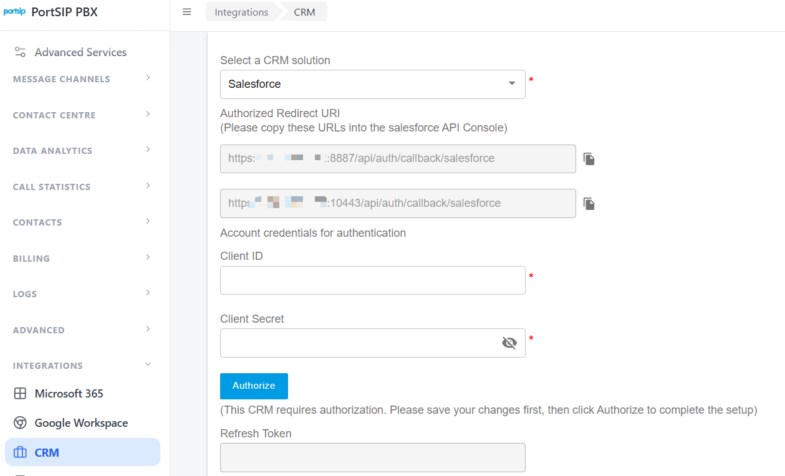<figcaption></figcaption></figure>

5. Sign in to [Salesforce](https://login.salesforce.com/).
6. Click the gear icon in the upper-right corner to open **Quick Settings**, then click **Open Advanced Setup**.

<figure>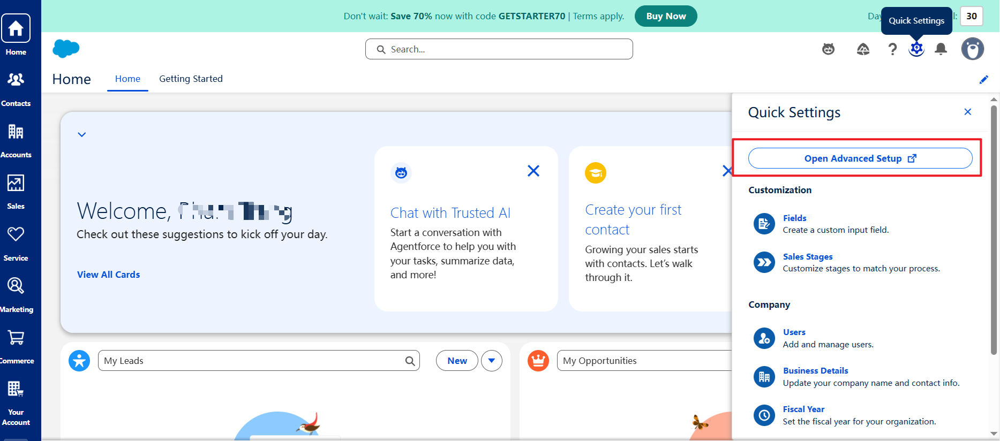<figcaption></figcaption></figure>

7. In the left-hand navigation menu, go to **Platform Tools > Apps > App Manager**.

<figure>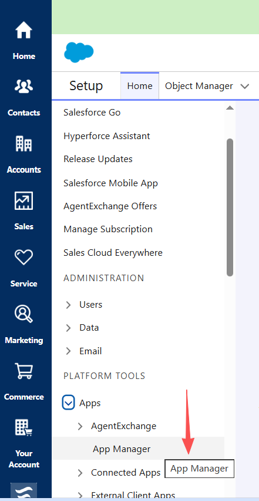<figcaption></figcaption></figure>

8. Click **New External Client App** in the upper-right corner.

<figure>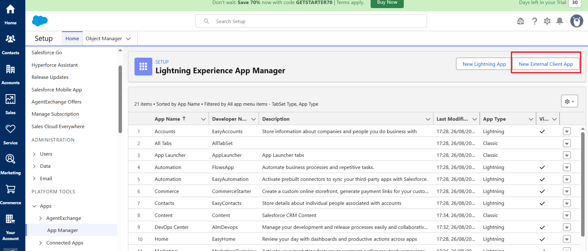<figcaption></figcaption></figure>

9. On the **Basic Information** page, enter the required application information.

<figure>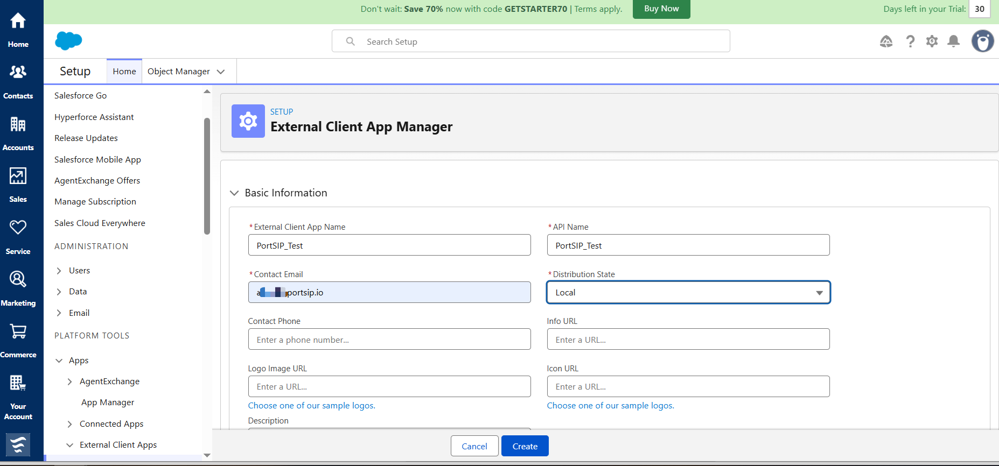<figcaption></figcaption></figure>

10. Scroll to the **API** settings and select **Enable OAuth**.
11. Under **App Settings**, enter the **Redirect URI** copied from PortSIP PBX in the **Callback URL** field.

    If PortSIP PBX displays multiple redirect URIs, enter each URI on a separate line.
12. Under **OAuth Scopes**, select each of the following scopes from **Available OAuth Scopes**, then move it to **Selected OAuth Scopes**:
    * **Manage user data via APIs (api)**
    * **Access the identity URL service (id, profile, email, address, phone)**
    * **Manage user data via Web browsers (web)**
    * **Full access (full)**
    * **Access unique user identifiers (openid)**
    * **Perform requests at any time (refresh\_token, offline\_access)**

<figure>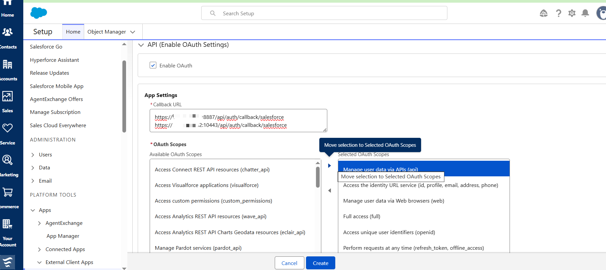<figcaption></figcaption></figure>

13. Scroll to **Security** and select the following options:

* **Require Secret for Web Server Flow**
* **Require Secret for Refresh Token Flow**

<figure>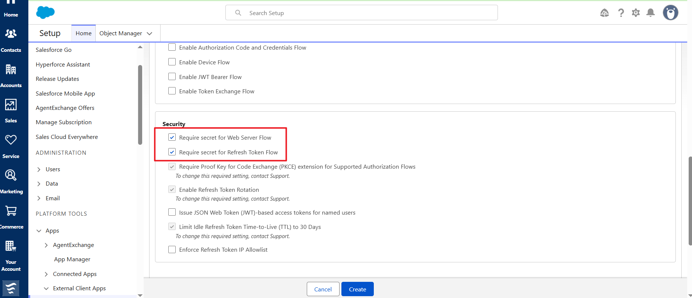<figcaption></figcaption></figure>

14. Click **Create**.

***

### Step 2: Obtain the Consumer Key and Consumer Secret

1. After the External Client App is created, open its **Settings** page.
2. Scroll to **App Settings**, then click **Consumer Key and Secret**.

<figure>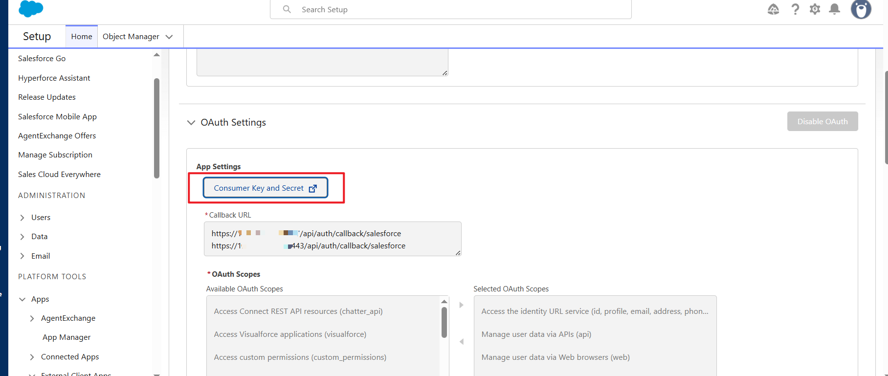<figcaption></figcaption></figure>

3. Salesforce sends a verification code to the email address associated with your account.
4. Enter the verification code, then click **Verify**.
5. Copy the **Consumer Key** and **Consumer Secret**, and store them securely.

<figure>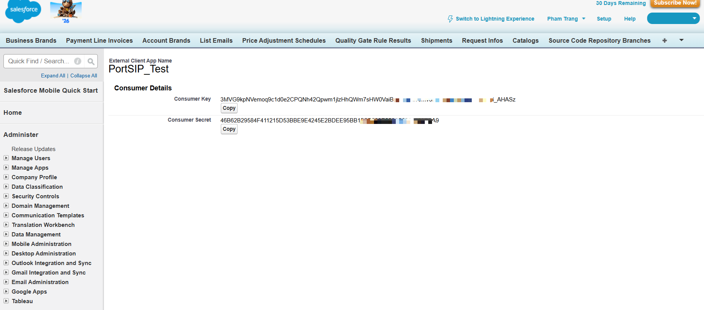<figcaption></figcaption></figure>

Securely store the **Consumer Key** and **Consumer Secret**. These credentials are required when configuring PortSIP PBX. Treat them as confidential and rotate them immediately if you suspect they have been compromised.

***

### Step 3: Configure PortSIP PBX

#### Enable CRM at the Tenant Level

Log in to the **PortSIP PBX Web Portal** as a **System Administrator**, then navigate to **Tenants**, select the target tenant, and click **Edit**.

Open the **Features** tab and ensure that the **CRM** option is enabled.

> **Important:** CRM integration will not function unless this feature is enabled for the tenant by a System Administrator.

Alternatively, you may sign in directly as the **Tenant Administrator** for the desired tenant.

***

#### Configure Salesforce CRM Integration

1. Navigate to **Integrations > CRM**.
2. From the **Select a CRM solution** dropdown, choose **Salesforce**.
3. Enter the Salesforce credentials obtained in Step 2:
   * In **Client ID**, enter the Salesforce **Consumer Key**.
   * In **Client Secret**, enter the Salesforce **Consumer Secret**.

<figure>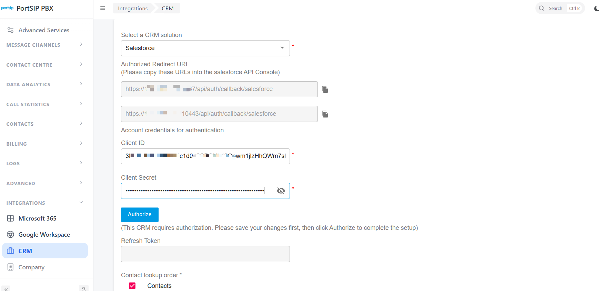<figcaption></figcaption></figure>

***

#### Configure CRM Behavior

**Contact Lookup Order**

Define the priority for Salesforce CRM searches:

* Contacts
* Leads
* Accounts

**Query CRM**

Specify when PortSIP PBX should query Salesforce CRM:

* **Always query**
* **Only when not found in PBX CRM contacts**

**Log Calls as Activities**

Enable this option to automatically log calls as Salesforce CRM activities.

When enabled, a call recording link can be included in the activity:

* **Private Recording Link** – Authentication with PortSIP PBX is required to access the recording.
* **Public Recording Link** – Authentication with PortSIP PBX is not required.

**Create Contacts for New Numbers**

Allow agents to create CRM records when calls come from unknown numbers.

Choose the record type to create:

* Contact
* Lead

**Authorize Salesforce Access**

1. Click **Authorize**. A new browser tab will open.
2. Sign in using the Salesforce account that should grant PortSIP PBX access to Salesforce CRM.
3. Click **Allow** to authorize PortSIP PBX to access Salesforce CRM data.

<figure>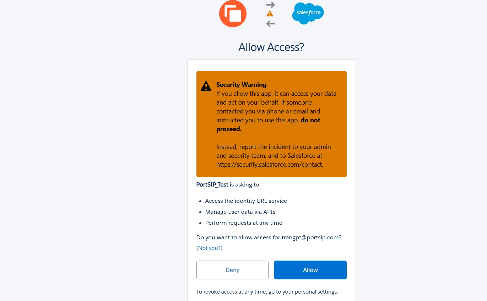<figcaption></figcaption></figure>

Once authorization is complete, the integration becomes active immediately.
