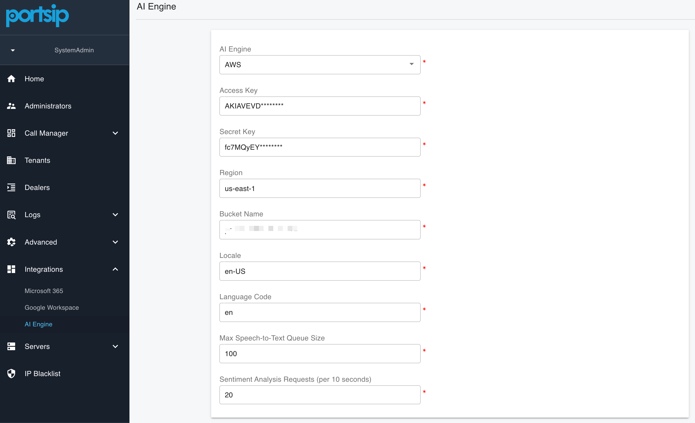

# Configuring AWS AI

### Overview

This guide explains how to configure AWS AI Transcription in PortSIP PBX.

Once configured, PortSIP PBX integrates with **Amazon Web Services (AWS) AI services** to provide enterprise-grade **Speech-to-Text (STT)** transcription and optional **sentiment analysis** for calls and voicemails. These capabilities enhance call analytics, quality management, compliance recording, and overall customer experience.

This guide follows VoIP, UCaaS, and CCaaS best practices and assumes basic familiarity with PortSIP PBX administration and AWS services.

***

### AWS Services Used

PortSIP PBX leverages the following **AWS AI services and IAM permissions** to enable transcription, analytics, and optional AI capabilities:

* **AmazonTranscribeFullAccess**\
  Provides real-time or post-call **Speech-to-Text (STT)** transcription for calls and voicemails.
* **ComprehendFullAccess**\
  Provides **sentiment analysis** and **natural language processing (NLP)** for transcribed text.
* **AmazonBedrockFullAccess**\
  Enables access to **Amazon Bedrock foundation models** for advanced AI processing and future AI-powered features.
* **AmazonS3FullAccess**\
  Allows storage and retrieval of transcription artifacts and related data in **Amazon S3**, if required by the deployment.

> **Best Practice**\
> For production environments, it is recommended to replace full-access policies with **custom IAM policies** that grant only the minimum permissions required.

***

### Prerequisites

Before you begin, ensure the following requirements are met:

* **System Administrator** privileges in PortSIP PBX
* An active **AWS account**
* An AWS **IAM user or role** with permissions for:
  * `AmazonTranscribe`
  * `AmazonComprehend` (required only if sentiment analysis is enabled)
* AWS **Access Key ID** and **Secret Access Key**
* A selected **AWS region** where AI services are available
* _(Optional)_ An **Amazon S3 bucket** for storing transcription output, if required by your deployment model

***

### Configuring the PortSIP PBX AI Engine

#### Step 1: Log in to PortSIP PBX

1. Sign in to the **PortSIP PBX Web Portal** using a **System Administrator** account.

***

#### Step 2: Select AWS as the AI Engine

1. Navigate to menu: **Integrations > AI Engine**
2. From the **AI Engine** drop-down list, select **AWS**.

<figure><figcaption></figcaption></figure>

This configures PortSIP PBX to use **Amazon AI services** as the backend for transcription and language analytics.

***

### Step 3: Configure AWS Credentials and Settings

This section describes how to configure **AWS credentials**, **service parameters**, and **platform API request limits** used by PortSIP PBX for AI-powered speech processing features such as **Speech-to-Text (STT)** and **language analysis**.

***

#### AWS Service Configuration

**Access Key**

The **AWS Access Key ID** associated with an IAM user or role.

This key identifies the AWS account and is required to authenticate requests sent from PortSIP PBX to AWS services.

**Secret Key**

The **AWS Secret Access Key** paired with the Access Key ID.

This key is used to cryptographically sign API requests to AWS services and **must be kept strictly confidential**.

> **Security Best Practice**\
> Use a dedicated IAM user or role with **least-privilege permissions**, and never use root account credentials.

**Region**

The AWS region where your AI services are deployed.

Examples include:\
`us-east-1`, `us-west-2`, `eu-central-1`, `ap-northeast-1`

> **Recommendation**\
> Choose the region closest to your PBX deployment or primary user base to minimize latency and improve transcription performance.

**Bucket Name**

The name of the **Amazon S3 bucket** used to store audio files, intermediate processing data, or transcription results, depending on your deployment configuration.

**Locale**

Specifies the language and regional format used for **speech recognition** and **text processing**.

Examples include:\
`en-US`, `en-GB`, `ja-JP`, `zh-CN`, `vi-VN`

**Language Code**

The **AWS-specific language code** used by speech and language services such as **Amazon Transcribe** and **Amazon Comprehend**.

Examples include:\
`en-US`, `ja-JP`, `de-DE`

> **Note**\
> This value must match one of the language codes supported by the corresponding AWS service.

***

#### AWS Platform API Request Limits

These settings control how many AI-related requests can be queued and processed concurrently. Proper configuration helps comply with **AWS service quotas** and protects overall system stability.

**Max Speech-to-Text Queue Size**

Defines the maximum number of **Speech-to-Text** requests that can be queued and waiting for processing when the AI service is busy or rate-limited.

**Sentiment Analysis Requests**

Specifies the maximum number of **Sentiment Analysis API requests** that PortSIP PBX is allowed to send to AWS.

This limit applies when analyzing transcription text to determine **caller sentiment**, **call quality metrics**, or other AI-derived insights.

***

#### Step 4: Enable AI Transcription for a Tenant

1. Log in to **PortSIP PBX** web portal as a **System Administrator**.
2. Navigate to **Tenants**, select the target tenant, and click **Edit**.
3. Select the **Features** tab and enable **AI Transcription**.
4. Navigate to **General** and enable **Enable AI Transcription**.
5. Configure the **Daily File Quota** to limit the tenant’s daily AI transcription usage and control AWS costs.

***

### Managing AI Transcription Within a Tenant

Once AI transcription is enabled, **Tenant Administrators** can manage and use AI features as follows:

1. Log in to the PortSIP PBX web portal as a tenant administrator.
2. Navigate to **Company > General** and configure:
   * **Automatically Transcribe Recorded Calls**
   * **Automatically Transcribe Voicemails**

<figure><figcaption></figcaption></figure>

4. Navigate to **Data Analytics > Call Recordings** to view transcription results.

<figure><figcaption></figcaption></figure>

5. Calls that have already been transcribed display a **sentiment indicator**.

<figure><figcaption></figcaption></figure>

6. For calls that have not yet been transcribed, click the transcription icon to manually trigger transcription.

***

### Managing AI Transcription at the User Level

Once AI transcription is enabled for the tenant, **Tenant Administrators** can manage and use AI transcription features for individual users as follows:

1. Log in to the PortSIP PBX Web Portal as a **Tenant Administrator**.
2. Navigate to **Call Manager > Users**, then double-click the target user.
3. Select the **Extension** tab and enable or disable the following option:
   * **Automatically Transcribe Recorded Calls**
4. Navigate to **Data Analytics > Call Recordings** to view transcription results.
5. Calls that have already been transcribed display a **sentiment indicator**.
6. For calls that have not yet been transcribed, click the **transcription icon** to manually trigger transcription.

***

### Operational Notes and Best Practices

* Call recording must be enabled for transcription to function.
* Only recorded calls and voicemails are eligible for transcription.
* Transcription workloads are processed asynchronously and may be queued during peak usage.
* Use **Daily File Quotas** to manage AWS costs and prevent unexpected usage spikes.
* For regulated environments, review AWS data residency and retention policies.

