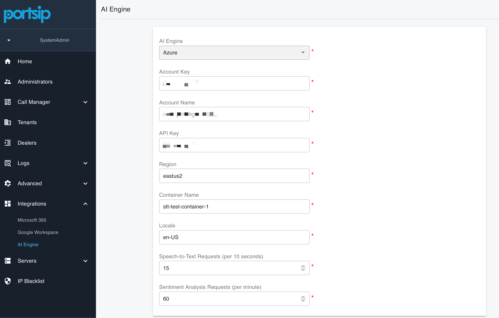

# Configuring Azure AI

### Overview

This guide describes how to configure **Azure AI Transcription** in PortSIP PBX.

Once configured, PortSIP PBX integrates with Microsoft Azure Cognitive Services to provide high-quality Speech-to-Text (STT) transcription and optional sentiment analysis for calls and voicemails. These AI capabilities enhance call analytics, compliance recording, quality management, and overall user experience.

This guide follows VoIP, UCaaS, and CCaaS best practices and assumes basic familiarity with PortSIP PBX administration and Microsoft Azure services.

***

### Prerequisites

Before you begin, ensure the following requirements are met:

* **System Administrator** privileges in PortSIP PBX
* An active **Microsoft Azure account**
* Azure **Speech** service enabled
* _(Optional)_ Azure **Text Analytics** service enabled for sentiment analysis
* Azure service credentials obtained from the Azure Portal:
  * Account name
  * API key
  * Region

***

### Configuring the PortSIP PBX AI Engine

#### Step 1: Log in to PortSIP PBX

1. Sign in to the **PortSIP PBX Web Portal** using a **System Administrator** account.

***

#### Step 2: Select Azure as the AI Engine

1. Navigate to: **Integrations > AI Engine**
2. From the **AI Engine** drop-down list, select **Azure**.

<figure><figcaption></figcaption></figure>

This configures PortSIP PBX to use **Microsoft Azure Cognitive Services** as the backend for AI transcription and language analytics.

***

#### Step 3: Configure Azure Credentials and Settings

Using the information obtained from the **Azure Portal**, configure the following fields.

***

**Azure Authentication**

* **Account Name**\
  The name of your Azure Cognitive Services or Azure Speech resource.
* **Account Key / API Key**\
  The access key generated by Azure, used to authenticate requests from PortSIP PBX.
* **Region**\
  The Azure region where your service is deployed\
  (for example: `eastus`, `westus2`, `westeurope`).

> **Best Practice**\
> Select the Azure region closest to your PBX deployment or primary user base to minimize latency and improve transcription accuracy.

***

**Azure Service Configuration**

* **Container Name**\
  This is mandatory .
* **Locale**\
  Specifies the language and regional format for speech recognition\
  (for example: `en-US`, `en-GB`, `ja-JP`).

***

**AI Request Limits**

* **Speech-to-Text Requests (per 10 seconds)**\
  Defines the maximum number of STT requests allowed per **10 seconds**.
* **Sentiment Analysis Requests (per minute)**\
  Defines the maximum number of sentiment analysis requests allowed per **minute**.

> **Recommendation**\
> For contact centers or high-volume recording environments, monitor Azure usage closely and consider upgrading your Azure service tier to avoid throttling.

***

### Assigning AI Capabilities to Tenants

> **Important**\
> Tenant Administrators **cannot configure the AI engine** themselves.\
> The **System Administrator** must configure Azure AI at the **system level** and then explicitly assign AI capabilities to individual tenants.

***

#### Step 4: Enable AI Transcription for a Tenant

1. Log in to **PortSIP PBX** as a **System Administrator**.
2. Navigate to **Tenants**, select the target tenant, and click **Edit**.
3. Open the **Features** tab and enable **AI Transcription**.
4. Navigate to **General** and enable **Enable AI Transcription**.
5. Configure **Daily File Quota** to limit the tenant’s daily AI transcription usage and control Azure costs.

***

### Managing AI Transcription Within a Tenant

Once AI transcription is enabled, **Tenant Administrators** can manage and use AI transcription features as follows:

1. Log in to the **Tenant Administration Portal**.
2. Navigate to **Company > General** and configure:
   * **Automatically Transcribe Recorded Calls**
   * **Automatically Transcribe Voicemails**

<figure><figcaption></figcaption></figure>

3. Navigate to **Data Analytics > Call Recordings** to view transcription results.

<figure><figcaption></figcaption></figure>

4. Calls that have already been transcribed display a **sentiment indicator**.

<figure><figcaption></figcaption></figure>

5. For calls that have not yet been transcribed, click the **transcription icon** to manually trigger transcription.

***

### Managing AI Transcription at the User Level

Once AI transcription is enabled for the tenant, **Tenant Administrators** can manage and use AI transcription features for individual users as follows:

1. Log in to the PortSIP PBX Web Portal as a **Tenant Administrator**.
2. Navigate to **Call Manager > Users**, then double-click the target user.
3. Select the **Extension** tab and enable or disable the following option:
   * **Automatically Transcribe Recorded Calls**
4. Navigate to **Data Analytics > Call Recordings** to view transcription results.
5. Calls that have already been transcribed display a **sentiment indicator**.
6. For calls that have not yet been transcribed, click the **transcription icon** to manually trigger transcription.

***

### Operational Notes and Best Practices

* **Call recording must be enabled** for transcription to function.
* Only recorded calls and voicemails are eligible for transcription.
* Transcription is processed asynchronously and may be queued during peak usage.
* Use **Daily File Quota** to control AI usage and manage Azure costs.
* For regulated environments, review **Azure data residency and retention policies**.

