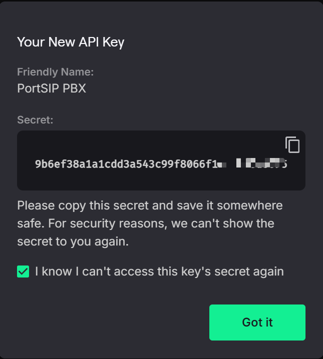
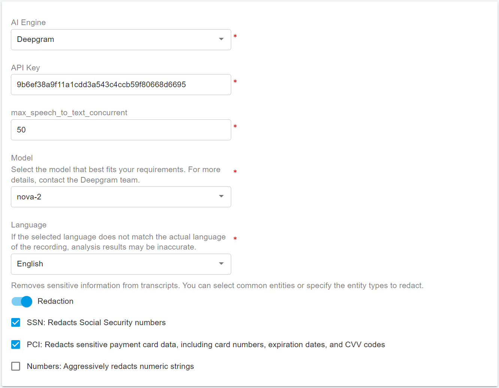

# Configuring Deepgram AI

### Overview

This guide explains how to configure [Deepgram](https://deepgram.com/) AI Transcription in PortSIP PBX.

Once configured, PortSIP PBX integrates with **Deepgram AI services** to provide enterprise-grade **Speech-to-Text (STT)** transcription and optional **sentiment analysis** for calls and voicemails. These capabilities enhance call analytics, quality management, compliance recording, and overall customer experience.

This guide follows VoIP, UCaaS, and CCaaS best practices and assumes basic familiarity with PortSIP PBX administration and Deepgram services.

***

### Deepgram Services Used

When configuring PortSIP PBX to use the [Deepgram ](https://deepgram.com/)AI service, you must obtain a Deepgram API key. This key allows PortSIP PBX to securely access Deepgram’s transcription and language analytics services.

Follow the steps below to create an API key.

***

#### Creating a Deepgram API Key

1. Go to the [Deepgram ](https://deepgram.com/)website and sign up for an account, or sign in if you already have one.
2. Click **Console** in the upper-right corner of the page. You will be redirected to the **Dashboard**.
3. Click **Create API Key** and follow the on-screen instructions.
4. Copy the generated **API key** and store it securely.

<figure><figcaption></figcaption></figure>

❗ **Important**

* The API key is **displayed only once**.
* After leaving the page, the key **cannot be viewed again**.
* Store the key in a secure location. If it is lost or exposed, you must generate a new one.

***

### Configuring the PortSIP PBX AI Engine

After obtaining the Deepgram API key, configure PortSIP PBX to use Deepgram as the AI backend.

#### Step 1: Log In to PortSIP PBX

Sign in to the PortSIP PBX Web Portal using a **System Administrator** account.

***

#### Step 2: Select Deepgram as the AI Engine

1. Navigate to: **Integrations > AI Engine**
2. From the **AI Engine** drop-down list, select **Deepgram**.
3. Paste the **Deepgram API key** you created earlier.
4. (Optional) Select the desired **language**, **model**, and other available parameters.
5. Click **OK** to save the configuration.

<figure><figcaption></figcaption></figure>

***

#### Step 3: Enable AI Transcription for a Tenant

1. Log in to the **PortSIP PBX** web portal as a **System Administrator**.
2. Navigate to **Tenants**, select the target tenant, and click **Edit**.
3. Select the **Features** tab and enable **AI Transcription**.
4. Navigate to **General** and enable **Enable AI Transcription**.
5. Configure the **Daily File Quota** to limit the tenant’s daily AI transcription usage and control AWS costs.

***

### Managing AI Transcription Within a Tenant

Once AI transcription is enabled, **Tenant Administrators** can manage and use AI features as follows:

1. Log in to the PortSIP PBX web portal as a tenant administrator.
2. Navigate to **Company > General** and configure:
   * **Automatically Transcribe Recorded Calls**
   * **Automatically Transcribe Voicemails**

<figure><figcaption></figcaption></figure>

4. Navigate to **Data Analytics > Call Recordings** to view transcription results.

<figure><figcaption></figcaption></figure>

5. Calls that have already been transcribed display a **sentiment indicator**.

<figure><figcaption></figcaption></figure>

6. For calls that have not yet been transcribed, click the transcription icon to manually trigger transcription.

***

### Managing AI Transcription at the User Level

Once AI transcription is enabled for the tenant, **Tenant Administrators** can manage and use AI transcription features for individual users as follows:

1. Log in to the PortSIP PBX Web Portal as a **Tenant Administrator**.
2. Navigate to **Call Manager > Users**, then double-click the target user.
3. Select the **Extension** tab and enable or disable the following option:
   * **Automatically Transcribe Recorded Calls**
4. Navigate to **Data Analytics > Call Recordings** to view transcription results.
5. Calls that have already been transcribed display a **sentiment indicator**.
6. For calls that have not yet been transcribed, click the **transcription icon** to manually trigger transcription.

***

### Operational Notes and Best Practices

* Call recording must be enabled for transcription to function.
* Only recorded calls and voicemails are eligible for transcription.
* Transcription workloads are processed asynchronously and may be queued during peak usage.
* Use **Daily File Quotas** to manage AWS costs and prevent unexpected usage spikes.
* For regulated environments, review AWS data residency and retention policies.

