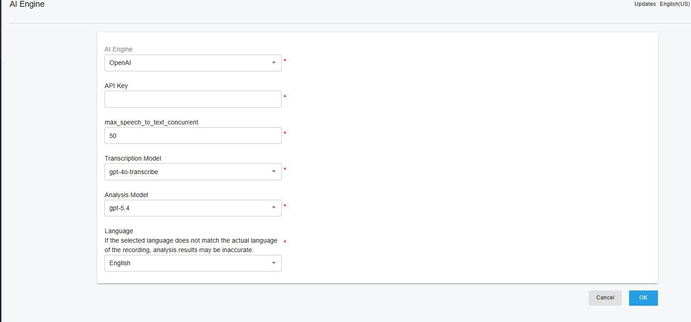

# Configuring OpenAI

### Overview

This guide explains how to configure [OpenAI ](https://openai.com/)Transcription in PortSIP PBX.

Once configured, PortSIP PBX integrates with OpenAI services to provide enterprise-grade **speech-to-text (STT)** transcription and optional sentiment analysis for calls and voicemails. These capabilities help enhance call analytics, quality management, compliance recording, and the overall customer experience.

This guide follows VoIP, UCaaS, and CCaaS best practices and assumes basic familiarity with PortSIP PBX administration and OpenAI services.

### Configuring OpenAI as the PortSIP PBX AI Engine

After you [obtain an OpenAI API key](https://help.openai.com/en/articles/4936850-where-do-i-find-my-openai-api-key), configure PortSIP PBX to use OpenAI as the backend AI service for transcription and analysis.

> **Prerequisite**\
> You must have a valid OpenAI API key. Store the key securely and do not share it.

#### Step 1: Sign in to PortSIP PBX

1. Open the PortSIP PBX Web Portal.
2. Sign in using a **System Administrator** account.

#### Step 2: Select OpenAI as the AI Engine

1. Go to **Integrations > AI Engine**.
2. From the **AI Engine** drop-down list, select **OpenAI**.
3. Paste the **OpenAI API key** that you created earlier.
4. Optional: Configure the available AI parameters, such as:
   * **Language**
   * **Transcription Model**
   * **Analysis Model**
   * Any other available options
5. Click **OK** to save the configuration.

<figure><figcaption></figcaption></figure>

**Expected result:** PortSIP PBX is now configured to use OpenAI as the AI backend.

> **Security note**\
> Treat the OpenAI API key as a secret credential. Do not send it by email, store it in public repositories, or share it with users who do not need administrative access. Use separate API keys for different environments, such as development, staging, and production, where applicable.

***

### Enabling AI Transcription for a Tenant

After OpenAI is configured as the AI Engine, enable AI transcription for each tenant that is allowed to use this feature.

#### Step 1: Open the tenant settings

1. Sign in to the PortSIP PBX Web Portal as a **System Administrator**.
2. Go to **Tenants**.
3. Select the target tenant.
4. Click **Edit**.

#### Step 2: Enable the AI Transcription feature

1. Select the **Features** tab.
2. Enable **AI Transcription**.

#### Step 3: Enable AI Transcription for the tenant

1. Go to the **General** tab.
2. Enable **Enable AI Transcription**.
3. Configure **Daily File Quota** to limit the tenant’s daily AI transcription usage.

**Expected result:** AI transcription is enabled for the selected tenant, subject to the configured quota.

> **Cost-control note**\
> Use **Daily File Quota** to help control OpenAI usage and reduce the risk of unexpected transcription costs.

***

### Managing AI Transcription Within a Tenant

After AI transcription is enabled for a tenant, Tenant Administrators can configure how transcription is used for recorded calls and voicemails.

#### Step 1: Sign in as a Tenant Administrator

1. Open the PortSIP PBX Web Portal.
2. Sign in using a **Tenant Administrator** account.

#### Step 2: Configure company-level transcription options

1. Go to **Company > General**.
2. Configure the following options as required:
   * **Automatically Transcribe Recorded Calls**
   * **Automatically Transcribe Voicemails**

**Expected result:** PortSIP PBX automatically submits eligible recorded calls and/or voicemails for transcription based on the selected options.

#### Step 3: View transcription results

1. Go to **Data Analytics > Call Recordings**.
2. Review the transcription status for recorded calls.
3. For calls that have already been transcribed, review the displayed sentiment indicator.
4. For calls that have not yet been transcribed, click the **transcription icon** to manually start transcription.

**Expected result:** Completed transcriptions and sentiment indicators are displayed for eligible call recordings.

***

### Managing AI Transcription at the User Level

After AI transcription is enabled for the tenant, Tenant Administrators can enable or disable automatic transcription for individual users.

#### Step 1: Open the user settings

1. Sign in to the PortSIP PBX Web Portal as a **Tenant Administrator**.
2. Go to **Call Manager > Users**.
3. Double-click the target user.

#### Step 2: Configure user-level transcription

1. Select the **Extension** tab.
2. Enable or disable **Automatically Transcribe Recorded Calls**.

**Expected result:** Automatic transcription for recorded calls is applied according to the user-level setting.

#### Step 3: View transcription results

1. Go to **Data Analytics > Call Recordings**.
2. Review the transcription status for the user’s recorded calls.
3. For calls that have already been transcribed, review the displayed sentiment indicator.
4. For calls that have not yet been transcribed, click the **transcription icon** to manually start transcription.

***

### Operational Notes and Best Practices

* **Call recording must be enabled** for call transcription to work.
* Only **recorded calls** and **voicemails** are eligible for transcription.
* Transcription is processed asynchronously. During periods of high usage, transcription jobs may be queued and completed later.
* Use **Daily File Quota** to manage OpenAI usage and reduce the risk of unexpected costs.
* For regulated environments, review your organization’s privacy, data-processing, data-residency, and retention requirements before enabling AI transcription.
* If recorded calls or voicemails may contain personal data, payment information, health information, or other regulated content, consult your legal, compliance, or security team before enabling transcription.
* Inform users and callers when required by applicable call recording, monitoring, consent, or privacy laws.

