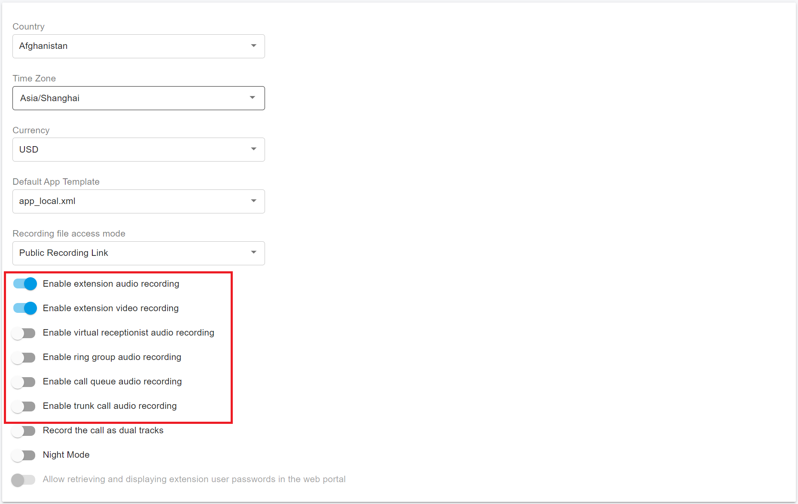

# 35 Call Recording

PortSIP PBX supports call recording for audio and video calls. Administrators can enable recording at different levels, including the tenant, extension, service, inbound rule, and outbound rule.

PortSIP PBX can also generate call recording file links in either public or private mode. This gives administrators flexibility when sharing recordings while helping control access to sensitive call data.

> ❗**Note**\
> Call recording requirements vary by country, region, and industry. Before enabling call recording, make sure your organization complies with all applicable privacy, consent, retention, and disclosure requirements.

***

### Activating Tenant-Level Call Recording

You can enable or disable call recording at the tenant level from the PortSIP PBX web portal.

When tenant-level call recording is enabled, calls for the tenant are recorded automatically according to the recording options you select.

#### To activate or deactivate tenant-level call recording

1. Sign in to the PortSIP PBX web portal as a **System Administrator** and select the tenant you want to manage.\
   Alternatively, sign in directly as the **Tenant Administrator**.
2. Go to **Company**.
3. Open the **General** tab.
4. Turn on or turn off one or both of the following options:
   * **Enable extension audio recording**
   * **Enable extension video recording**
5. Save the changes, if prompted.

**Expected outcome**

When the selected option is enabled, calls for extensions in the tenant are recorded automatically, including calls involving normal extensions and system extensions.

***

### Tenant-Level Recording Options

You can also control recording for specific call types and services. For example, you can record only calls that involve a call queue, ring group, virtual receptionist, or trunk.

<figure><figcaption></figcaption></figure>

#### To configure tenant-level recording options

1. Sign in to the PortSIP PBX web portal as a **System Administrator** and select the tenant you want to manage.\
   Alternatively, sign in directly as the **Tenant Administrator**.
2. Go to the **company**.
3. Open the **General** tab.
4. Configure the required recording options.

The following tenant-level recording options are available:

* **Enable virtual receptionist audio recordings**\
  Records calls that are connected to a virtual receptionist.
* **Enable ring group audio recordings**\
  Records calls that are connected to a ring group member.
* **Enable call queue audio recordings**\
  Records calls that are connected to a call queue or answered by a queue agent.
* **Enable trunk call audio recordings**\
  Records calls that are connected through a trunk.

> **Note**\
> These options provide more granular recording control than recording all extension calls. Use them when your organization needs to record only specific call flows.

***

#### To configure recording file access mode

You can choose how PortSIP PBX generates call recording file links.

* **Public Recording Link**\
  Anyone who has the recording file link can access that recording file.
* **Private Recording Link**\
  When a user opens the recording file link, PortSIP PBX prompts the user to sign in before allowing access.

> ❗**Security recommendation**\
> Use **Private Recording Link** when recordings contain sensitive, confidential, or regulated information. Use **Public Recording Link** only when the recording can be shared externally according to your organization’s privacy and security policies.

***

### Activating Call Recording on a Specific Extension

PortSIP PBX allows administrators to enable or disable call recording for a specific extension.

#### To activate or deactivate call recording on an extension

1. Sign in to the PortSIP PBX web portal as a **System Administrator** and select the tenant you want to manage.\
   Alternatively, sign in directly as the **Tenant Administrator**.
2. Go to **Call Manager > Users**.
3. Open the **Extension** tab.
4. Select the extension you want to manage.
5. Turn on or turn off one or both of the following options:
   * **Record Audio Calls**
   * **Record Video Calls**
6. Save the changes, if prompted.

**Expected outcome**

When recording is enabled for the extension, audio calls, video calls, or both are recorded according to the selected options.

***

### Activating Call Recording on a Specific Service

PortSIP PBX supports call recording for specific system services, including call queues, ring groups, and virtual receptionists.

***

#### Activating Call Recording on a Call Queue

Use this option to record calls that are connected to a specific call queue.

**To activate or deactivate call recording on a call queue**

1. Sign in to the PortSIP PBX web portal as a **System Administrator** and select the tenant you want to manage.\
   Alternatively, sign in directly as the **Tenant Administrator**.
2. Go to **Advanced Service > Call Queue**.
3. Select the call queue you want to edit.
4. Turn on or turn off **Enable audio recording**.
5. Save the changes, if prompted.

**Expected outcome**

When the option is enabled, calls connected to the selected call queue are recorded.

***

#### Activating Call Recording on a Ring Group

Use this option to record calls that are connected to members of a specific ring group.

**To activate or deactivate call recording on a ring group**

1. Sign in to the PortSIP PBX web portal as a **System Administrator** and select the tenant you want to manage.\
   Alternatively, sign in directly as the **Tenant Administrator**.
2. Go to **Advanced Service > Ring Group**.
3. Select the ring group you want to edit.
4. Turn on or turn off **Enable audio recording**.
5. Save the changes, if prompted.

**Expected outcome**

When the option is enabled, calls connected to the selected ring group are recorded.

***

#### Activating Call Recording on a Virtual Receptionist

Use this option to record calls that are connected to a specific virtual receptionist.

**To activate or deactivate call recording on a virtual receptionist**

1. Sign in to the PortSIP PBX web portal as a **System Administrator** and select the tenant you want to manage.\
   Alternatively, sign in directly as the **Tenant Administrator**.
2. Go to **Advanced Service > Virtual Receptionist**.
3. Select the virtual receptionist you want to edit.
4. Turn on or turn off **Enable audio recording**.
5. Save the changes, if prompted.

**Expected outcome**

When the option is enabled, calls connected to the selected virtual receptionist are recorded.

***

### Activating Call Recording on a Specific Trunk Route Rule

PortSIP PBX allows administrators to enable or disable call recording for a specific inbound rule or outbound rule. This is useful when recording should apply only to calls that match specific trunk routing rules.

***

#### Activating Call Recording on an Inbound Rule

Use this option to record inbound trunk calls that match a specific inbound rule.

**To activate or deactivate call recording on an inbound rule**

1. Sign in to the PortSIP PBX web portal as a **System Administrator** and select the tenant you want to manage.\
   Alternatively, sign in directly as the **Tenant Administrator**.
2. Go to **Call Manager > Inbound Rules**.
3. Select the inbound rule you want to edit.
4. Turn on or turn off **Enable audio recording**.
5. Save the changes, if prompted.

**Expected outcome**

When the option is enabled, inbound calls that match the selected inbound rule are recorded.

***

#### Activating Call Recording on an Outbound Rule

Use this option to record outbound trunk calls that match a specific outbound rule.

**To activate or deactivate call recording on an outbound rule**

1. Sign in to the PortSIP PBX web portal as a **System Administrator** and select the tenant you want to manage.\
   Alternatively, sign in directly as the **Tenant Administrator**.
2. Go to **Call Manager > Outbound Rules**.
3. Select the outbound rule you want to edit.
4. Turn on or turn off **Enable audio recording**.
5. Save the changes, if prompted.

**Expected outcome**

When the option is enabled, outbound calls that match the selected outbound rule are recorded.

